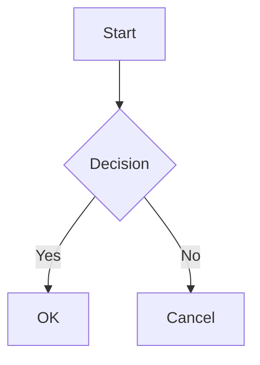

# Git Docs App

Self-hosted wiki solution powered by **Astro Starlight** with Google OAuth authentication.

Drop markdown files into a folder, and instantly get a beautiful, searchable wiki with access control.

## Features

- **Markdown → Wiki**: Automatically converts markdown files to a static wiki site
- **Google OAuth**: Login restricted to approved Google accounts only
- **Admin Panel**: Manage users, approve access requests, configure site settings
- **Auto Build**: File changes in `source/` trigger automatic rebuilds
- **Auto Sidebar**: Navigation sidebar generated from directory structure
- **Mermaid Diagrams**: Mermaid code blocks rendered as diagrams
- **Docker Ready**: Single image, multiple instances via port mapping
- **Multi-language filenames**: Korean, Japanese, Chinese, and other non-ASCII filenames supported

## Quick Start (Docker)

### 1. Set up Google OAuth

1. Go to [Google Cloud Console](https://console.cloud.google.com/apis/credentials)
2. Create a new OAuth 2.0 Client ID (Web application)
3. Add **Authorized redirect URIs**:
   - `http://localhost:3000/oauth2/callback` (local development)
   - `https://your-domain.com/oauth2/callback` (production)
4. Download the JSON credentials file

### 2. Configure

```bash
# Clone the repository
git clone https://github.com/your-repo/git-docs-app.git
cd git-docs-app

# Place your Google OAuth credentials (either way works):

# Option A: Download from Google Console and rename
mv ~/Downloads/client_secret_*.json conf/google_auth.json

# Option B: Copy the example and fill in your credentials
cp conf/google_auth.example.json conf/google_auth.json
# Edit conf/google_auth.json with your client_id, client_secret, redirect_uris
```

### 3. Run with Docker Compose

```bash
# Set your admin email and start
ADMIN_EMAIL=your-email@gmail.com docker compose up -d
```

Open `http://localhost:8080` in your browser.

### 4. Add Content

Place your markdown files in the `source/` directory:

```
source/
├── getting-started.md
├── guides/
│   ├── installation.md
│   └── configuration.md
├── api/
│   └── reference.md
├── images/
│   └── architecture.png    # Embedded in wiki pages
└── downloads/
    └── report.pdf           # Available as download
```

The wiki rebuilds automatically when files change. Sidebar navigation is generated from the directory structure.

## Folder Structure

| Folder | Description | Docker Volume |
|--------|-------------|---------------|
| `source/` | Your markdown, HTML, and resource files | Yes |
| `conf/` | `google_auth.json` (OAuth credentials) | Yes |
| `data/` | `wiki.db` (SQLite - auto-created) | Yes |
| `dist/` | Built static HTML (served to users) | No |

## Environment Variables

| Variable | Default | Description |
|----------|---------|-------------|
| `ADMIN_EMAIL` | *(empty)* | Initial admin Google email |
| `PORT` | `8080` | Host-side port mapping (docker compose) |
| `SESSION_SECRET` | `change-me-in-production` | Session encryption key |
| `DEV_MODE` | `false` | Set `true` to bypass authentication (for local dev) |

## Content Types

| File Type | Behavior |
|-----------|----------|
| `.md`, `.mdx` | Converted to HTML wiki pages |
| `.html` folder (with `index.html`) | Embedded as iframe |
| Single `.html` | Embedded as iframe |
| `.png`, `.jpg`, `.svg`, etc. | Copied to static assets, usable in markdown |
| Other files (PDF, CSV, ZIP, etc.) | Available as download links at `/downloads/` |

## Mermaid Diagrams

Use fenced code blocks with `mermaid` language:

````markdown

````

## Docker Build & Push

소스에서 직접 빌드하고 Docker Hub에 배포하는 방법:

```bash
# 멀티 플랫폼 빌드 & 푸시 (amd64 + arm64)
docker buildx build --platform linux/amd64,linux/arm64 \
  -t bumworld/git-docs-app:latest \
  -t bumworld/git-docs-app:1.0.0 \
  --push .

# 로컬 빌드만 (현재 플랫폼)
docker compose build
```

배포 서버에서는 소스 없이 이미지만 pull해서 사용:

```yaml
# docker-compose.yml (서버용)
services:
  wiki:
    image: bumworld/git-docs-app:latest
    ports:
      - "8080:3000"
    volumes:
      - ./source:/app/source
      - ./conf:/app/conf
      - ./data:/app/data
    environment:
      - ADMIN_EMAIL=your-email@gmail.com
      - SESSION_SECRET=your-random-secret-key
    restart: unless-stopped
```

## Multiple Instances

Run separate wikis on different ports:

```bash
# Wiki A on port 8080
docker run -p 8080:3000 \
  -v ./repo-a/source:/app/source \
  -v ./repo-a/conf:/app/conf \
  -v ./repo-a/data:/app/data \
  -e ADMIN_EMAIL=admin-a@gmail.com \
  bumworld/git-docs-app

# Wiki B on port 8081
docker run -p 8081:3000 \
  -v ./repo-b/source:/app/source \
  -v ./repo-b/conf:/app/conf \
  -v ./repo-b/data:/app/data \
  -e ADMIN_EMAIL=admin-b@gmail.com \
  bumworld/git-docs-app
```

## Admin Panel

Access the admin panel at `/admin` (admin users only):

- **Dashboard**: View user statistics and pending access requests
- **Users**: Manage users, approve/block accounts, assign admin roles
- **Settings**: Configure site title, description, contact email, footer text

## Access Control Flow

1. User clicks "Sign in with Google"
2. If email is registered and **active** → access granted
3. If email is **not registered** → auto-added as **pending**, shown waiting page
4. If email is **blocked** → access denied
5. Admin approves/blocks pending users via admin panel

## API Endpoints

| Method | Path | Auth | Description |
|--------|------|------|-------------|
| `GET` | `/auth/google` | Public | Start Google login |
| `GET` | `/auth/me` | Public | Current user info |
| `GET` | `/auth/logout` | Public | Logout |
| `POST` | `/api/rebuild` | User | Trigger wiki rebuild |
| `GET` | `/api/admin/users` | Admin | List all users |
| `PUT` | `/api/admin/users/:id/status` | Admin | Update user status |
| `PUT` | `/api/admin/users/:id/role` | Admin | Update user role |
| `GET/PUT` | `/api/admin/settings` | Admin | Site settings |

## Development

```bash
# Install dependencies
npm install

# Start with authentication bypassed
DEV_MODE=true npm run dev

# Start with Google OAuth
ADMIN_EMAIL=you@gmail.com npm run dev

# Manual build only
npm run build
```

## Tech Stack

- **Astro Starlight** - Static site generator
- **Express.js** - HTTP server with auth middleware
- **Passport.js** - Google OAuth 2.0
- **better-sqlite3** - Embedded database
- **chokidar** - File system watcher
- **Mermaid** - Diagram rendering

## License

MIT
