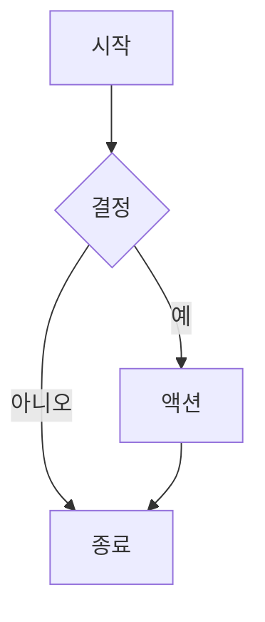
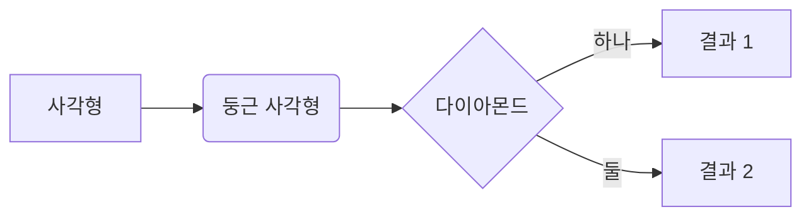
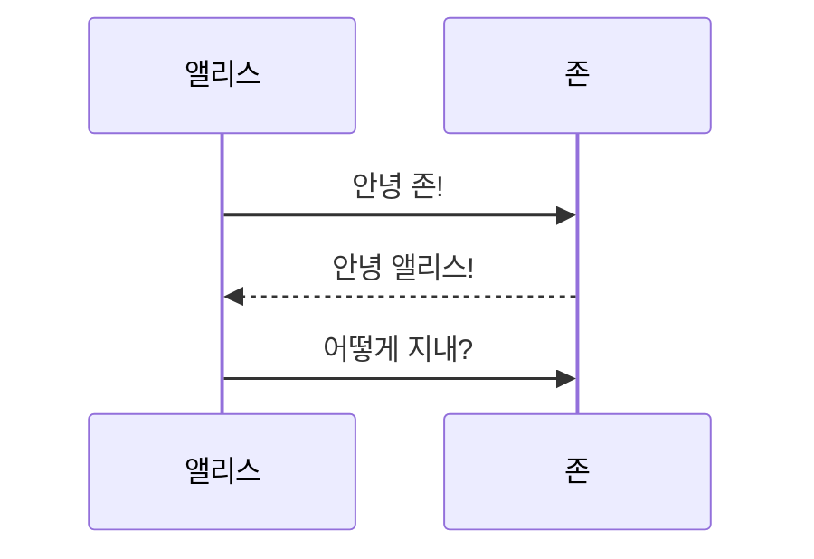
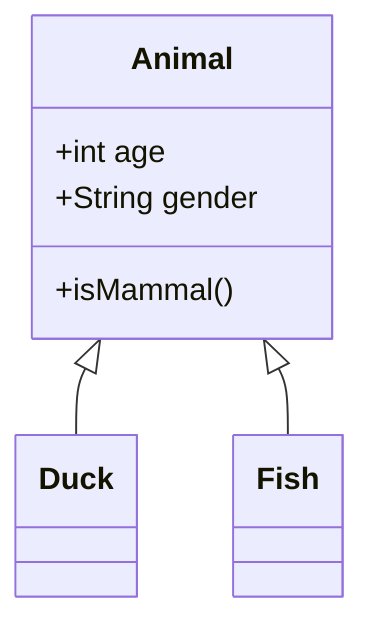
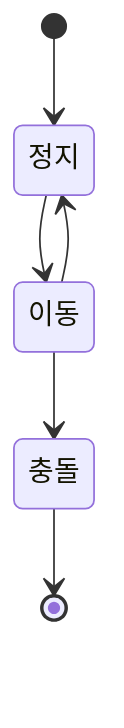
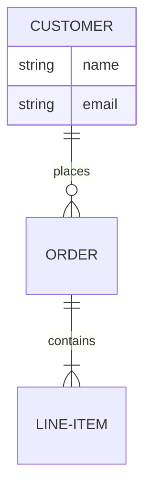

# Git Docs App - 사용 가이드

Git Docs App의 모든 기능을 상세히 설명합니다.

## 목차

- [기본 사용법](#기본-사용법)
- [콘텐츠 관리](#콘텐츠-관리)
- [프레젠테이션 모드](#프레젠테이션-모드)
- [소스 보기](#소스-보기)
- [콘텐츠 복사](#콘텐츠-복사)
- [PDF 인쇄](#pdf-인쇄)
- [영상 삽입](#영상-삽입)
- [Mermaid 다이어그램](#mermaid-다이어그램)
- [관리자 패널](#관리자-패널)
- [인증](#인증)

---

## 기본 사용법

### 위키 시작하기

```bash
# Docker Compose 사용
ADMIN_EMAIL=admin@example.com docker compose up -d

# Docker 직접 실행
docker run -p 8080:3000 \
  -v ./sample/source:/app/source \
  -v ./sample/conf:/app/conf \
  -v ./sample/data:/app/data \
  -e ADMIN_EMAIL=admin@example.com \
  bumworld/git-docs-app
```

`http://localhost:8080`으로 위키에 접속합니다.

### 콘텐츠 추가하기

`sample/source/` 디렉토리에 마크다운 파일을 배치합니다:

```
sample/source/
├── index.md              # 홈페이지
├── getting-started.md    # 기본 페이지
├── guides/
│   ├── tutorial.md
│   └── advanced.md
├── images/
│   └── diagram.png      # 페이지에 사용할 이미지
└── downloads/
    └── manual.pdf       # 다운로드 가능한 파일
```

파일이 변경되면 위키가 자동으로 다시 빌드됩니다. 사이드바 네비게이션은 폴더 구조에서 자동 생성됩니다.

---

## 콘텐츠 관리

### 지원 파일 타입

| 파일 타입 | 설명 | 출력 |
|-----------|------|------|
| `.md`, `.mdx` | 마크다운 문서 | HTML 위키 페이지 |
| `.html` (폴더) | `index.html`이 있는 HTML | iframe으로 삽입 |
| `.html` (단일) | 독립 HTML 파일 | iframe으로 삽입 |
| `.png`, `.jpg`, `.svg` | 이미지 | 정적 자산 (마크다운에서 사용) |
| `.pdf`, `.zip` 등 | 기타 파일 | `/downloads/`에서 다운로드 링크 |

### 마크다운 기능

#### 표준 마크다운

```markdown
# 제목 1
## 제목 2
### 제목 3

**굵은 텍스트**와 *기울임 텍스트*

- 불릿 리스트
- 다른 항목

1. 번호 리스트
2. 두 번째 항목

[링크 텍스트](https://example.com)


```

#### 코드 블록

````markdown
```javascript
function hello(name) {
  console.log(`안녕하세요, ${name}님!`);
}
```
````

#### 표

```markdown
| 열 1 | 열 2 | 열 3 |
|------|------|------|
| 데이터 1 | 데이터 2 | 데이터 3 |
| 더 많은 | 데이터 | 여기에 |
```

---

## 프레젠테이션 모드

마크다운 페이지를 reveal.js 프레젠테이션으로 변환합니다.

### 프레젠테이션 만들기

마크다운 파일에 frontmatter를 추가합니다:

```markdown
---
title: 내 프레젠테이션
presentation: true
theme: night
---

# 환영합니다

첫 번째 슬라이드 내용

---

## 두 번째 슬라이드

더 많은 내용

---

## 세 번째 슬라이드

- 포인트 1
- 포인트 2
```

### 슬라이드 구분자

`---` (하이픈 3개)를 사용하여 슬라이드를 구분합니다:

```markdown
슬라이드 1의 내용

---

슬라이드 2의 내용

---

슬라이드 3의 내용
```

### 사용 가능한 테마

reveal.js 테마 중 선택: `black`, `white`, `league`, `beige`, `sky`, `night`, `serif`, `simple`, `solarized`

```yaml
---
presentation: true
theme: sky
---
```

### 프레젠테이션 보기

1. **문서 모드**: 일반 위키 페이지로 보기
2. **프레젠테이션 모드**: 우측 하단의 "🎬 Presentation Mode" 버튼 클릭
3. **전환**: "📄 Document Mode"를 클릭하여 돌아가기

### 키보드 단축키

| 키 | 동작 |
|----|------|
| Space / 화살표 키 | 슬라이드 탐색 |
| F | 전체화면 |
| Esc | 개요 모드 |
| ? | 도움말 표시 |

### 예제 프레젠테이션

전체 예제는 [`sample/source/example-presentation.md`](sample/source/example-presentation.md)를 참고하세요.

---

## 소스 보기

페이지의 원본 마크다운 또는 렌더링된 HTML을 보고 복사합니다.

### 사용 방법

1. 우측 사이드바(모바일에서는 "이 페이지에서")의 **"View Source"** 버튼 클릭
2. 두 개의 탭이 있는 모달 열림:
   - **Markdown**: 원본 마크다운 소스
   - **HTML**: 렌더링된 HTML 출력
3. **"Copy"** 버튼을 클릭하여 클립보드에 복사
4. **Esc**를 누르거나 외부 클릭으로 닫기

### 사용 사례

- 다른 문서에서 재사용하기 위해 마크다운 복사
- 외부 게시를 위해 HTML 내보내기
- 렌더링 문제 디버깅
- 협업자와 페이지 소스 공유

---

## 콘텐츠 복사

렌더링된 페이지 콘텐츠를 리치 텍스트로 복사(서식 유지).

### 사용 방법

1. 우측 사이드바(모바일에서는 "이 페이지에서")의 **"Copy Content"** 버튼 클릭
2. 서식이 포함된 콘텐츠가 클립보드에 복사됨
3. 다음에 붙여넣기:
   - 워드 프로세서 (Word, Google Docs)
   - 이메일 클라이언트
   - 리치 텍스트 편집기
   - 채팅 애플리케이션 (Slack, Teams)

### 복사되는 내용

- ✅ 서식이 있는 텍스트 (굵게, 기울임, 제목)
- ✅ 리스트 (불릿 및 번호)
- ✅ 스타일이 있는 표
- ✅ 구문 강조가 있는 코드 블록
- ✅ 링크 (클릭 가능하게 유지)
- ✅ 이미지 (삽입됨)
- ❌ 네비게이션 요소 (제외됨)
- ❌ 사이드바 (제외됨)

### 장점

- **붙여넣기 후 서식 지정 불필요**
- **구조 유지** (제목, 리스트, 표)
- **애플리케이션 간 호환** (Word, Slack, 이메일)
- **기본 스타일로 시각적 충실도 유지**

---

## PDF 인쇄

최적화된 레이아웃으로 페이지를 PDF로 인쇄합니다.

### 사용 방법

1. 우측 사이드바(모바일에서는 "이 페이지에서")의 **"Print PDF"** 버튼 클릭
2. 브라우저 인쇄 대화상자 열림
3. 대상으로 **"PDF로 저장"** 선택
4. 설정 조정 (여백, 배율, 머리글/바닥글)
5. **"저장"** 클릭

### 인쇄 최적화

인쇄 레이아웃이 자동으로:
- 네비게이션 및 사이드바 숨김
- Mermaid 다이어그램을 인쇄용으로 최적화
- 가독성을 위한 페이지 구분 조정
- 인쇄 친화적인 글꼴 및 크기 사용

### 팁

- **Chrome/Edge**: 최고 품질의 PDF 출력
- **여백**: "기본" 또는 "최소" 사용
- **배율**: 최적 맞춤을 위해 90-100% 시도
- **배경 그래픽**: 색상 배경이 있는 다이어그램을 위해 활성화

---

## 영상 삽입

YouTube 또는 로컬 영상을 소스 링크 표시와 함께 삽입합니다.

### YouTube 영상

```markdown
<div class="video-wrapper">
  <iframe
    src="https://www.youtube.com/embed/VIDEO_ID"
    frameborder="0"
    allowfullscreen
  ></iframe>
</div>
```

`VIDEO_ID`를 YouTube 영상 ID로 바꿉니다.

### 로컬 영상 파일

```markdown
<div class="video-wrapper">
  <video controls>
    <source src="./videos/tutorial.mp4" type="video/mp4">
  </video>
</div>
```

### 영상 소스 바

삽입된 영상 아래에 자동으로 표시됩니다:
- **소스 링크**: 클릭하여 새 탭에서 영상 열기
- **복사 버튼**: URL을 클립보드에 복사

### 지원 형식

- **YouTube**: iframe을 통한 삽입
- **로컬 영상**: MP4, WebM, OGG
- **외부 영상**: 직접 영상 URL

---

## Mermaid 다이어그램

마크다운 코드 블록에서 직접 다이어그램을 렌더링합니다.

### 기본 사용법

````markdown

````

### 다이어그램 타입

#### 플로우차트

````markdown

````

#### 시퀀스 다이어그램

````markdown

````

#### 클래스 다이어그램

````markdown

````

#### 상태 다이어그램

````markdown

````

#### ER 다이어그램

````markdown

````

### 스타일링

Mermaid 다이어그램은 자동으로:
- 페이지 테마에 맞춤 (라이트/다크)
- 모바일에서 반응형 확장
- 인쇄/PDF 출력 최적화
- 프레젠테이션에서 렌더링

---

## 관리자 패널

사용자, 접근 제어 및 사이트 설정을 관리합니다.

### 관리자 패널 접근

1. 관리자 계정으로 로그인
2. `/admin`으로 이동하거나 사용자 메뉴 → "Admin" 클릭
3. 관리자 패널 열림 (관리자만 볼 수 있음)

### 대시보드

개요 통계 보기:
- 전체 사용자 (활성, 대기, 차단)
- 최근 접근 요청
- 빠른 작업 (사용자 승인/차단)

### 사용자 관리

**모든 사용자 보기**
- 모든 등록 사용자 목록 표시
- 상태 표시: 활성, 대기, 차단
- 역할 표시: 관리자, 사용자

**사용자 상태 업데이트**
- **활성**: 위키 접근 허용
- **대기**: 승인 대기 (새 사용자의 기본값)
- **차단**: 접근 거부

**관리자 역할 할당**
- 사용자를 관리자로 승격
- 관리자는 관리자 패널에 접근 가능
- 여러 관리자 지원

**작업**
1. "Users" 탭으로 이동
2. 목록에서 사용자 찾기
3. 상태 드롭다운을 클릭하여 상태 변경
4. 역할 드롭다운을 클릭하여 역할 변경
5. 변경 사항이 자동으로 저장됨

### 사이트 설정

위키 외관 및 정보 구성:

| 설정 | 설명 | 예시 |
|------|------|------|
| **Site Title** | 위키 이름 | "엔지니어링 위키" |
| **Description** | 짧은 설명 | "내부 문서" |
| **Contact Email** | 지원 이메일 | "wiki-admin@company.com" |
| **Footer Text** | 사용자 정의 바닥글 | "© 2025 회사 이름" |

**설정 업데이트**
1. "Settings" 탭으로 이동
2. 필드 편집
3. "Save Settings" 클릭
4. 변경 사항이 즉시 적용됨

---

## 인증

Google OAuth로 안전한 접근을 보장합니다.

### 로그인 흐름

1. 사용자가 **"Sign in with Google"** 클릭
2. Google OAuth 인증
3. 시스템이 사용자 상태 확인:
   - **활성**: 접근 허용 → 위키로 리디렉션
   - **대기**: 관리자 승인 대기 → 대기 페이지 표시
   - **차단**: 접근 거부 → 오류 메시지 표시
   - **신규 사용자**: 자동으로 대기 상태로 등록

### 접근 상태

| 상태 | 설명 | 동작 |
|------|------|------|
| **활성** | 승인된 사용자 | 전체 위키 접근 |
| **대기** | 승인 대기 중 | 접근 불가, 대기 페이지 표시 |
| **차단** | 접근 거부됨 | 로그인 거부 |

### 초기 설정

1. 첫 실행 전에 `ADMIN_EMAIL` 환경 변수 설정:
   ```bash
   ADMIN_EMAIL=you@company.com docker compose up -d
   ```

2. 첫 로그인 시 관리자 사용자가 자동 생성됨

3. 관리자는 관리자 패널을 통해 다른 사용자를 승인할 수 있음

### 사용자 등록

**자동 등록**
- 새 사용자는 첫 로그인 시 자동으로 "대기" 상태로 등록됨
- 관리자가 알림을 받음 (대시보드에서 확인 가능)
- 관리자가 관리자 패널을 통해 승인 또는 차단

**셀프 서비스 없음**
- 사용자가 스스로 승인할 수 없음
- 모든 접근은 관리자 승인 필요
- 통제된 접근 유지

### 로그아웃

사용자 메뉴(우측 상단) → "Logout" 클릭

### 개발 모드

로컬 테스트를 위해 인증 우회:

```bash
DEV_MODE=true npm run dev
```

⚠️ **프로덕션에서는 절대 `DEV_MODE=true`를 사용하지 마세요!**

---

## 환경 변수

| 변수 | 기본값 | 필수 | 설명 |
|------|--------|------|------|
| `ADMIN_EMAIL` | *(없음)* | 예 | 초기 관리자 사용자 이메일 |
| `SESSION_SECRET` | `change-me-in-production` | 예 (프로덕션) | 세션 암호화 키 |
| `PORT` | `8080` | 아니오 | 호스트 포트 매핑 (Docker) |
| `DEV_MODE` | `false` | 아니오 | 인증 우회 (개발 전용) |

### 보안 참고사항

- 프로덕션에서는 항상 강력한 `SESSION_SECRET` 설정
- 비밀 정보를 git에 커밋하지 마세요
- `SESSION_SECRET`를 주기적으로 교체
- 로컬 개발에만 `DEV_MODE=true` 사용

---

## API 참조

### 공개 엔드포인트

| 메서드 | 경로 | 설명 |
|--------|------|------|
| `GET` | `/auth/google` | Google OAuth 로그인 시작 |
| `GET` | `/oauth2/callback` | OAuth 콜백 핸들러 |
| `GET` | `/auth/me` | 현재 사용자 정보 |
| `GET` | `/auth/logout` | 사용자 로그아웃 |

### 사용자 엔드포인트

인증 필요 (활성 사용자).

| 메서드 | 경로 | 설명 |
|--------|------|------|
| `POST` | `/api/rebuild` | 수동 위키 재빌드 트리거 |

### 관리자 엔드포인트

관리자 역할 필요.

| 메서드 | 경로 | 설명 |
|--------|------|------|
| `GET` | `/api/admin/users` | 모든 사용자 목록 |
| `PUT` | `/api/admin/users/:id/status` | 사용자 상태 업데이트 |
| `PUT` | `/api/admin/users/:id/role` | 사용자 역할 업데이트 |
| `GET` | `/api/admin/settings` | 사이트 설정 가져오기 |
| `PUT` | `/api/admin/settings` | 사이트 설정 업데이트 |

### 예제: 사용자 상태 업데이트

```bash
curl -X PUT http://localhost:8080/api/admin/users/123/status \
  -H "Content-Type: application/json" \
  -d '{"status":"active"}' \
  --cookie "SESSION_COOKIE"
```

---

## 문제 해결

### 위키가 재빌드되지 않음

1. 파일 감시자 로그 확인: `docker logs wiki`
2. 수동으로 재빌드 트리거: `POST /api/rebuild`
3. 컨테이너 재시작: `docker restart wiki`

### OAuth 오류

- `google_auth.json`이 올바른지 확인
- Google Console의 리디렉션 URI가 배포 URL과 일치하는지 확인
- `SESSION_SECRET`가 설정되었는지 확인

### 프레젠테이션 모드가 작동하지 않음

- frontmatter에 `presentation: true`가 있는지 확인
- 브라우저 콘솔에서 JavaScript 오류 확인
- 강력 새로고침 시도 (Ctrl+Shift+R / Cmd+Shift+R)

### 다이어그램이 렌더링되지 않음

- mermaid 구문 확인: https://mermaid.js.org/
- 코드 블록이 ```mermaid를 사용하는지 확인
- 캐시 지우고 페이지 새로고침

### 사용자가 대기 상태에 머물러 있음

- 관리자가 관리자 패널을 통해 수동으로 승인해야 함
- 사용자가 "Users" 탭에 나타나는지 확인
- 상태를 "대기"에서 "활성"으로 변경

---

## 팁 및 모범 사례

### 콘텐츠 구성

- 폴더를 사용하여 관련 페이지 그룹화
- 파일 이름을 URL 친화적으로 유지 (소문자, 하이픈)
- 폴더에 `index.md`를 추가하여 랜딩 페이지 생성
- 전용 `images/` 폴더에 이미지 배치

### 성능

- 업로드 전에 이미지 최적화 (압축, 크기 조정)
- 가능한 경우 이미지 대신 Mermaid 다이어그램 사용
- 영상 파일 크기 제한 (대용량 영상은 외부 호스팅 사용)

### 협업

- "Copy Content"를 사용하여 이메일/채팅을 통해 서식 있는 페이지 공유
- 협업 편집을 위해 "View Source" 마크다운 공유
- 오프라인 보기를 위해 프레젠테이션을 PDF로 내보내기

### 보안

- 관리자 패널에서 사용자 접근을 정기적으로 검토
- 더 이상 접근이 필요하지 않은 경우 차단된 사용자 제거
- 비정상적인 활동이 있는지 관리자 패널 대시보드 모니터링
- Docker 이미지를 최신 상태로 유지: `docker pull bumworld/git-docs-app:latest`

---

## 추가 리소스

- **Astro Starlight 문서**: https://starlight.astro.build/
- **Mermaid 문서**: https://mermaid.js.org/
- **Reveal.js 문서**: https://revealjs.com/
- **마크다운 가이드**: https://www.markdownguide.org/

문제 및 기능 요청은 다음을 방문하세요: https://github.com/bumworld/git-docs-app/issues
