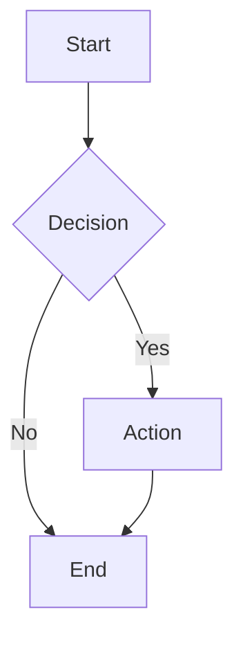
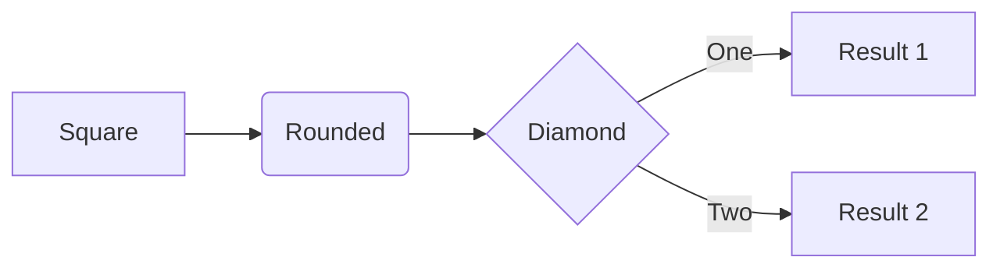
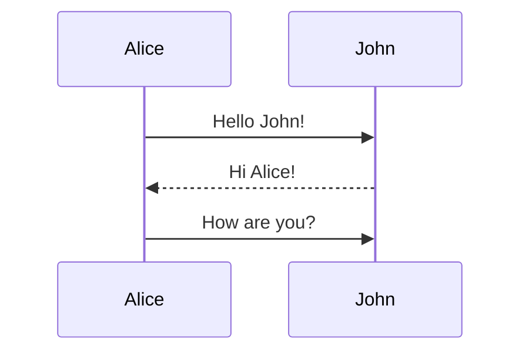
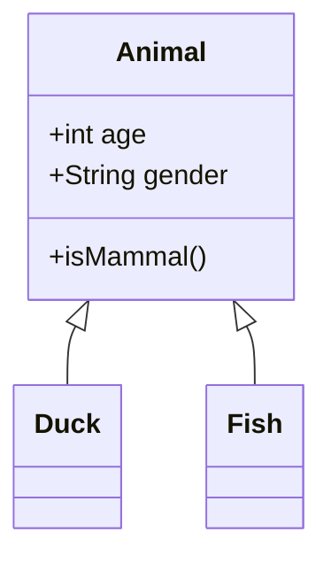
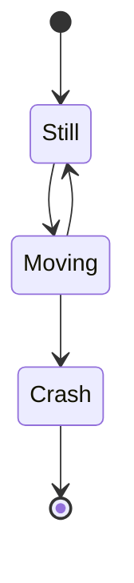
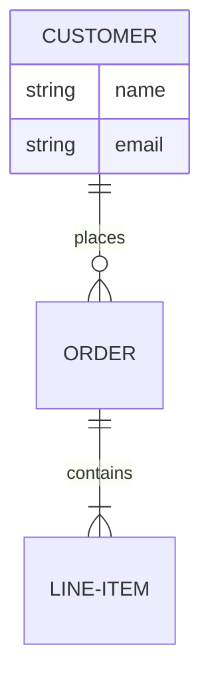

# Git Docs App - Usage Guide

This guide covers all features of Git Docs App in detail.

## Table of Contents

- [Basic Usage](#basic-usage)
- [Content Management](#content-management)
- [Presentation Mode](#presentation-mode)
- [Source Viewing](#source-viewing)
- [Content Copying](#content-copying)
- [Print to PDF](#print-to-pdf)
- [Video Embedding](#video-embedding)
- [Mermaid Diagrams](#mermaid-diagrams)
- [Admin Panel](#admin-panel)
- [Authentication](#authentication)

---

## Basic Usage

### Starting the Wiki

```bash
# Using Docker Compose
ADMIN_EMAIL=admin@example.com docker compose up -d

# Direct Docker run
docker run -p 8080:3000 \
  -v ./sample/source:/app/source \
  -v ./sample/conf:/app/conf \
  -v ./sample/data:/app/data \
  -e ADMIN_EMAIL=admin@example.com \
  bumworld/git-docs-app
```

Access your wiki at `http://localhost:8080`

### Adding Content

Place markdown files in the `sample/source/` directory:

```
sample/source/
├── index.md              # Homepage
├── getting-started.md    # Basic page
├── guides/
│   ├── tutorial.md
│   └── advanced.md
├── images/
│   └── diagram.png      # Images for pages
└── downloads/
    └── manual.pdf       # Downloadable files
```

The wiki automatically rebuilds when files change. The sidebar navigation is generated from your folder structure.

---

## Content Management

### Supported File Types

| File Type | Description | Output |
|-----------|-------------|--------|
| `.md`, `.mdx` | Markdown documents | HTML wiki pages |
| `.html` (folder) | HTML with `index.html` | Embedded iframe |
| `.html` (single) | Standalone HTML | Embedded iframe |
| `.png`, `.jpg`, `.svg` | Images | Static assets (use in markdown) |
| `.pdf`, `.zip`, etc. | Other files | Download links at `/downloads/` |

### Markdown Features

#### Standard Markdown

```markdown
# Heading 1
## Heading 2
### Heading 3

**Bold text** and *italic text*

- Bullet list
- Another item

1. Numbered list
2. Second item

[Link text](https://example.com)


```

#### Code Blocks

````markdown
```javascript
function hello(name) {
  console.log(`Hello, ${name}!`);
}
```
````

#### Tables

```markdown
| Column 1 | Column 2 | Column 3 |
|----------|----------|----------|
| Data 1   | Data 2   | Data 3   |
| More     | Data     | Here     |
```

---

## Presentation Mode

Convert any markdown page into a reveal.js presentation.

### Creating a Presentation

Add frontmatter to your markdown file:

```markdown
---
title: My Presentation
presentation: true
theme: night
---

# Welcome

Your first slide content

---

## Second Slide

More content here

---

## Third Slide

- Point 1
- Point 2
```

### Slide Separators

Use `---` (three hyphens) to separate slides:

```markdown
Content for slide 1

---

Content for slide 2

---

Content for slide 3
```

### Available Themes

Choose from reveal.js themes: `black`, `white`, `league`, `beige`, `sky`, `night`, `serif`, `simple`, `solarized`

```yaml
---
presentation: true
theme: sky
---
```

### Viewing Presentations

1. **Document Mode**: View as regular wiki page
2. **Presentation Mode**: Click "🎬 Presentation Mode" button at bottom-right
3. **Toggle**: Click "📄 Document Mode" to return

### Keyboard Shortcuts

| Key | Action |
|-----|--------|
| Space / Arrow keys | Navigate slides |
| F | Fullscreen |
| Esc | Overview mode |
| ? | Show help |

### Example Presentation

See [`sample/source/example-presentation.md`](sample/source/example-presentation.md) for a complete example.

---

## Source Viewing

View and copy the raw markdown or rendered HTML of any page.

### How to Use

1. Click **"View Source"** button in the right sidebar (or "On this page" on mobile)
2. Modal opens with two tabs:
   - **Markdown**: Raw markdown source
   - **HTML**: Rendered HTML output
3. Click **"Copy"** button to copy content to clipboard
4. Press **Esc** or click outside to close

### Use Cases

- Copy markdown to reuse in other documents
- Export HTML for external publishing
- Debug rendering issues
- Share page source with collaborators

---

## Content Copying

Copy rendered page content as rich text (preserves formatting).

### How to Use

1. Click **"Copy Content"** button in the right sidebar (or "On this page" on mobile)
2. Content is copied to clipboard with formatting
3. Paste into:
   - Word processors (Word, Google Docs)
   - Email clients
   - Rich text editors
   - Chat applications (Slack, Teams)

### What Gets Copied

- ✅ Text with formatting (bold, italic, headings)
- ✅ Lists (bullets and numbered)
- ✅ Tables with styling
- ✅ Code blocks with syntax highlighting
- ✅ Links (preserved as clickable)
- ✅ Images (embedded)
- ❌ Navigation elements (excluded)
- ❌ Sidebars (excluded)

### Benefits

- **No manual formatting** needed after paste
- **Preserves structure** (headings, lists, tables)
- **Works across applications** (Word, Slack, email)
- **Maintains visual fidelity** with basic styling

---

## Print to PDF

Print any page to PDF with optimized layout.

### How to Use

1. Click **"Print PDF"** button in the right sidebar (or "On this page" on mobile)
2. Browser print dialog opens
3. Select **"Save as PDF"** as destination
4. Adjust settings (margins, scale, headers/footers)
5. Click **"Save"**

### Print Optimization

The print layout automatically:
- Hides navigation and sidebars
- Optimizes Mermaid diagrams for print
- Adjusts page breaks for readability
- Uses print-friendly fonts and sizes

### Tips

- **Chrome/Edge**: Best PDF output quality
- **Margins**: Use "Default" or "Minimum"
- **Scale**: Try 90-100% for best fit
- **Background graphics**: Enable for diagrams with colored backgrounds

---

## Video Embedding

Embed videos (YouTube, local files) with source link display.

### YouTube Videos

```markdown
<div class="video-wrapper">
  <iframe
    src="https://www.youtube.com/embed/VIDEO_ID"
    frameborder="0"
    allowfullscreen
  ></iframe>
</div>
```

Replace `VIDEO_ID` with your YouTube video ID.

### Local Video Files

```markdown
<div class="video-wrapper">
  <video controls>
    <source src="./videos/tutorial.mp4" type="video/mp4">
  </video>
</div>
```

### Video Source Bar

Automatically displays below embedded videos:
- **Source link**: Click to open video in new tab
- **Copy button**: Copy URL to clipboard

### Supported Formats

- **YouTube**: Embed via iframe
- **Local videos**: MP4, WebM, OGG
- **External videos**: Direct video URLs

---

## Mermaid Diagrams

Render diagrams directly from markdown code blocks.

### Basic Usage

````markdown

````

### Diagram Types

#### Flowchart

````markdown

````

#### Sequence Diagram

````markdown

````

#### Class Diagram

````markdown

````

#### State Diagram

````markdown

````

#### ER Diagram

````markdown

````

### Styling

Mermaid diagrams automatically:
- Adapt to page theme (light/dark)
- Scale responsively on mobile
- Optimize for print/PDF output
- Render in presentations

---

## Admin Panel

Manage users, access control, and site settings.

### Accessing Admin Panel

1. Log in with admin account
2. Navigate to `/admin` or click user menu → "Admin"
3. Admin panel opens (only visible to admins)

### Dashboard

View overview statistics:
- Total users (active, pending, blocked)
- Recent access requests
- Quick actions (approve/block users)

### User Management

**View All Users**
- Lists all registered users
- Shows status: active, pending, blocked
- Displays role: admin, user

**Update User Status**
- **Active**: Grant access to wiki
- **Pending**: Awaiting approval (default for new users)
- **Blocked**: Deny access

**Assign Admin Role**
- Promote users to admin
- Admins can access admin panel
- Multiple admins supported

**Actions**
1. Go to "Users" tab
2. Find user in list
3. Click status dropdown to change status
4. Click role dropdown to change role
5. Changes save automatically

### Site Settings

Configure wiki appearance and information:

| Setting | Description | Example |
|---------|-------------|---------|
| **Site Title** | Wiki name | "Engineering Wiki" |
| **Description** | Short description | "Internal documentation" |
| **Contact Email** | Support email | "wiki-admin@company.com" |
| **Footer Text** | Custom footer | "© 2025 Company Name" |

**Update Settings**
1. Go to "Settings" tab
2. Edit fields
3. Click "Save Settings"
4. Changes apply immediately

---

## Authentication

Secure access with Google OAuth.

### Login Flow

1. User clicks **"Sign in with Google"**
2. Google OAuth authentication
3. System checks user status:
   - **Active**: Access granted → Redirect to wiki
   - **Pending**: Waiting for admin approval → Show waiting page
   - **Blocked**: Access denied → Show error message
   - **New user**: Auto-registered as pending

### Access States

| Status | Description | Action |
|--------|-------------|--------|
| **Active** | Approved user | Full wiki access |
| **Pending** | Awaiting approval | No access, waiting page shown |
| **Blocked** | Denied access | Login rejected |

### First-Time Setup

1. Set `ADMIN_EMAIL` environment variable before first run:
   ```bash
   ADMIN_EMAIL=you@company.com docker compose up -d
   ```

2. Admin user is auto-created on first login

3. Admin can then approve other users via admin panel

### User Registration

**Automatic Registration**
- New users auto-register as "pending" on first login
- Admin receives notification (can check dashboard)
- Admin approves or blocks via admin panel

**No Self-Service**
- Users cannot self-approve
- All access requires admin approval
- Maintains controlled access

### Logout

Click user menu (top-right) → "Logout"

### Development Mode

Bypass authentication for local testing:

```bash
DEV_MODE=true npm run dev
```

⚠️ **Never use `DEV_MODE=true` in production!**

---

## Environment Variables

| Variable | Default | Required | Description |
|----------|---------|----------|-------------|
| `ADMIN_EMAIL` | *(none)* | Yes | Initial admin user email |
| `SESSION_SECRET` | `change-me-in-production` | Yes (production) | Session encryption key |
| `PORT` | `8080` | No | Host port mapping (Docker) |
| `DEV_MODE` | `false` | No | Bypass auth (dev only) |

### Security Notes

- Always set strong `SESSION_SECRET` in production
- Never commit secrets to git
- Rotate `SESSION_SECRET` periodically
- Use `DEV_MODE=true` only for local development

---

## API Reference

### Public Endpoints

| Method | Path | Description |
|--------|------|-------------|
| `GET` | `/auth/google` | Initiate Google OAuth login |
| `GET` | `/oauth2/callback` | OAuth callback handler |
| `GET` | `/auth/me` | Get current user info |
| `GET` | `/auth/logout` | Logout user |

### User Endpoints

Require authentication (active user).

| Method | Path | Description |
|--------|------|-------------|
| `POST` | `/api/rebuild` | Trigger manual wiki rebuild |

### Admin Endpoints

Require admin role.

| Method | Path | Description |
|--------|------|-------------|
| `GET` | `/api/admin/users` | List all users |
| `PUT` | `/api/admin/users/:id/status` | Update user status |
| `PUT` | `/api/admin/users/:id/role` | Update user role |
| `GET` | `/api/admin/settings` | Get site settings |
| `PUT` | `/api/admin/settings` | Update site settings |

### Example: Update User Status

```bash
curl -X PUT http://localhost:8080/api/admin/users/123/status \
  -H "Content-Type: application/json" \
  -d '{"status":"active"}' \
  --cookie "SESSION_COOKIE"
```

---

## Troubleshooting

### Wiki not rebuilding

1. Check file watcher logs: `docker logs wiki`
2. Manually trigger rebuild: `POST /api/rebuild`
3. Restart container: `docker restart wiki`

### OAuth errors

- Verify `google_auth.json` is correct
- Check redirect URIs in Google Console match deployment URL
- Ensure `SESSION_SECRET` is set

### Presentation mode not working

- Verify frontmatter has `presentation: true`
- Check for JavaScript errors in browser console
- Try hard refresh (Ctrl+Shift+R / Cmd+Shift+R)

### Diagrams not rendering

- Check mermaid syntax: https://mermaid.js.org/
- Verify code block uses ```mermaid
- Clear cache and reload page

### User stuck in pending

- Admin must manually approve via admin panel
- Check user appears in "Users" tab
- Change status from "pending" to "active"

---

## Tips & Best Practices

### Content Organization

- Use folders to group related pages
- Keep filenames URL-friendly (lowercase, hyphens)
- Add `index.md` in folders for landing pages
- Place images in dedicated `images/` folder

### Performance

- Optimize images before uploading (compress, resize)
- Use Mermaid for diagrams instead of images when possible
- Limit video file sizes (use external hosting for large videos)

### Collaboration

- Use "Copy Content" to share formatted pages via email/chat
- Share "View Source" markdown for collaborative editing
- Export presentations as PDFs for offline viewing

### Security

- Regularly review user access in admin panel
- Remove blocked users if they no longer need access
- Monitor admin panel dashboard for unusual activity
- Keep Docker image updated: `docker pull bumworld/git-docs-app:latest`

---

## Additional Resources

- **Astro Starlight Docs**: https://starlight.astro.build/
- **Mermaid Documentation**: https://mermaid.js.org/
- **Reveal.js Documentation**: https://revealjs.com/
- **Markdown Guide**: https://www.markdownguide.org/

For issues and feature requests, visit: https://github.com/bumworld/git-docs-app/issues
