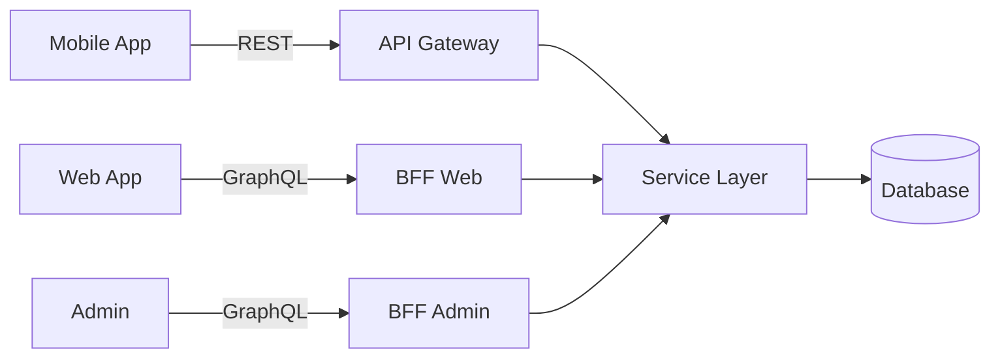

# ADR 002: API 아키텍처 - REST vs GraphQL

## Status
**Accepted** (2026-01-20)

## Context

프론트엔드(Web, Mobile)와 백엔드 간 API 설계 방식을 결정해야 함.

### 요구사항
1. **유연성**: 다양한 클라이언트 (Web, Mobile, Admin)
2. **성능**: Over-fetching / Under-fetching 최소화
3. **개발 속도**: 빠른 기능 개발
4. **모니터링**: API 사용량 추적 필요
5. **캐싱**: CDN 및 브라우저 캐싱 활용

### 비교 대상
- REST API
- GraphQL
- Hybrid (BFF 패턴)

## Decision

**Hybrid 아키텍처: REST + GraphQL (BFF)**

- **Public API**: REST (모바일 앱, 써드파티)
- **Web Dashboard**: GraphQL BFF
- **Admin Panel**: GraphQL BFF



## Rationale

### REST API (Public)

#### 장점
1. **캐싱 용이**
   ```
   GET /api/products/123
   Cache-Control: max-age=3600
   ETag: "abc123"
   → CDN, 브라우저 캐싱
   ```

2. **HTTP 표준 활용**
   ```
   GET    /api/orders        # 조회
   POST   /api/orders        # 생성
   PATCH  /api/orders/:id    # 수정
   DELETE /api/orders/:id    # 삭제
   ```

3. **모니터링 간편**
   ```
   GET /api/products → 1,234 req/s
   POST /api/orders → 45 req/s
   → 엔드포인트별 추적 쉬움
   ```

4. **Rate Limiting**
   ```
   X-RateLimit-Limit: 1000
   X-RateLimit-Remaining: 999
   → 엔드포인트별 제한 가능
   ```

#### 단점
1. **Over-fetching**
   ```json
   // 상품명만 필요한데 모든 필드 반환
   GET /api/products/123
   {
     "id": "123",
     "name": "노트북",
     "description": "...",  // 불필요
     "specs": {...},        // 불필요
     "reviews": [...]       // 불필요
   }
   ```

2. **Under-fetching**
   ```
   // 상품 + 리뷰 + 판매자 정보 → 3번 요청
   GET /api/products/123
   GET /api/reviews?productId=123
   GET /api/sellers/456
   ```

3. **버전 관리 복잡**
   ```
   /api/v1/products  # 기존
   /api/v2/products  # 필드 추가/변경
   → 여러 버전 동시 유지
   ```

### GraphQL BFF (Web/Admin)

#### 장점
1. **정확한 데이터 요청**
   ```graphql
   query ProductDetail {
     product(id: "123") {
       name          # 필요한 것만
       price
       seller {
         name
       }
     }
   }
   ```

2. **단일 요청으로 여러 리소스**
   ```graphql
   query Dashboard {
     todayOrders {
       id
       total
       customer { name }
     }
     todayRevenue
     topProducts {
       name
       salesCount
     }
   }
   # 위 데이터를 1번 요청으로
   ```

3. **타입 시스템**
   ```graphql
   type Product {
     id: ID!
     name: String!
     price: Int!
     stock: Int!
   }
   # 자동 검증, IDE 자동완성
   ```

4. **Introspection**
   ```graphql
   query {
     __schema {
       types {
         name
         fields { name }
       }
     }
   }
   # API 문서 자동 생성 (GraphiQL)
   ```

#### 단점
1. **캐싱 복잡**
   ```
   POST /graphql
   body: { query: "..." }
   → HTTP 캐싱 불가
   → Apollo Cache, DataLoader로 대응
   ```

2. **Rate Limiting 어려움**
   ```graphql
   # 이 쿼리는 몇 점?
   query {
     products {
       reviews {
         author {
           orders {
             items { ... }
           }
         }
       }
     }
   }
   → Query Complexity로 제한
   ```

3. **Over-fetching 가능**
   ```graphql
   # N+1 Problem
   query {
     orders {
       customer { name }  # 각 order마다 DB 조회
     }
   }
   → DataLoader로 배칭
   ```

### BFF (Backend for Frontend) 패턴

```typescript
// BFF for Web
@Resolver()
class WebProductResolver {
  @Query()
  async productListForWeb(@Args('filters') filters: ProductFilters) {
    // Web에 최적화된 데이터 구조
    const products = await this.productService.find(filters);
    return products.map(p => ({
      id: p.id,
      name: p.name,
      thumbnail: this.cdn.optimize(p.image, { width: 300 }),
      priceDisplay: this.formatPrice(p.price),
      isWishlisted: await this.checkWishlist(p.id)
    }));
  }
}

// BFF for Mobile
@Controller('api/mobile')
class MobileProductController {
  @Get('products')
  async productListForMobile() {
    // Mobile에 최적화 (데이터 최소화)
    const products = await this.productService.find();
    return products.map(p => ({
      id: p.id,
      name: p.name,
      thumbnail: this.cdn.optimize(p.image, { width: 150 }),
      price: p.price
    }));
  }
}
```

#### 장점
1. **클라이언트별 최적화**: Web은 풍부한 데이터, Mobile은 간결한 데이터
2. **독립적 배포**: Web BFF 변경 시 Mobile 영향 없음
3. **버전 관리 용이**: BFF 내부에서 처리

## Implementation Plan

### Phase 1: REST API (MVP)
```javascript
// Express + TypeScript
app.get('/api/products', async (req, res) => {
  const products = await db.products.findMany({
    where: { status: 'active' },
    include: { category: true }
  });
  res.json({ data: products });
});

app.get('/api/products/:id', async (req, res) => {
  const product = await db.products.findUnique({
    where: { id: req.params.id },
    include: { seller: true, reviews: true }
  });
  res.setHeader('Cache-Control', 'public, max-age=3600');
  res.json({ data: product });
});
```

### Phase 2: GraphQL BFF (Web)
```typescript
// Apollo Server
const typeDefs = gql`
  type Query {
    product(id: ID!): Product
    products(filters: ProductFilters, page: Int, size: Int): ProductConnection
  }

  type Product {
    id: ID!
    name: String!
    price: Int!
    seller: Seller!
    reviews(limit: Int): [Review!]!
  }
`;

const resolvers = {
  Query: {
    product: (_, { id }, { dataSources }) =>
      dataSources.productAPI.getProduct(id),
    products: (_, args, { dataSources }) =>
      dataSources.productAPI.getProducts(args)
  },
  Product: {
    seller: (product, _, { dataSources }) =>
      dataSources.userAPI.getSeller(product.sellerId),
    reviews: (product, { limit }, { dataSources }) =>
      dataSources.reviewAPI.getReviewsByProduct(product.id, limit)
  }
};
```

### Phase 3: DataLoader (N+1 해결)
```typescript
const sellerLoader = new DataLoader(async (sellerIds) => {
  const sellers = await db.users.findMany({
    where: { id: { in: sellerIds } }
  });
  return sellerIds.map(id => sellers.find(s => s.id === id));
});

// Resolver에서 사용
Product: {
  seller: (product, _, { loaders }) =>
    loaders.sellerLoader.load(product.sellerId)
    // 100개 product → 1번 DB 쿼리로 배칭
}
```

## Performance Comparison

### Test Scenario: 상품 목록 + 판매자 정보

#### REST API
```bash
# 3번 요청
GET /api/products?page=1&size=20     # 20 products
GET /api/sellers?ids=1,2,3,...,10    # 판매자 정보
GET /api/categories?ids=5,6,7        # 카테고리 정보

# 결과
Total Requests: 3
Total Size: 45 KB
Time: 180ms
```

#### GraphQL
```graphql
query ProductList {
  products(page: 1, size: 20) {
    nodes {
      id
      name
      price
      seller { name }
      category { name }
    }
  }
}

# 결과
Total Requests: 1
Total Size: 28 KB (필요한 필드만)
Time: 120ms
```

## Consequences

### Positive
- ✅ REST: 모바일 앱 캐싱 최적화
- ✅ GraphQL: Web 대시보드 개발 속도 향상
- ✅ BFF: 클라이언트별 최적화 가능
- ✅ 단계적 마이그레이션 (REST → GraphQL)

### Negative
- ❌ 두 가지 API 스타일 유지 (러닝 커브)
- ❌ GraphQL 캐싱 복잡도
- ❌ 모니터링 도구 2배 (REST + GraphQL)

### Risks & Mitigation

#### Risk 1: GraphQL Query Depth Attack
```graphql
# 악의적 쿼리
query {
  products {
    seller {
      products {
        seller {
          products {
            # 무한 중첩...
          }
        }
      }
    }
  }
}
```

**Mitigation**:
```javascript
import depthLimit from 'graphql-depth-limit';

const server = new ApolloServer({
  typeDefs,
  resolvers,
  validationRules: [depthLimit(5)]  // 최대 5단계
});
```

#### Risk 2: GraphQL Query Complexity
```graphql
# 비용이 높은 쿼리
query {
  products(first: 1000) {  # 1000개
    reviews(first: 100) {  # 각각 100개 리뷰
      author { ... }
    }
  }
}
# Total: 1000 * 100 = 100,000 rows
```

**Mitigation**:
```javascript
import { createComplexityLimitRule } from 'graphql-validation-complexity';

const complexityLimit = createComplexityLimitRule(1000, {
  scalarCost: 1,
  objectCost: 5,
  listFactor: 10
});
```

## Alternatives Considered

### Alternative 1: 100% REST
**Pros**: 간단, 캐싱 쉬움
**Cons**: Over-fetching, 개발 속도 느림

### Alternative 2: 100% GraphQL
**Pros**: 유연성, 개발 속도
**Cons**: 캐싱 어려움, 모바일 앱 부적합

### Alternative 3: gRPC
**Pros**: 고성능, 타입 안정성
**Cons**: 브라우저 미지원, HTTP/2 필수

## Monitoring

### REST API
```yaml
# Prometheus Metrics
http_request_duration_seconds{method="GET",path="/api/products"}
http_request_total{method="POST",path="/api/orders",status="201"}
```

### GraphQL
```yaml
# Apollo Studio
graphql_operation_duration{operation_name="ProductList"}
graphql_resolver_duration{type="Product",field="seller"}
graphql_error_total{operation_name="CreateOrder"}
```

## References

- [GraphQL Best Practices](https://graphql.org/learn/best-practices/)
- [Apollo Server Documentation](https://www.apollographql.com/docs/apollo-server/)
- [Netflix: GraphQL BFF Pattern](https://netflixtechblog.com/our-learnings-from-adopting-graphql-f099de39ae5f)
- [Shopify: GraphQL Design Tutorial](https://shopify.engineering/graphql-design-tutorial)

---

**Author**: API Team
**Reviewers**: Frontend Lead, Backend Lead, CTO
**Approved**: 2026-01-20
