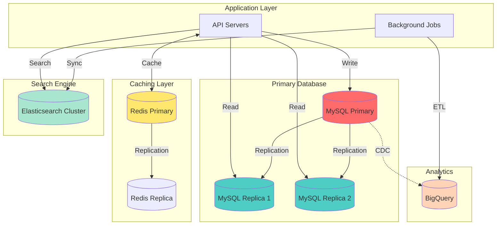
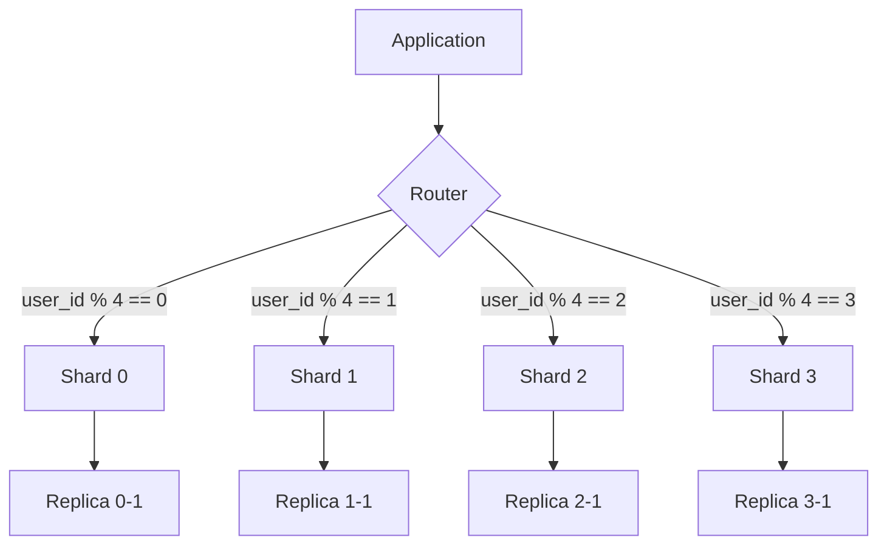

# Database Architecture & Schema Design

## Overview

### 데이터베이스 전략
- **Primary**: MySQL 8.0 (트랜잭션 데이터)
- **Caching**: Redis 7.0 (세션, 캐시)
- **Search**: Elasticsearch 8.x (상품 검색)
- **Analytics**: BigQuery (데이터 웨어하우스)

### 설계 원칙
1. **정규화 vs 비정규화**: OLTP는 3NF, 읽기 최적화는 선택적 비정규화
2. **파티셔닝**: 대용량 테이블은 날짜 기준 파티션
3. **인덱스 전략**: Covering Index 우선, 쓰기 성능 고려
4. **샤딩 준비**: user_id 기준 샤딩 가능하도록 설계

## Database Architecture



## Core Schema

### Users & Authentication

#### users table
```sql
CREATE TABLE users (
    -- Primary Key
    id VARCHAR(36) PRIMARY KEY COMMENT 'UUID v4',

    -- Authentication
    email VARCHAR(255) UNIQUE NOT NULL,
    password_hash VARCHAR(255) COMMENT 'bcrypt hash, nullable for social login',
    email_verified BOOLEAN DEFAULT FALSE,
    email_verification_token VARCHAR(100),
    email_verification_expires_at TIMESTAMP,

    -- Profile
    name VARCHAR(100) NOT NULL,
    phone VARCHAR(20),
    birth_date DATE,
    gender ENUM('male', 'female', 'other', 'prefer_not_to_say'),
    profile_image_url VARCHAR(500),

    -- Security
    two_factor_enabled BOOLEAN DEFAULT FALSE,
    two_factor_secret VARCHAR(255),
    backup_codes JSON COMMENT 'encrypted backup codes',

    -- Status
    status ENUM('active', 'suspended', 'deleted') DEFAULT 'active',
    role ENUM('customer', 'seller', 'admin') DEFAULT 'customer',

    -- Timestamps
    created_at TIMESTAMP DEFAULT CURRENT_TIMESTAMP,
    updated_at TIMESTAMP DEFAULT CURRENT_TIMESTAMP ON UPDATE CURRENT_TIMESTAMP,
    last_login_at TIMESTAMP,
    deleted_at TIMESTAMP COMMENT 'soft delete',

    -- Indexes
    INDEX idx_email (email),
    INDEX idx_status (status),
    INDEX idx_created_at (created_at)
) ENGINE=InnoDB DEFAULT CHARSET=utf8mb4 COLLATE=utf8mb4_unicode_ci
COMMENT='사용자 기본 정보';
```

#### oauth_providers table
```sql
CREATE TABLE oauth_providers (
    id VARCHAR(36) PRIMARY KEY,
    user_id VARCHAR(36) NOT NULL,
    provider ENUM('kakao', 'naver', 'google', 'apple', 'facebook') NOT NULL,
    provider_user_id VARCHAR(255) NOT NULL,

    -- OAuth Tokens
    access_token TEXT,
    refresh_token TEXT,
    expires_at TIMESTAMP,

    -- Provider Profile Data
    profile_data JSON COMMENT 'raw profile data from provider',

    created_at TIMESTAMP DEFAULT CURRENT_TIMESTAMP,
    updated_at TIMESTAMP DEFAULT CURRENT_TIMESTAMP ON UPDATE CURRENT_TIMESTAMP,

    FOREIGN KEY (user_id) REFERENCES users(id) ON DELETE CASCADE,
    UNIQUE KEY unique_provider (provider, provider_user_id),
    INDEX idx_user_id (user_id)
) ENGINE=InnoDB DEFAULT CHARSET=utf8mb4 COLLATE=utf8mb4_unicode_ci
COMMENT='소셜 로그인 연동 정보';
```

#### user_addresses table
```sql
CREATE TABLE user_addresses (
    id VARCHAR(36) PRIMARY KEY,
    user_id VARCHAR(36) NOT NULL,

    -- Address Info
    name VARCHAR(100) NOT NULL COMMENT '받는 사람',
    phone VARCHAR(20) NOT NULL,
    zip_code VARCHAR(10) NOT NULL,
    address VARCHAR(500) NOT NULL,
    address_detail VARCHAR(500),

    -- Flags
    is_default BOOLEAN DEFAULT FALSE,

    created_at TIMESTAMP DEFAULT CURRENT_TIMESTAMP,
    updated_at TIMESTAMP DEFAULT CURRENT_TIMESTAMP ON UPDATE CURRENT_TIMESTAMP,

    FOREIGN KEY (user_id) REFERENCES users(id) ON DELETE CASCADE,
    INDEX idx_user_id (user_id),
    INDEX idx_default (user_id, is_default)
) ENGINE=InnoDB DEFAULT CHARSET=utf8mb4 COLLATE=utf8mb4_unicode_ci
COMMENT='사용자 배송지 목록';
```

### Products & Catalog

#### categories table
```sql
CREATE TABLE categories (
    id VARCHAR(36) PRIMARY KEY,
    parent_id VARCHAR(36) COMMENT 'null for root categories',

    -- Category Info
    name VARCHAR(100) NOT NULL,
    slug VARCHAR(100) UNIQUE NOT NULL,
    description TEXT,
    image_url VARCHAR(500),

    -- Display
    display_order INT DEFAULT 0,
    is_visible BOOLEAN DEFAULT TRUE,

    -- SEO
    meta_title VARCHAR(100),
    meta_description VARCHAR(200),

    created_at TIMESTAMP DEFAULT CURRENT_TIMESTAMP,
    updated_at TIMESTAMP DEFAULT CURRENT_TIMESTAMP ON UPDATE CURRENT_TIMESTAMP,

    FOREIGN KEY (parent_id) REFERENCES categories(id) ON DELETE SET NULL,
    INDEX idx_parent_id (parent_id),
    INDEX idx_slug (slug),
    INDEX idx_display_order (display_order)
) ENGINE=InnoDB DEFAULT CHARSET=utf8mb4 COLLATE=utf8mb4_unicode_ci
COMMENT='상품 카테고리 (계층 구조)';
```

#### brands table
```sql
CREATE TABLE brands (
    id VARCHAR(36) PRIMARY KEY,
    name VARCHAR(100) UNIQUE NOT NULL,
    slug VARCHAR(100) UNIQUE NOT NULL,
    logo_url VARCHAR(500),
    description TEXT,
    website_url VARCHAR(500),

    -- Status
    is_active BOOLEAN DEFAULT TRUE,

    created_at TIMESTAMP DEFAULT CURRENT_TIMESTAMP,
    updated_at TIMESTAMP DEFAULT CURRENT_TIMESTAMP ON UPDATE CURRENT_TIMESTAMP,

    INDEX idx_slug (slug)
) ENGINE=InnoDB DEFAULT CHARSET=utf8mb4 COLLATE=utf8mb4_unicode_ci
COMMENT='브랜드 정보';
```

#### products table
```sql
CREATE TABLE products (
    id VARCHAR(36) PRIMARY KEY,
    seller_id VARCHAR(36) NOT NULL COMMENT '판매자 (users.id)',
    category_id VARCHAR(36),
    brand_id VARCHAR(36),

    -- Basic Info
    name VARCHAR(300) NOT NULL,
    slug VARCHAR(300) UNIQUE NOT NULL,
    description TEXT,
    short_description VARCHAR(500),

    -- Pricing
    price INT NOT NULL COMMENT '판매가 (원)',
    original_price INT COMMENT '정가 (할인 전)',
    cost_price INT COMMENT '원가 (내부용)',

    -- Inventory
    stock_quantity INT DEFAULT 0,
    low_stock_threshold INT DEFAULT 10,
    sku VARCHAR(100) UNIQUE COMMENT 'Stock Keeping Unit',
    barcode VARCHAR(100),

    -- Attributes
    weight INT COMMENT '무게 (g)',
    dimensions JSON COMMENT '{"width": 10, "height": 20, "depth": 5} (cm)',

    -- Media
    images JSON COMMENT '["url1", "url2", ...]',
    video_url VARCHAR(500),

    -- Status
    status ENUM('draft', 'active', 'out_of_stock', 'discontinued') DEFAULT 'draft',
    is_featured BOOLEAN DEFAULT FALSE,

    -- SEO
    meta_title VARCHAR(100),
    meta_description VARCHAR(200),
    meta_keywords JSON,

    -- Stats (denormalized for performance)
    view_count INT DEFAULT 0,
    sale_count INT DEFAULT 0,
    review_count INT DEFAULT 0,
    average_rating DECIMAL(3,2) DEFAULT 0.00,

    -- Timestamps
    created_at TIMESTAMP DEFAULT CURRENT_TIMESTAMP,
    updated_at TIMESTAMP DEFAULT CURRENT_TIMESTAMP ON UPDATE CURRENT_TIMESTAMP,
    published_at TIMESTAMP,

    FOREIGN KEY (seller_id) REFERENCES users(id),
    FOREIGN KEY (category_id) REFERENCES categories(id) ON DELETE SET NULL,
    FOREIGN KEY (brand_id) REFERENCES brands(id) ON DELETE SET NULL,

    INDEX idx_seller_id (seller_id),
    INDEX idx_category_id (category_id),
    INDEX idx_brand_id (brand_id),
    INDEX idx_slug (slug),
    INDEX idx_status (status),
    INDEX idx_price (price),
    INDEX idx_created_at (created_at),
    INDEX idx_sale_count (sale_count),
    INDEX idx_average_rating (average_rating),

    -- Covering index for product listing
    INDEX idx_listing (status, category_id, created_at)
        INCLUDE (name, price, images, average_rating)
) ENGINE=InnoDB DEFAULT CHARSET=utf8mb4 COLLATE=utf8mb4_unicode_ci
COMMENT='상품 마스터';
```

#### product_variants table
```sql
CREATE TABLE product_variants (
    id VARCHAR(36) PRIMARY KEY,
    product_id VARCHAR(36) NOT NULL,

    -- Variant Info
    name VARCHAR(200) NOT NULL COMMENT 'e.g., "화이트 / M"',
    sku VARCHAR(100) UNIQUE,

    -- Pricing Override
    price INT COMMENT 'null이면 product.price 사용',
    original_price INT,

    -- Inventory
    stock_quantity INT DEFAULT 0,

    -- Options (JSON for flexibility)
    options JSON COMMENT '{"color": "화이트", "size": "M"}',

    -- Media
    image_url VARCHAR(500),

    -- Status
    is_active BOOLEAN DEFAULT TRUE,

    created_at TIMESTAMP DEFAULT CURRENT_TIMESTAMP,
    updated_at TIMESTAMP DEFAULT CURRENT_TIMESTAMP ON UPDATE CURRENT_TIMESTAMP,

    FOREIGN KEY (product_id) REFERENCES products(id) ON DELETE CASCADE,
    INDEX idx_product_id (product_id),
    INDEX idx_sku (sku)
) ENGINE=InnoDB DEFAULT CHARSET=utf8mb4 COLLATE=utf8mb4_unicode_ci
COMMENT='상품 옵션 (색상, 사이즈 등)';
```

### Shopping Cart

#### carts table
```sql
CREATE TABLE carts (
    id VARCHAR(36) PRIMARY KEY,
    user_id VARCHAR(36) COMMENT 'null for guest',
    session_id VARCHAR(100) COMMENT 'for guest carts',

    -- Metadata
    merged_at TIMESTAMP COMMENT 'guest cart merged to user cart',

    created_at TIMESTAMP DEFAULT CURRENT_TIMESTAMP,
    updated_at TIMESTAMP DEFAULT CURRENT_TIMESTAMP ON UPDATE CURRENT_TIMESTAMP,
    expires_at TIMESTAMP COMMENT '30 days for guest, null for users',

    UNIQUE KEY unique_user (user_id),
    INDEX idx_session_id (session_id),
    INDEX idx_expires_at (expires_at)
) ENGINE=InnoDB DEFAULT CHARSET=utf8mb4 COLLATE=utf8mb4_unicode_ci
COMMENT='장바구니';
```

#### cart_items table
```sql
CREATE TABLE cart_items (
    id VARCHAR(36) PRIMARY KEY,
    cart_id VARCHAR(36) NOT NULL,
    product_id VARCHAR(36) NOT NULL,
    variant_id VARCHAR(36) COMMENT 'null for products without variants',

    -- Purchase Info
    quantity INT NOT NULL DEFAULT 1,
    price INT NOT NULL COMMENT 'snapshot price at time of add',

    -- Flags
    is_selected BOOLEAN DEFAULT TRUE COMMENT 'for partial checkout',

    added_at TIMESTAMP DEFAULT CURRENT_TIMESTAMP,
    updated_at TIMESTAMP DEFAULT CURRENT_TIMESTAMP ON UPDATE CURRENT_TIMESTAMP,

    FOREIGN KEY (cart_id) REFERENCES carts(id) ON DELETE CASCADE,
    FOREIGN KEY (product_id) REFERENCES products(id) ON DELETE CASCADE,
    FOREIGN KEY (variant_id) REFERENCES product_variants(id) ON DELETE CASCADE,

    INDEX idx_cart_id (cart_id),
    UNIQUE KEY unique_cart_product (cart_id, product_id, variant_id)
) ENGINE=InnoDB DEFAULT CHARSET=utf8mb4 COLLATE=utf8mb4_unicode_ci
COMMENT='장바구니 상품';
```

### Orders & Payments

#### orders table
```sql
CREATE TABLE orders (
    -- Primary Key
    id VARCHAR(36) PRIMARY KEY,
    order_number VARCHAR(20) UNIQUE NOT NULL COMMENT 'human-readable order number',

    -- Relations
    user_id VARCHAR(36) NOT NULL,

    -- Status
    status ENUM(
        'pending',        -- 주문 생성
        'payment_pending',-- 결제 대기
        'paid',           -- 결제 완료
        'preparing',      -- 배송 준비
        'shipped',        -- 배송 중
        'delivered',      -- 배송 완료
        'cancelled',      -- 취소
        'refund_requested',-- 환불 요청
        'refunded'        -- 환불 완료
    ) DEFAULT 'pending',

    -- Pricing
    subtotal INT NOT NULL COMMENT '상품 합계',
    shipping_fee INT NOT NULL DEFAULT 0,
    discount INT DEFAULT 0 COMMENT '쿠폰 할인',
    tax INT DEFAULT 0,
    total INT NOT NULL COMMENT '최종 결제 금액',

    -- Shipping Address (snapshot)
    shipping_name VARCHAR(100) NOT NULL,
    shipping_phone VARCHAR(20) NOT NULL,
    shipping_zip_code VARCHAR(10) NOT NULL,
    shipping_address VARCHAR(500) NOT NULL,
    shipping_address_detail VARCHAR(500),
    delivery_request TEXT,

    -- Payment Info
    payment_method VARCHAR(50),
    payment_pg VARCHAR(50) COMMENT 'PG사: tosspayments, kakaopay 등',

    -- Coupon
    coupon_id VARCHAR(36),
    coupon_discount INT DEFAULT 0,

    -- Timestamps
    created_at TIMESTAMP DEFAULT CURRENT_TIMESTAMP,
    updated_at TIMESTAMP DEFAULT CURRENT_TIMESTAMP ON UPDATE CURRENT_TIMESTAMP,
    paid_at TIMESTAMP,
    shipped_at TIMESTAMP,
    delivered_at TIMESTAMP,
    cancelled_at TIMESTAMP,

    FOREIGN KEY (user_id) REFERENCES users(id),
    INDEX idx_user_id (user_id),
    INDEX idx_order_number (order_number),
    INDEX idx_status (status),
    INDEX idx_created_at (created_at),

    -- Composite index for user order history
    INDEX idx_user_orders (user_id, created_at DESC)
) ENGINE=InnoDB DEFAULT CHARSET=utf8mb4 COLLATE=utf8mb4_unicode_ci
COMMENT='주문';

-- Partitioning by date (monthly)
PARTITION BY RANGE (YEAR(created_at) * 100 + MONTH(created_at)) (
    PARTITION p202601 VALUES LESS THAN (202602),
    PARTITION p202602 VALUES LESS THAN (202603),
    PARTITION p202603 VALUES LESS THAN (202604),
    PARTITION pmax VALUES LESS THAN MAXVALUE
);
```

#### order_items table
```sql
CREATE TABLE order_items (
    id VARCHAR(36) PRIMARY KEY,
    order_id VARCHAR(36) NOT NULL,

    -- Product Snapshot
    product_id VARCHAR(36) NOT NULL,
    variant_id VARCHAR(36),
    product_name VARCHAR(300) NOT NULL,
    variant_name VARCHAR(200),
    sku VARCHAR(100),

    -- Pricing Snapshot
    price INT NOT NULL COMMENT '단가',
    quantity INT NOT NULL,
    subtotal INT NOT NULL COMMENT 'price * quantity',

    -- Product Info Snapshot
    product_image VARCHAR(500),
    product_options JSON,

    -- Fulfillment
    status ENUM('pending', 'prepared', 'shipped', 'delivered', 'cancelled', 'refunded') DEFAULT 'pending',

    created_at TIMESTAMP DEFAULT CURRENT_TIMESTAMP,
    updated_at TIMESTAMP DEFAULT CURRENT_TIMESTAMP ON UPDATE CURRENT_TIMESTAMP,

    FOREIGN KEY (order_id) REFERENCES orders(id) ON DELETE CASCADE,
    FOREIGN KEY (product_id) REFERENCES products(id),
    INDEX idx_order_id (order_id),
    INDEX idx_product_id (product_id)
) ENGINE=InnoDB DEFAULT CHARSET=utf8mb4 COLLATE=utf8mb4_unicode_ci
COMMENT='주문 상품 (스냅샷)';
```

#### payments table
```sql
CREATE TABLE payments (
    id VARCHAR(36) PRIMARY KEY,
    order_id VARCHAR(36) NOT NULL,

    -- PG Info
    pg_provider VARCHAR(50) NOT NULL COMMENT 'tosspayments, kakaopay, etc',
    pg_transaction_id VARCHAR(200) UNIQUE COMMENT 'PG사 거래 ID',

    -- Amount
    amount INT NOT NULL,

    -- Status
    status ENUM(
        'pending',      -- 결제 시작
        'authorized',   -- 인증 완료 (카드 승인)
        'captured',     -- 결제 완료 (매출 전표)
        'failed',       -- 실패
        'cancelled',    -- 취소
        'partial_refunded', -- 부분 환불
        'refunded'      -- 전액 환불
    ) DEFAULT 'pending',

    -- Method
    payment_method VARCHAR(50) COMMENT 'card, transfer, kakaopay, etc',

    -- Card Info (masked)
    card_info JSON COMMENT '{"type": "credit", "company": "신한", "number": "1234-****-****-5678"}',

    -- Error Info
    error_code VARCHAR(50),
    error_message TEXT,

    -- Timestamps
    created_at TIMESTAMP DEFAULT CURRENT_TIMESTAMP,
    updated_at TIMESTAMP DEFAULT CURRENT_TIMESTAMP ON UPDATE CURRENT_TIMESTAMP,
    authorized_at TIMESTAMP,
    captured_at TIMESTAMP,
    cancelled_at TIMESTAMP,

    FOREIGN KEY (order_id) REFERENCES orders(id),
    INDEX idx_order_id (order_id),
    INDEX idx_pg_transaction_id (pg_transaction_id),
    INDEX idx_status (status)
) ENGINE=InnoDB DEFAULT CHARSET=utf8mb4 COLLATE=utf8mb4_unicode_ci
COMMENT='결제';
```

## Denormalization Strategy

### 성능을 위한 비정규화

#### products 테이블의 통계 필드
```sql
-- 정규화된 설계라면 별도 테이블이지만, 읽기 성능을 위해 비정규화
view_count INT DEFAULT 0,
sale_count INT DEFAULT 0,
review_count INT DEFAULT 0,
average_rating DECIMAL(3,2) DEFAULT 0.00
```

**업데이트 전략**
```sql
-- 리뷰 작성 시 트리거
DELIMITER //
CREATE TRIGGER after_review_insert
AFTER INSERT ON reviews
FOR EACH ROW
BEGIN
    UPDATE products
    SET
        review_count = review_count + 1,
        average_rating = (
            SELECT AVG(rating)
            FROM reviews
            WHERE product_id = NEW.product_id
        )
    WHERE id = NEW.product_id;
END//
DELIMITER ;
```

## Indexing Strategy

### 인덱스 설계 원칙
1. **Covering Index**: SELECT 절의 모든 컬럼 포함
2. **Cardinality**: 선택도가 높은 컬럼 우선
3. **Query Pattern**: 실제 쿼리 패턴 분석 기반

### 예시: 상품 목록 조회 최적화

```sql
-- Bad: 여러 인덱스를 개별로
CREATE INDEX idx_status ON products(status);
CREATE INDEX idx_category ON products(category_id);

-- Good: Composite covering index
CREATE INDEX idx_listing ON products(status, category_id, created_at)
    INCLUDE (name, price, images, average_rating);
```

**효과**
- Index-only scan 가능
- 테이블 접근 없이 인덱스만으로 결과 반환
- 10배 이상 속도 향상

## Sharding Strategy

### Sharding Key: user_id



### 샤딩 대상 테이블
- `orders` (user_id 기준)
- `carts` (user_id 기준)
- `user_addresses` (user_id 기준)
- `reviews` (user_id 기준)

### 글로벌 테이블 (샤딩 안 함)
- `products` (모든 샤드에서 복제)
- `categories`
- `brands`

## Backup & Disaster Recovery

### 백업 전략

#### 1. Full Backup (Daily)
```bash
# 매일 01:00 UTC
mysqldump --all-databases --single-transaction \
  --master-data=2 --routines --triggers \
  | gzip > /backup/full_$(date +%Y%m%d).sql.gz
```

#### 2. Incremental Backup (Hourly)
```bash
# Binary log 기반
mysqlbinlog /var/log/mysql/mysql-bin.* \
  --start-datetime="2026-02-19 00:00:00" \
  | gzip > /backup/incr_$(date +%Y%m%d%H).sql.gz
```

#### 3. Point-in-Time Recovery
```bash
# 특정 시점으로 복구
mysql < /backup/full_20260219.sql.gz
mysqlbinlog --stop-datetime="2026-02-19 14:30:00" \
  /var/log/mysql/mysql-bin.000001 | mysql
```

### RTO/RPO 목표
- **RTO (Recovery Time Objective)**: 1시간
- **RPO (Recovery Point Objective)**: 5분

---

**문서 버전**: 1.0
**최종 업데이트**: 2026-02-19
**작성자**: Database Team
