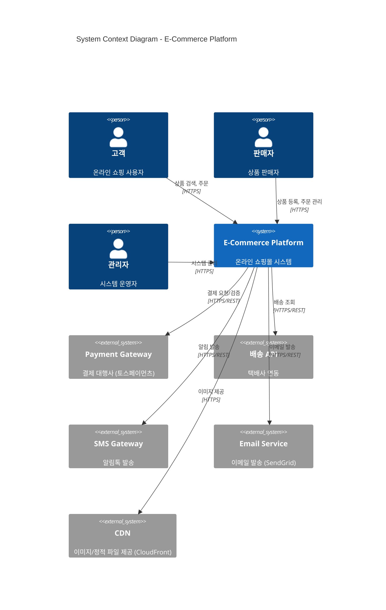
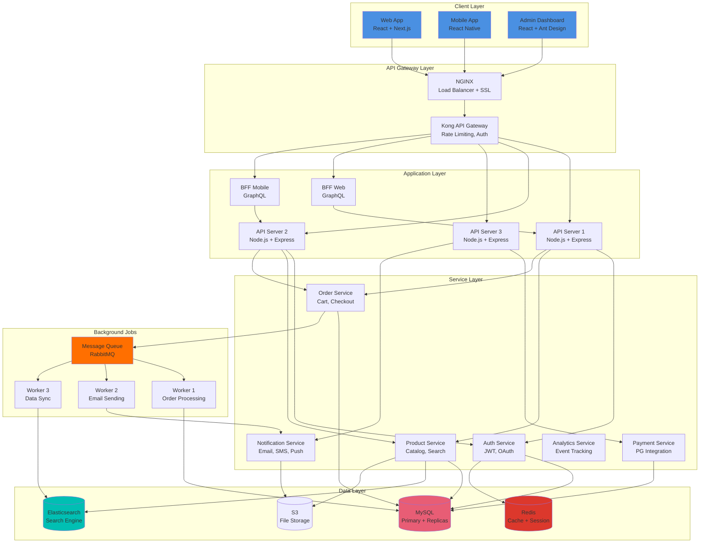
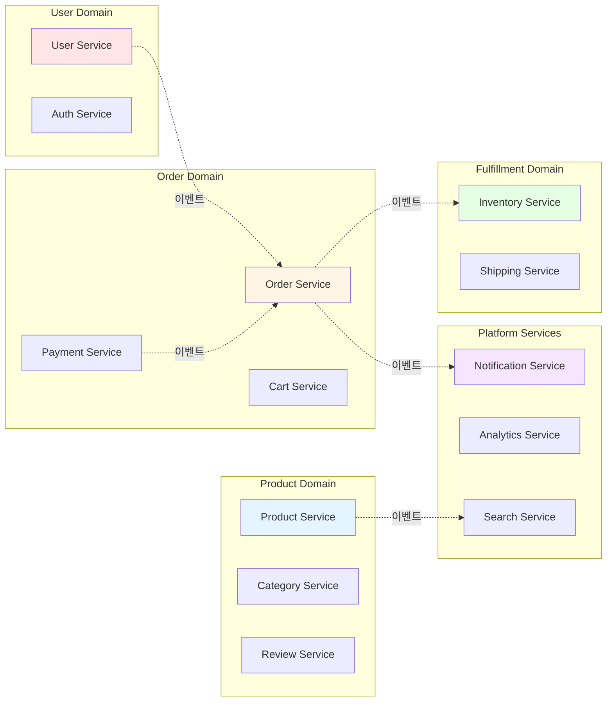
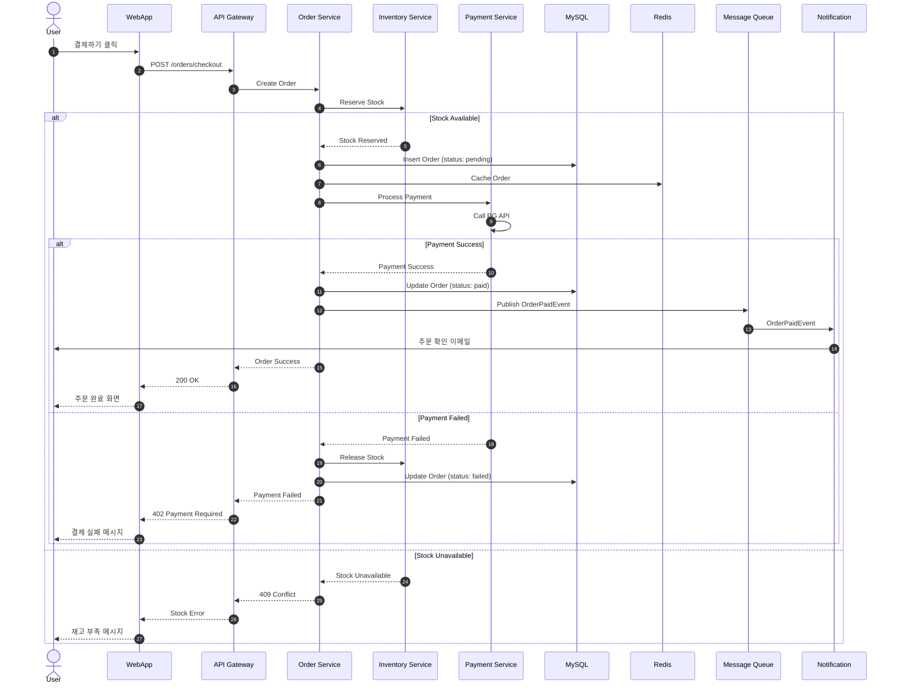
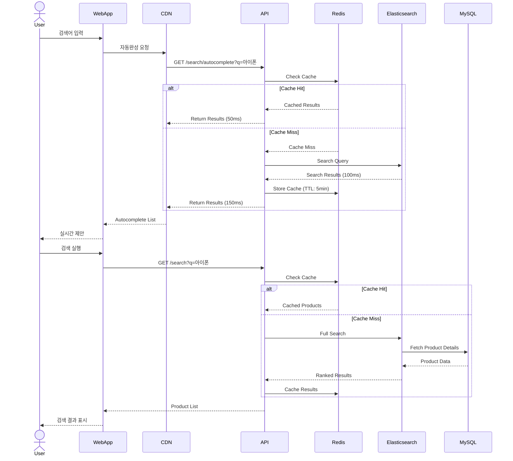
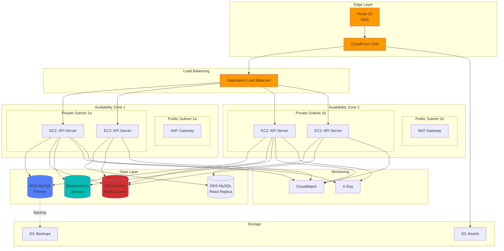
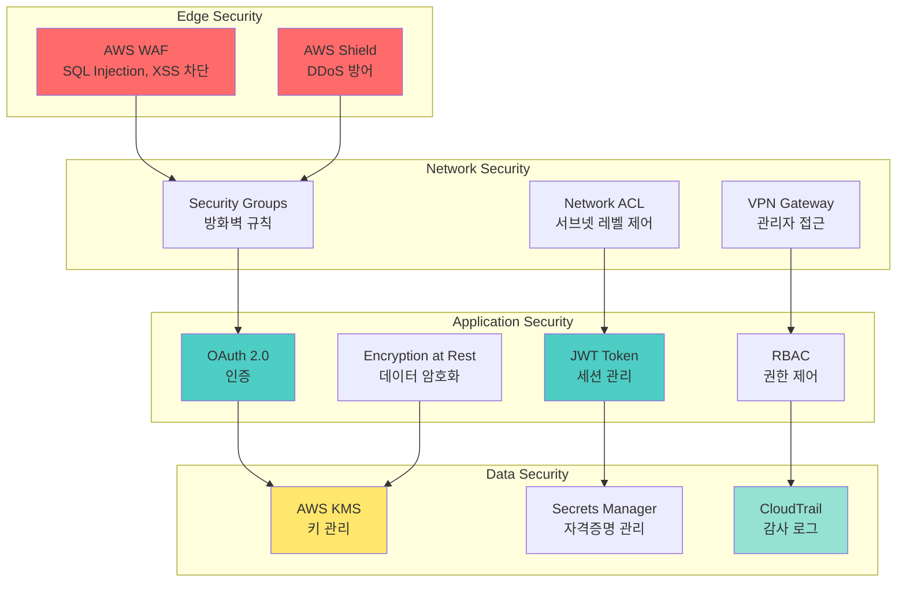
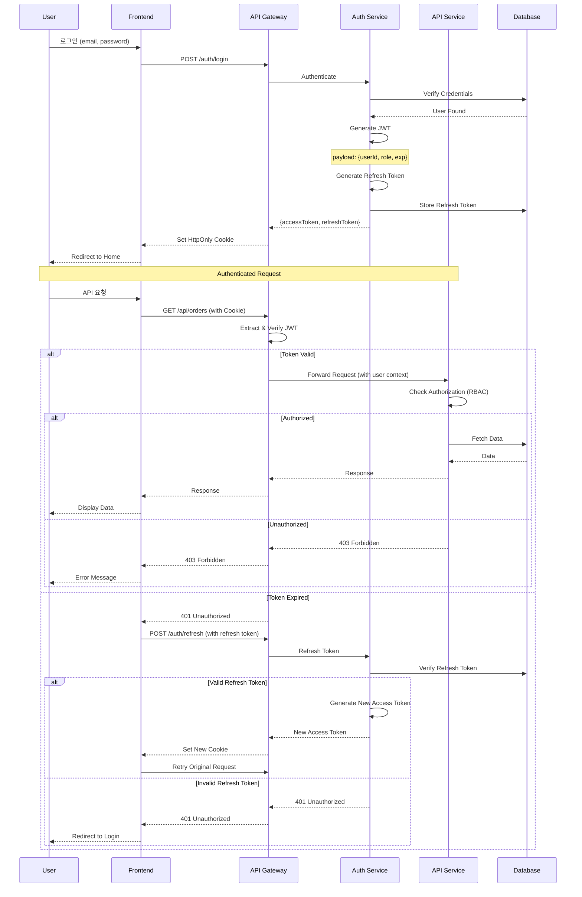
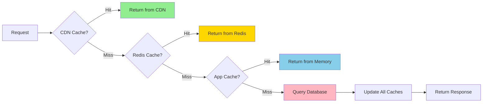
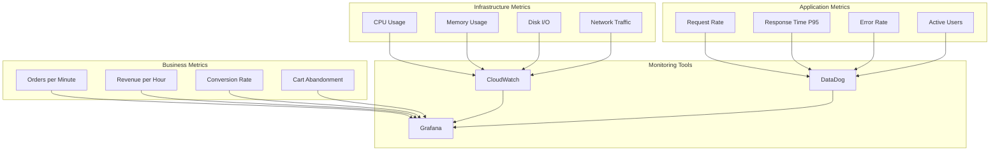

# System Architecture

## High-Level Architecture



## Container Diagram



## Microservices Architecture (Phase 2 목표)

### Service Decomposition



### 서비스 간 통신

#### Synchronous (REST/gRPC)
```
Order Service --> Payment Service (결제 요청)
Order Service --> Inventory Service (재고 확인)
Product Service --> Review Service (리뷰 조회)
```

#### Asynchronous (Message Queue)
```
Order Placed Event --> Notification Service (주문 확인 이메일)
Order Placed Event --> Analytics Service (이벤트 트래킹)
Payment Completed Event --> Order Service (주문 상태 업데이트)
```

## Data Flow Architecture

### 주문 플로우 (Order Flow)



### 상품 검색 플로우



## Infrastructure Architecture

### AWS Architecture



### Kubernetes Architecture (Phase 2)

```yaml
# 마이크로서비스 배포 구조
apiVersion: v1
kind: Namespace
metadata:
  name: ecommerce-production

---
# API Server Deployment
apiVersion: apps/v1
kind: Deployment
metadata:
  name: api-server
  namespace: ecommerce-production
spec:
  replicas: 5
  selector:
    matchLabels:
      app: api-server
  template:
    metadata:
      labels:
        app: api-server
        version: v1.2.3
    spec:
      containers:
      - name: api
        image: ecommerce/api-server:1.2.3
        ports:
        - containerPort: 3000
        env:
        - name: NODE_ENV
          value: "production"
        - name: DB_HOST
          valueFrom:
            secretKeyRef:
              name: db-credentials
              key: host
        resources:
          requests:
            memory: "512Mi"
            cpu: "500m"
          limits:
            memory: "1Gi"
            cpu: "1000m"
        livenessProbe:
          httpGet:
            path: /health
            port: 3000
          initialDelaySeconds: 30
          periodSeconds: 10
        readinessProbe:
          httpGet:
            path: /ready
            port: 3000
          initialDelaySeconds: 10
          periodSeconds: 5

---
# Horizontal Pod Autoscaler
apiVersion: autoscaling/v2
kind: HorizontalPodAutoscaler
metadata:
  name: api-server-hpa
  namespace: ecommerce-production
spec:
  scaleTargetRef:
    apiVersion: apps/v1
    kind: Deployment
    name: api-server
  minReplicas: 3
  maxReplicas: 20
  metrics:
  - type: Resource
    resource:
      name: cpu
      target:
        type: Utilization
        averageUtilization: 70
  - type: Resource
    resource:
      name: memory
      target:
        type: Utilization
        averageUtilization: 80
```

## Security Architecture

### 보안 계층



### 인증/인가 플로우



## Performance & Scalability

### 캐싱 전략



#### 캐시 레이어별 전략

| 레이어 | 대상 | TTL | 무효화 전략 |
|--------|------|-----|-------------|
| CDN | 정적 파일, 이미지 | 1년 | 파일명 해시 |
| Redis | API 응답, 세션 | 5-60분 | 데이터 변경 시 |
| Application | 설정, 메타데이터 | 10분 | 재시작 시 |

### 확장성 패턴

#### Horizontal Scaling
```
현재: 3 API Servers
트래픽 증가 시: Auto Scaling → 20 Servers
```

#### Database Scaling
```
Read: Primary + 2 Read Replicas
Write: Primary Only
Future: Sharding (user_id 기준)
```

#### Message Queue
```
비동기 처리: RabbitMQ
- 이메일 발송
- 데이터 동기화
- 이미지 리사이징
```

## Monitoring & Observability

### Metrics



### Distributed Tracing

```javascript
// X-Ray를 통한 요청 추적
const AWSXRay = require('aws-xray-sdk-core');
const http = AWSXRay.captureHTTPs(require('http'));

app.get('/api/orders/:id', async (req, res) => {
  const segment = AWSXRay.getSegment();
  const subsegment = segment.addNewSubsegment('fetch-order');

  try {
    // Database Query (traced)
    subsegment.addAnnotation('orderId', req.params.id);
    const order = await db.query('SELECT * FROM orders WHERE id = ?', [req.params.id]);

    // External API Call (traced)
    const shipping = await axios.get(`https://shipping-api/track/${order.trackingNumber}`);

    res.json({ order, shipping });
  } catch (error) {
    subsegment.addError(error);
    throw error;
  } finally {
    subsegment.close();
  }
});
```

## Disaster Recovery

### 백업 전략
- **Database**: Daily full backup + hourly incremental
- **Files**: S3 versioning + cross-region replication
- **Config**: Git repository + encrypted secrets

### RTO/RPO
- **RTO (Recovery Time Objective)**: 1시간
- **RPO (Recovery Point Objective)**: 5분

### Failover Plan
1. CloudWatch 알람 → PagerDuty
2. 자동 Failover (RDS Multi-AZ)
3. 수동 DR 사이트 활성화 (1시간 이내)

---

**문서 버전**: 2.0
**최종 업데이트**: 2026-02-19
**작성자**: Architecture Team
**검토자**: CTO, DevOps Lead
