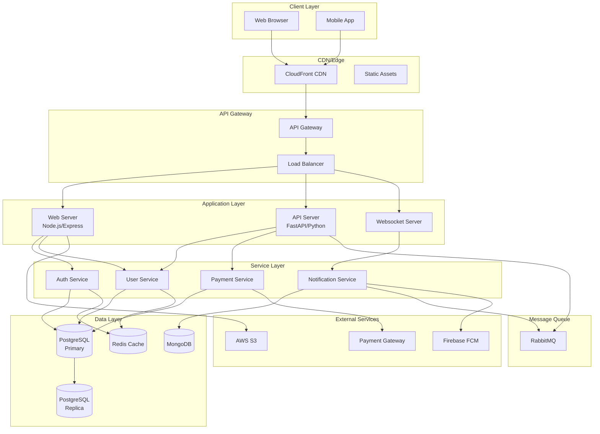
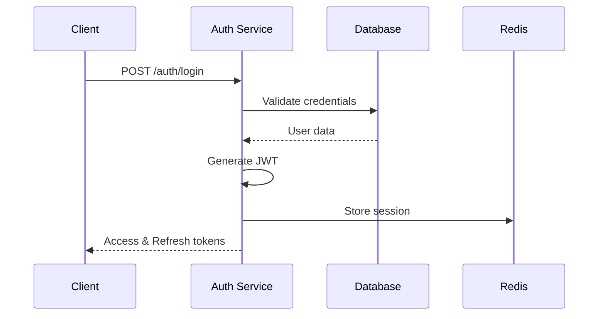
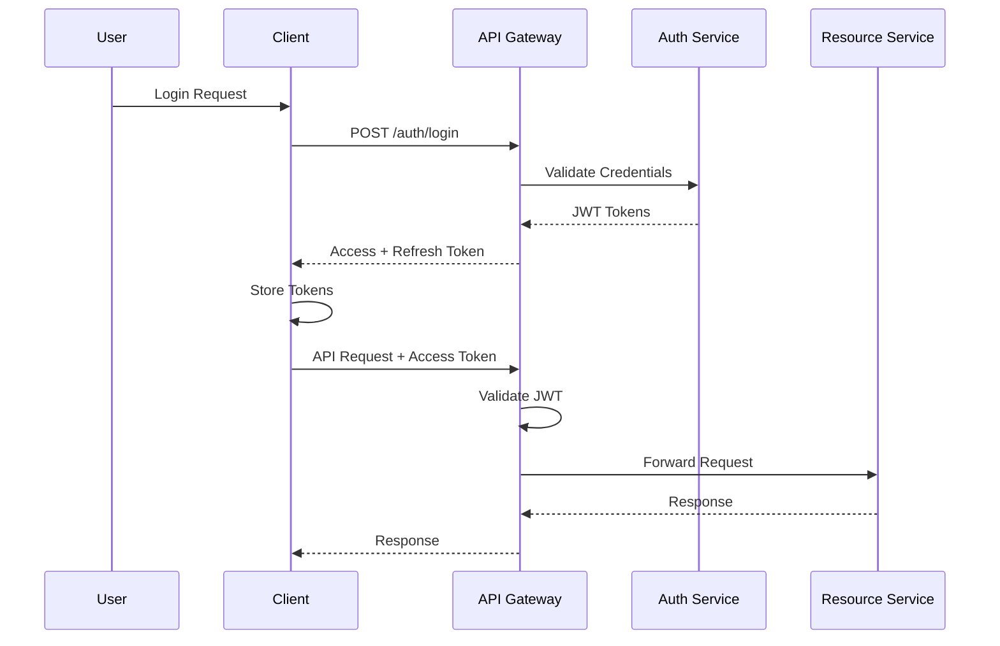

# System Architecture Design

## High-Level Architecture



---

## Technology Stack

### Frontend

| Technology | Version | Purpose |
|------------|---------|---------|
| React | 18.2+ | UI Framework |
| TypeScript | 5.0+ | Type Safety |
| Vite | 4.0+ | Build Tool |
| Tailwind CSS | 3.0+ | Styling |
| Redux Toolkit | 1.9+ | State Management |
| React Query | 4.0+ | Server State |

### Backend

| Technology | Version | Purpose |
|------------|---------|---------|
| Node.js | 20 LTS | Web Server |
| Express | 4.18+ | API Framework |
| Python | 3.11+ | Backend Services |
| FastAPI | 0.104+ | API Framework |
| Celery | 5.3+ | Task Queue |

### Database

| Technology | Version | Purpose |
|------------|---------|---------|
| PostgreSQL | 15+ | Primary Database |
| Redis | 7.0+ | Cache & Sessions |
| MongoDB | 6.0+ | Document Store |
| Elasticsearch | 8.0+ | Search Engine |

### Infrastructure

| Technology | Purpose |
|------------|---------|
| Docker | Containerization |
| Kubernetes | Orchestration |
| Terraform | IaC |
| AWS | Cloud Provider |
| GitHub Actions | CI/CD |

---

## System Components

### 1. API Gateway

**Responsibilities:**
- Request routing
- Rate limiting
- Authentication/Authorization
- Request/Response transformation
- API versioning

**Implementation:**
```yaml
apiVersion: networking.k8s.io/v1
kind: Ingress
metadata:
  name: api-gateway
  annotations:
    nginx.ingress.kubernetes.io/rate-limit: "100"
spec:
  rules:
  - host: api.example.com
    http:
      paths:
      - path: /v1
        backend:
          service:
            name: api-v1
            port: 8000
```

### 2. Authentication Service

**Features:**
- JWT token generation/validation
- OAuth 2.0 integration
- Session management
- Multi-factor authentication

**Flow:**


### 3. Caching Strategy

**Multi-Level Caching:**

```
┌─────────────┐
│   Browser   │  Local Storage, IndexedDB
└──────┬──────┘
       │
┌──────▼──────┐
│     CDN     │  CloudFront, 1 hour TTL
└──────┬──────┘
       │
┌──────▼──────┐
│  API Server │  Memory Cache, 5 min TTL
└──────┬──────┘
       │
┌──────▼──────┐
│    Redis    │  Distributed Cache, 1 hour TTL
└──────┬──────┘
       │
┌──────▼──────┐
│  Database   │  PostgreSQL
└─────────────┘
```

**Cache Invalidation:**
- Write-through for user data
- Cache-aside for read-heavy data
- TTL-based expiration
- Event-driven invalidation

---

## Scalability

### Horizontal Scaling

**Auto-scaling Configuration:**
```yaml
apiVersion: autoscaling/v2
kind: HorizontalPodAutoscaler
metadata:
  name: api-server
spec:
  scaleTargetRef:
    apiVersion: apps/v1
    kind: Deployment
    name: api-server
  minReplicas: 3
  maxReplicas: 20
  metrics:
  - type: Resource
    resource:
      name: cpu
      target:
        type: Utilization
        averageUtilization: 70
```

### Database Scaling

**Read Replicas:**
- Primary for writes
- Multiple replicas for reads
- Automatic failover
- Connection pooling

**Sharding Strategy:**
- User-based sharding by user_id
- Geographic sharding for global users
- Feature-based sharding for isolation

---

## Reliability

### Circuit Breaker

```typescript
class CircuitBreaker {
  private failures = 0;
  private state = 'CLOSED'; // CLOSED, OPEN, HALF_OPEN
  private readonly threshold = 5;
  private readonly timeout = 60000; // 1 minute

  async call(fn: () => Promise<any>) {
    if (this.state === 'OPEN') {
      if (Date.now() - this.lastFailure > this.timeout) {
        this.state = 'HALF_OPEN';
      } else {
        throw new Error('Circuit breaker is OPEN');
      }
    }

    try {
      const result = await fn();
      this.onSuccess();
      return result;
    } catch (error) {
      this.onFailure();
      throw error;
    }
  }

  private onSuccess() {
    this.failures = 0;
    this.state = 'CLOSED';
  }

  private onFailure() {
    this.failures++;
    this.lastFailure = Date.now();
    if (this.failures >= this.threshold) {
      this.state = 'OPEN';
    }
  }
}
```

### Retry Strategy

- Exponential backoff
- Jitter to prevent thundering herd
- Max retry attempts: 3
- Idempotency for safe retries

---

## Security

### Security Layers

1. **Network Level**
   - VPC with private subnets
   - Security groups
   - WAF rules
   - DDoS protection

2. **Application Level**
   - Input validation
   - SQL injection prevention
   - XSS protection
   - CSRF tokens

3. **Data Level**
   - Encryption at rest (AES-256)
   - Encryption in transit (TLS 1.3)
   - PII data masking
   - Audit logging

### Authentication Flow



---

## Monitoring & Observability

### Metrics

**Application Metrics:**
- Request rate (req/s)
- Error rate (%)
- Response time (p50, p95, p99)
- Active users
- Database query time

**Infrastructure Metrics:**
- CPU utilization
- Memory usage
- Disk I/O
- Network bandwidth

### Logging

**Structured Logging:**
```json
{
  "timestamp": "2024-02-18T00:00:00Z",
  "level": "INFO",
  "service": "api-server",
  "trace_id": "abc123",
  "user_id": "user-456",
  "method": "GET",
  "path": "/api/users/123",
  "status": 200,
  "duration_ms": 45,
  "message": "Request completed successfully"
}
```

### Distributed Tracing

```
┌─────────────┐
│   API GW    │ ──────┐
└─────────────┘       │
       │              │
       │ span_id: 1   │ trace_id: abc123
       ▼              │
┌─────────────┐       │
│ Auth Service│       │
└─────────────┘       │
       │              │
       │ span_id: 2   │
       ▼              │
┌─────────────┐       │
│  Database   │ ◄─────┘
└─────────────┘
   span_id: 3
```

---

## Disaster Recovery

### Backup Strategy

- **Database**: Daily full backup, hourly incremental
- **Files**: Continuous replication to S3
- **Configuration**: Version controlled in Git
- **Recovery Time Objective (RTO)**: 1 hour
- **Recovery Point Objective (RPO)**: 5 minutes

### High Availability

- Multi-AZ deployment
- Active-active configuration
- Automatic failover
- Health checks every 30 seconds
- 99.99% uptime SLA
