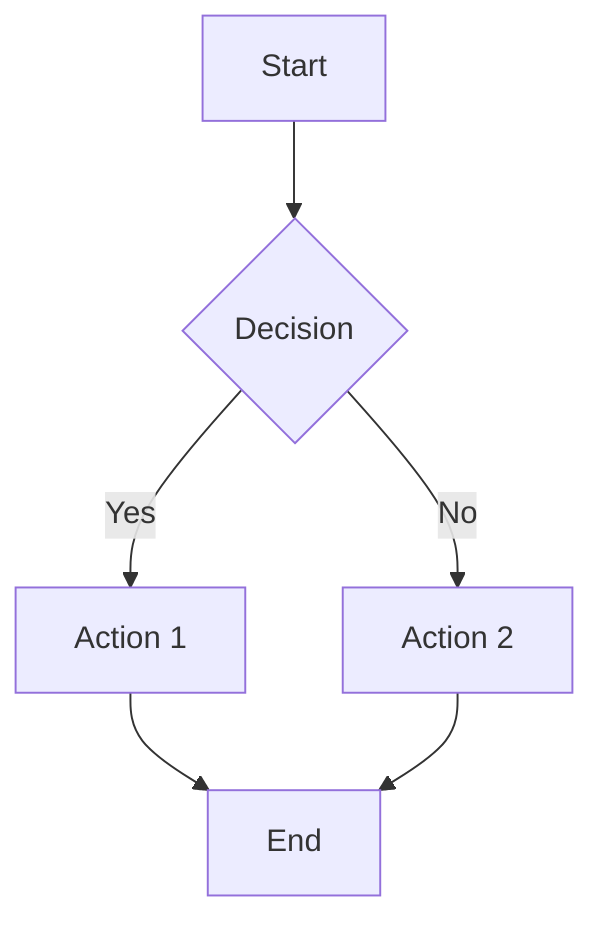

# Welcome to Reveal.js

This is your first slide using markdown!

---

## Features

- 📊 Easy slide creation with `---`
- 🎨 Multiple themes available
- 🖼️ Support for images and code
- 📈 Mermaid diagrams supported

---

## Code Example

Here's some JavaScript:

```javascript
function greet(name) {
  console.log(`Hello, ${name}!`);
}

greet('World');
```

---

## Lists and Content

1. First item
2. Second item
3. Third item

- Bullet point A
- Bullet point B
- Bullet point C

---

## Mermaid Diagram



---

## Images

You can add images to your slides:


---

## Keyboard Shortcuts

- **Space / Arrow keys**: Navigate slides
- **F**: Fullscreen
- **Esc**: Overview mode
- **S**: Speaker notes (if enabled)

---

## Thank You!

Questions?

Navigate with arrow keys or swipe on touch devices.
