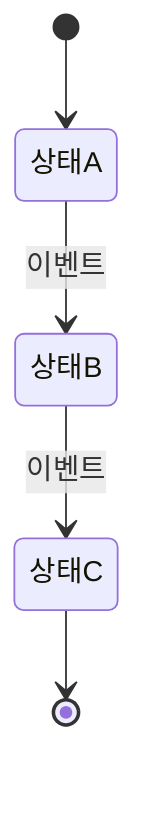

# 피그마 없이 기획하기
## 기능정의서 + HTML 스켈레톤으로 완성하는 화면 정의 워크플로우

---

## 왜 피그마를 대체할 수 있는가?

피그마의 핵심 역할은 두 가지다.

1. **"화면이 어떻게 생겼는지" 전달** — 레이아웃, 컴포넌트 배치
2. **"어떻게 동작하는지" 전달** — 인터랙션, 상태 변화

문제는 피그마가 이 두 가지를 **시각적 픽셀**에 묶어버린다는 점이다. 폰트 크기 하나 바뀌면 개발자가 일일이 확인해야 하고, 상태 변화는 별도 프로토타입을 만들어야 한다. 문서와 화면이 분리되어 있어서 항상 최신 상태인지 알 수 없다.

**대안: 기능정의서(Markdown) + HTML 스켈레톤**

- 기능 정책은 마크다운으로 → Git으로 버전 관리, 리뷰, 히스토리 추적
- 화면 구조는 HTML로 → 실제 브라우저에서 렌더링, 반응형 즉시 확인
- 두 파일을 같은 폴더에 두고 **화면 미리보기 연동** → 문서 안에서 화면을 직접 확인

> **화면 미리보기 연동이란?**
> 마크다운 기획서 최상단 `frontmatter`에 HTML 경로를 지정하면, 오른쪽 사이드바에 **화면 미리보기** 버튼이 나타난다.
> 버튼을 클릭하면 모달에서 해당 화면을 **모바일 / 태블릿 / 데스크톱** 크기로 즉시 확인할 수 있다.

---

## 기능정의서에 반드시 들어가야 하는 8가지

HTML까지 안정적으로 뽑으려면 **화면(또는 컴포넌트) 단위**로 아래 8가지가 있어야 한다.

| # | 항목 | 없으면 생기는 문제 |
|---|------|--------------------|
| 1 | **목적 / 사용자 시나리오** | 화면의 존재 이유를 모름. 불필요한 요소 넣게 됨 |
| 2 | **권한별 가능/불가** | 비회원에게 관리자 버튼 노출, 로그인 후 리다이렉트 누락 |
| 3 | **상태 머신** | 같은 화면이 상태에 따라 다르게 보여야 하는데 한 가지만 구현 |
| 4 | **필드 정의** | 필수값 빠짐, 표시 조건 누락, 길이 초과 처리 없음 |
| 5 | **행동(CTA) 정의** | 버튼 클릭 후 무슨 일이 일어나는지 아무도 모름 |
| 6 | **에러/예외 처리** | API 실패, 빈 데이터, 권한 없음 화면 없음 |
| 7 | **알림/사이드이펙트** | 캘린더 등록 시 알림 발송 같은 후속 동작 누락 |
| 8 | **API 계약 (최소 I/O)** | 이게 없으면 HTML은 영원히 더미로 끝남 |

이 8개가 채워지면 HTML은 **"충분히 반영된 수준"**까지 완성된다.

---

## 파일 구조 — 한 폴더에 문서와 화면을 함께

```
source/planning/
├── S01_home.md                  ← 기능정의서 (마크다운)
├── S02_login.md
├── S03_competition_detail.md
└── screens/                     ← HTML 스켈레톤
    ├── home.html
    ├── login.html
    └── competition-detail.html
```

### frontmatter 전체 필드 설명

```yaml
---
title: 문서 제목           # 필수
screen: screens/home.html  # 단일 화면 — 현재 파일 기준 상대경로
screens:                   # 복수 화면 (screen 대신 사용)
  - url: screens/step1.html
    label: "1단계 - 입력"
  - url: screens/step2.html
    label: "2단계 - 확인"
figma: https://figma.com/... # Figma 링크 (선택 — 병행 사용 시)
status: draft               # draft | review | confirmed | dev | done
version: "1.0.0"            # 문서 버전 (선택)
---
```

### `screen` vs `screens`

- `screen` — 단일 HTML 파일 연동. 사이드바에 미리보기 버튼 1개 표시.
- `screens` — 복수 HTML 파일 연동. 사이드바에서 탭으로 전환하며 확인 가능.

복수 화면 예시 (단계별 플로우):

```yaml
screens:
  - url: screens/payment-step1.html
    label: "1단계 - 배송지 입력"
  - url: screens/payment-step2.html
    label: "2단계 - 결제 수단"
  - url: screens/payment-step3.html
    label: "3단계 - 최종 확인"
```

### `status` 값 안내

| 값 | 표시 | 의미 |
|----|------|------|
| `draft` | 초안 | 작성 중인 초안 |
| `review` | 검토중 | 리뷰 요청 단계 |
| `confirmed` | 확정 | 기획 확정 완료 |
| `dev` | 개발중 | 개발팀 구현 중 |
| `done` | 완료 | 개발 및 배포 완료 |

### 경로 작성 규칙

| 방식 | 예시 | 설명 |
|------|------|------|
| 상대경로 | `screens/home.html` | 현재 마크다운 파일 위치 기준 **(권장)** |
| 절대경로 | `/planning/screens/home.html` | source 루트(`/`) 기준 |
| 외부 URL | `https://staging.example.com` | 외부 주소 그대로 사용 |

> **팁**: 기획서와 HTML 목업을 같은 폴더에 두고 상대경로로 연결하면 폴더를 옮겨도 경로가 깨지지 않는다.

---

## 기능정의서 작성 템플릿

아래 템플릿을 복사해서 화면 단위로 하나씩 찍어낸다.

```markdown
---
title: [화면명] 기획서
screen: screens/[파일명].html
status: draft
version: "1.0.0"
---

# [화면명] 기획서

## 1. 개요

| 항목 | 내용 |
|------|------|
| 화면 ID | S00 |
| 화면명 | |
| 담당 기획자 | |
| 최초 작성일 | YYYY-MM-DD |
| 최종 수정일 | YYYY-MM-DD |

## 2. 목적 / 사용자 시나리오

> 이 화면은 누가, 어떤 상황에서, 무엇을 하기 위해 진입하는가?

**주요 시나리오:**
- 시나리오 A: …
- 시나리오 B: …

## 3. 권한별 접근 정책

| 사용자 유형 | 접근 | 표시 내용 | 비고 |
|------------|------|-----------|------|
| 비회원 | ✅ 가능 | 읽기 전용, CTA → 로그인 유도 | |
| 일반 회원 | ✅ 가능 | 전체 기능 | |
| 정지된 회원 | ❌ 불가 | 접근 차단 페이지 표시 | |
| 관리자 | ✅ 가능 | 관리자 전용 버튼 추가 노출 | |

## 4. 상태 머신

> 화면 또는 핵심 데이터가 가질 수 있는 모든 상태를 나열한다.



| 상태 | 표시 | 가능한 행동 |
|------|------|------------|
| 상태A | | |
| 상태B | | |

## 5. 컴포넌트별 필드 정의

### 5.1 [컴포넌트명]

| 필드명 | 필수 | 표시 조건 | 포맷 / 제한 | 비고 |
|--------|------|-----------|-------------|------|
| 제목 | 필수 | 항상 | 최대 50자 | |
| 부제목 | 선택 | 값 있을 때만 | 최대 100자 | |
| 상태 배지 | 필수 | 항상 | 열거형 | 상태 머신 참고 |

## 6. 행동(CTA) 정의

| 버튼/액션 | 노출 조건 | 클릭 시 동작 | 성공 처리 | 실패 처리 |
|-----------|-----------|--------------|-----------|-----------|
| 참가 신청 | 접수중 상태 + 로그인 | POST /api/apply | 신청 완료 토스트 | 에러 메시지 |
| 좋아요 | 로그인 | PATCH /api/like | 아이콘 즉시 토글 | 원상 복구 |
| 삭제 | 관리자만 | 확인 다이얼로그 → DELETE | 목록으로 이동 | 에러 토스트 |

## 7. 에러 / 예외 처리

| 상황 | 표시 방식 | 처리 내용 |
|------|-----------|-----------|
| API 서버 에러 (5xx) | 전체 화면 에러 | "잠시 후 다시 시도해주세요" + 재시도 버튼 |
| 데이터 없음 (404) | 빈 상태 컴포넌트 | "존재하지 않는 페이지입니다" + 홈으로 이동 |
| 권한 없음 (403) | 접근 차단 페이지 | "접근 권한이 없습니다" |
| 네트워크 오류 | 인라인 에러 | "인터넷 연결을 확인해주세요" |
| 빈 목록 | 빈 상태 UI | 안내 문구 + 행동 유도 버튼 |

## 8. 알림 / 사이드이펙트

| 트리거 | 알림 채널 | 내용 | 대상 |
|--------|-----------|------|------|
| 신청 완료 | 이메일 | 신청 확인 메일 | 신청자 |
| 신청 완료 | 앱 푸시 | "신청이 완료되었습니다" | 신청자 |
| 상태 변경 (관리자) | 이메일 | 상태 변경 알림 | 신청자 전체 |
| D-7 | 앱 푸시 | "7일 후 시작됩니다" | 북마크한 사용자 |

## 9. API 계약 (최소 I/O)

### GET /api/items/:id

**Response (성공 200)**
```json
{
  "id": "string",
  "title": "string",
  "status": "draft | active | closed",
  "createdAt": "ISO8601",
  "author": { "id": "string", "name": "string" }
}
```

**Response (실패)**
- `404` — 존재하지 않는 항목
- `403` — 접근 권한 없음

### POST /api/items/:id/apply

**Request Body**
```json
{ "userId": "string" }
```

**Response (성공 201)**
```json
{ "applyId": "string", "status": "pending" }
```

## 10. 변경 이력

| 버전 | 날짜 | 변경 내용 | 작성자 |
|------|------|----------|--------|
| 1.0.0 | YYYY-MM-DD | 최초 작성 | |
```

---

## HTML 스켈레톤 작성 원칙

기능정의서가 완성되면 HTML 스켈레톤을 작성한다. 이때 **컴포넌트 단위로 분리**하는 것이 핵심이다.

### 화면을 컴포넌트로 쪼개기

통으로 만들면 반드시 누락이 생긴다. 예: 대회 상세 화면

```
CompetitionHeader     ← 제목 / 상태 배지 / 대표 이미지
CompetitionMeta       ← 일자 / 접수기간 / 장소 / 참가비
Actions               ← 좋아요 / 북마크 / 캘린더 등록 / 신청 버튼
CommentList           ← 댓글 목록 (Empty State 포함)
CommentForm           ← 댓글 입력 (로그인 여부에 따라 분기)
ErrorState            ← API 실패 / 404 / 403 화면
```

각 컴포넌트에 **상태별 UI**를 HTML 주석으로 표시해두면 개발자가 곧바로 구현에 들어갈 수 있다.

### HTML 스켈레톤 예시 구조

```html
<!DOCTYPE html>
<html lang="ko">
<head>
  <meta charset="UTF-8">
  <meta name="viewport" content="width=device-width, initial-scale=1.0">
  <title>[화면명] 목업</title>
  <style>
    /* 목업 전용 최소 스타일 — 실제 디자인 시스템과 무관 */
    *, *::before, *::after { box-sizing: border-box; margin: 0; padding: 0; }
    body { font-family: -apple-system, sans-serif; background: #f5f5f5; color: #1a1a1a; }
  </style>
</head>
<body>

  <!-- ================================
       CompetitionHeader
       상태: 접수중 (접수예정/마감/종료 등 상태별 배지 색상 변경)
  ================================ -->
  <header class="comp-header">
    <span class="status-badge status-open">접수중</span>
    <h1>2025 스프링 해커톤</h1>
    
  </header>

  <!-- ================================
       CompetitionMeta
       필드: 일자/접수기간/장소/참가비
       [참가비 없음 → "무료" 표시]
  ================================ -->
  <section class="comp-meta">
    <!-- ... -->
  </section>

  <!-- ================================
       Actions
       [비회원] 좋아요X / 신청 버튼 → 로그인 유도
       [로그인] 좋아요O / 신청 가능
       [이미 신청] 신청 버튼 비활성화 + "신청완료" 텍스트
       [마감] 신청 버튼 비활성화 + "접수 마감" 텍스트
  ================================ -->
  <section class="comp-actions">
    <!-- ... -->
  </section>

  <!-- ================================
       ErrorState (숨김 처리 → 필요 시 노출)
  ================================ -->
  <div class="error-state" style="display:none">
    <p>존재하지 않는 페이지입니다.</p>
    <a href="/">홈으로 이동</a>
  </div>

</body>
</html>
```

---

## 상태별 HTML 목업 전환 패턴

HTML 단일 파일에서 여러 상태를 표현하는 방법은 두 가지다.

### 방법 A — `frontmatter`의 `screens` 배열 활용 (권장)

상태마다 별도 HTML 파일을 만들고 마크다운에서 탭으로 전환한다.

```yaml
screens:
  - url: screens/competition-open.html
    label: "접수중 상태"
  - url: screens/competition-closed.html
    label: "마감 상태"
  - url: screens/competition-empty.html
    label: "빈 상태 / 에러"
```

**장점**: 각 상태가 독립적으로 명확하다. 리뷰어가 탭을 클릭해 즉시 비교 가능.

### 방법 B — 단일 HTML에서 JavaScript로 전환

HTML 파일 상단에 토글 버튼을 달아두고 상태를 전환한다.

```html
<!-- 목업 전용 상태 토글 (실제 구현 아님) -->
<div class="mock-controls" style="background:#fef3c7; padding:8px; text-align:center; font-size:12px;">
  상태 전환:
  <button onclick="setStatus('open')">접수중</button>
  <button onclick="setStatus('closed')">마감</button>
  <button onclick="setStatus('empty')">빈 상태</button>
</div>
```

**장점**: 파일 하나로 관리. **단점**: HTML이 복잡해짐.

---

## 피그마 vs. 기능정의서+HTML 비교

| 항목 | 피그마 | 기능정의서 + HTML |
|------|--------|-------------------|
| 버전 관리 | 피그마 내부 히스토리 | Git — diff/blame/PR 리뷰 |
| 실제 브라우저 확인 | 불가 (프로토타입 별도) | 가능 (iframe 미리보기) |
| 반응형 확인 | 별도 프레임 필요 | 브라우저 크기 조절 즉시 |
| 정책 문서 연동 | 별도 노션/컨플루언스 | 같은 파일에 정의 |
| 개발 핸드오프 | Zeplin / Dev Mode | HTML 스켈레톤 직접 전달 |
| 협업 리뷰 | 피그마 댓글 | Git PR 코멘트 |
| 비용 | 유료 (팀플랜) | 무료 (Git 기반) |
| 학습 난이도 | 피그마 툴 숙지 필요 | 마크다운 + 기본 HTML |

---

## 실전 워크플로우 — 기획자가 따라하는 순서

```
1. 화면 ID 부여
   S01_home, S02_login, S03_competition_detail …

2. 기능정의서 작성 (마크다운)
   위 템플릿의 8가지 항목을 채운다.
   상태 머신은 mermaid stateDiagram으로 그린다.

3. HTML 스켈레톤 작성
   컴포넌트 단위로 분리한다.
   각 컴포넌트에 상태 조건을 HTML 주석으로 명시한다.
   실제 스타일보다 레이아웃과 구조에 집중한다.

4. frontmatter 연동
   마크다운 최상단에 screen: 또는 screens: 경로를 지정한다.
   status를 현재 단계에 맞게 설정한다.

5. Git으로 커밋 & 리뷰 요청
   PR을 열고 팀원에게 리뷰 요청한다.
   PR 댓글로 피드백 → 수정 → 머지.

6. status를 confirmed로 변경
   개발팀 핸드오프 완료.
   이후 수정은 버전 올리고 변경 이력에 기록.
```

---

## 자주 묻는 질문

**Q. HTML을 직접 짜야 하나? 기획자가 코딩을 못하면?**

A. 기본 HTML 구조(div, h1, p, button)만 알면 충분하다. 목업 HTML은 "실제 동작하는 코드"가 아니라 "배치와 흐름을 보여주는 스케치"다. CSS는 인라인 style로 최소한만 적어도 된다. 모르는 부분은 AI(Claude 등)에게 컴포넌트별로 요청하면 빠르게 생성할 수 있다.

**Q. 피그마처럼 정교한 디자인은 어떻게?**

A. 기획 단계에서 정교한 디자인은 필요 없다. 기획서의 HTML은 **레이아웃과 정책을 전달하는 도구**다. 정교한 비주얼 디자인은 디자이너가 이 HTML을 기반으로 Figma에서 작업하거나, 실제 코드에서 디자인 시스템을 적용하면 된다.

**Q. 기획이 바뀌면 HTML도 같이 수정해야 하나?**

A. 그렇다. 하지만 이것이 오히려 장점이다. 기획이 바뀌면 HTML도 바뀌고, Git diff로 무엇이 변경됐는지 한눈에 보인다. 피그마에서 변경사항을 놓치는 일이 없어진다.

**Q. 상태가 너무 많아서 HTML 파일이 복잡해진다.**

A. `screens` 배열 방식으로 상태마다 파일을 분리하는 것을 권장한다. 파일이 여러 개여도 Git으로 한꺼번에 관리되고, 리뷰어는 탭으로 빠르게 전환하며 확인할 수 있다.

---

## 참고 문서

- [홈 화면 기획서 예시](../planning/01-home) — 완성된 기획서 + 단일 화면 연동 샘플
- [상품 목록 기획서 예시](../planning/03-product-list) — 복수 화면(`screens`) 연동 샘플
- [Mermaid 다이어그램 가이드](./mermaid-examples) — 상태 머신, 플로우차트 작성법
