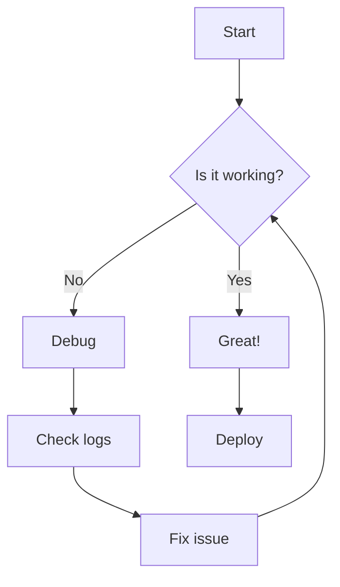
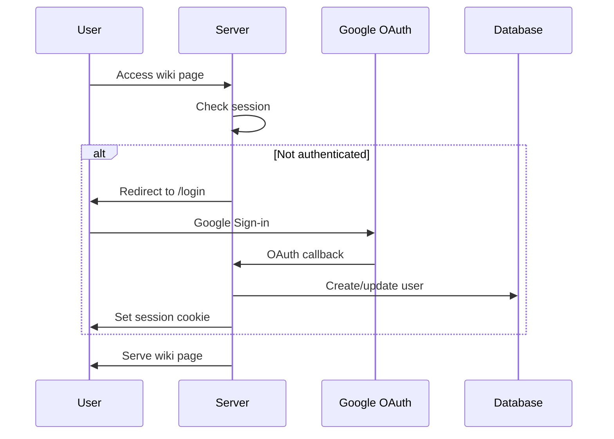
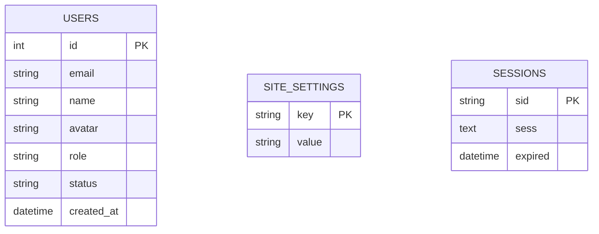
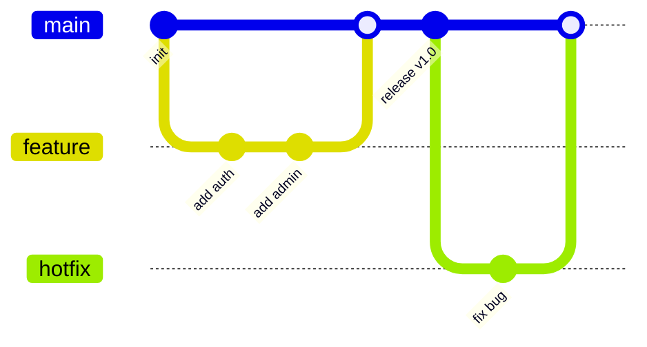
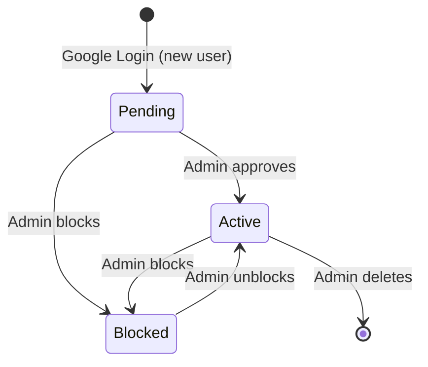
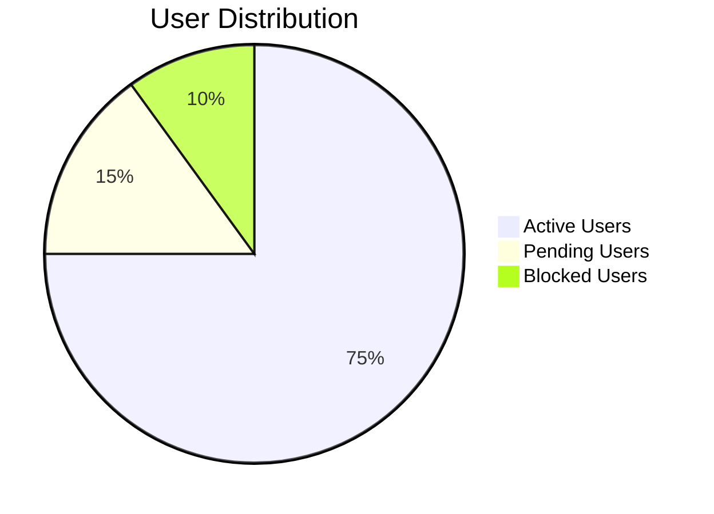

## Flowchart

```mermaid
flowchart TD
    A[Start] --> B{Is it working?}
    B -->|Yes| C[Great!]
    B -->|No| D[Debug]
    D --> E[Check logs]
    E --> F[Fix issue]
    F --> B
    C --> G[Deploy]
```

## Sequence Diagram

```mermaid
sequenceDiagram
    participant U as User
    participant S as Server
    participant G as Google OAuth
    participant DB as Database

    U->>S: Access wiki page
    S->>S: Check session
    alt Not authenticated
        S->>U: Redirect to /login
        U->>G: Google Sign-in
        G->>S: OAuth callback
        S->>DB: Create/update user
        S->>U: Set session cookie
    end
    S->>U: Serve wiki page
```

## Entity Relationship Diagram

```mermaid
erDiagram
    USERS {
        int id PK
        string email
        string name
        string avatar
        string role
        string status
        datetime created_at
    }
    SITE_SETTINGS {
        string key PK
        string value
    }
    SESSIONS {
        string sid PK
        text sess
        datetime expired
    }
```

## Git Graph

```mermaid
gitGraph
    commit id: "init"
    branch feature
    checkout feature
    commit id: "add auth"
    commit id: "add admin"
    checkout main
    merge feature
    commit id: "release v1.0"
    branch hotfix
    commit id: "fix bug"
    checkout main
    merge hotfix
```

## State Diagram

```mermaid
stateDiagram-v2
    [*] --> Pending : Google Login (new user)
    Pending --> Active : Admin approves
    Pending --> Blocked : Admin blocks
    Active --> Blocked : Admin blocks
    Blocked --> Active : Admin unblocks
    Active --> [*] : Admin deletes
```

## Pie Chart

```mermaid
pie title User Distribution
    "Active Users" : 75
    "Pending Users" : 15
    "Blocked Users" : 10
```
