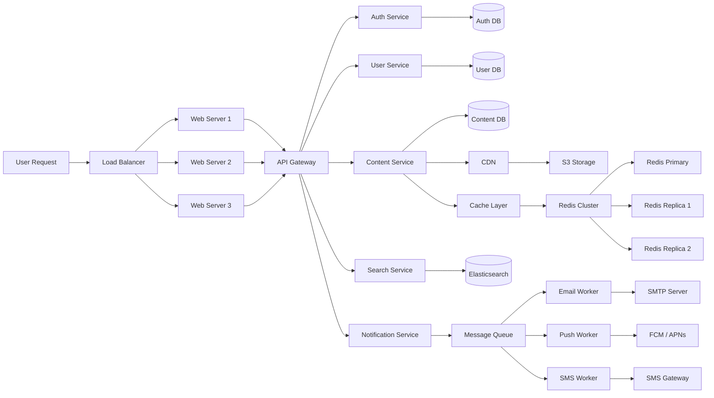
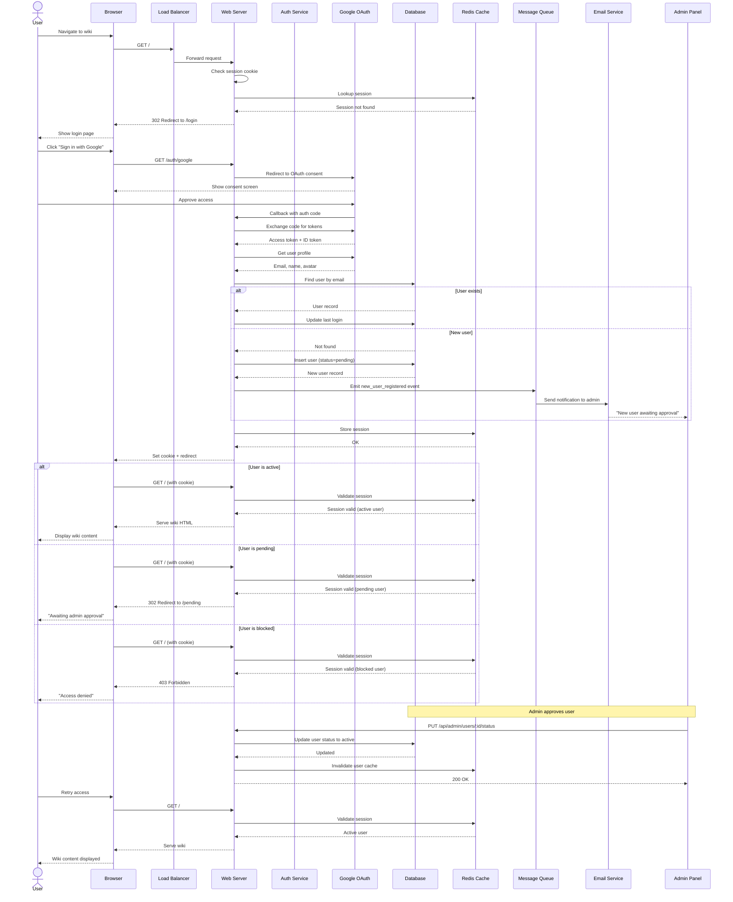
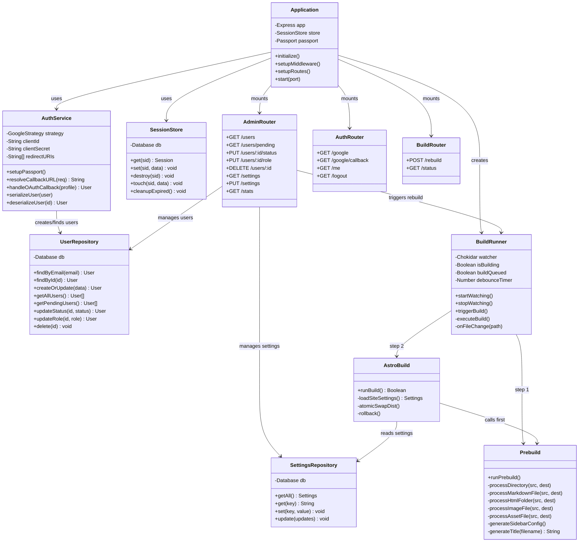
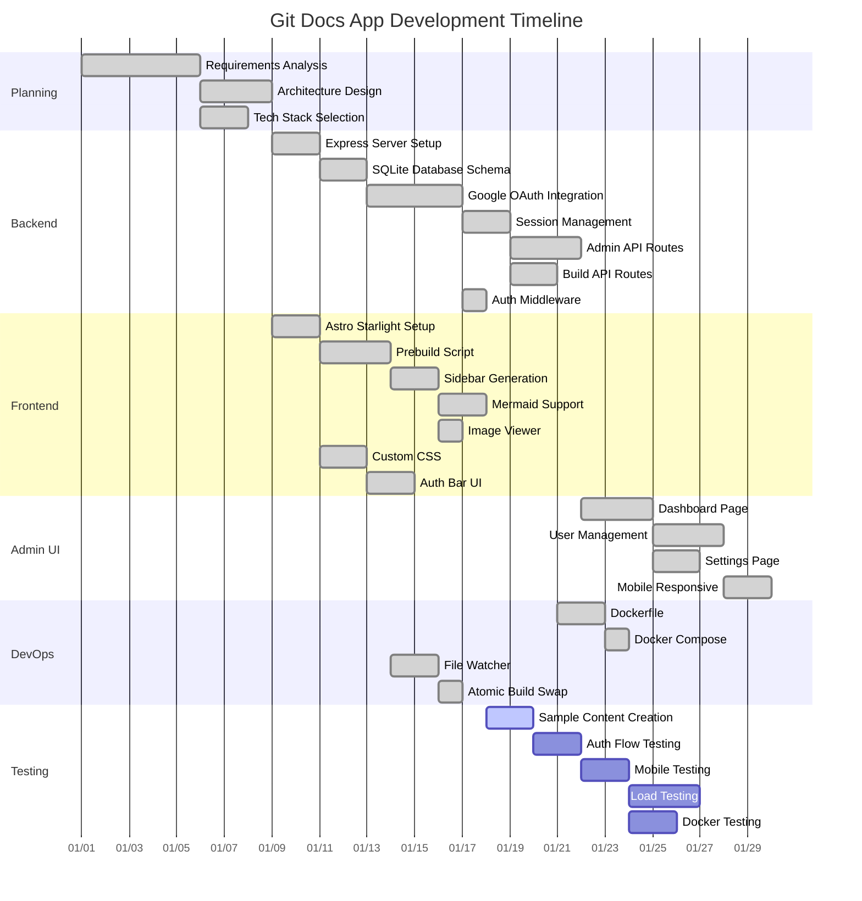

## Wide Flowchart (Horizontal Scroll Test)

```mermaid
flowchart LR
    A[User Request] --> B[Load Balancer]
    B --> C[Web Server 1]
    B --> D[Web Server 2]
    B --> E[Web Server 3]
    C --> F[API Gateway]
    D --> F
    E --> F
    F --> G[Auth Service]
    F --> H[User Service]
    F --> I[Content Service]
    F --> J[Search Service]
    F --> K[Notification Service]
    G --> L[(Auth DB)]
    H --> M[(User DB)]
    I --> N[(Content DB)]
    J --> O[(Elasticsearch)]
    K --> P[Message Queue]
    P --> Q[Email Worker]
    P --> R[Push Worker]
    P --> S[SMS Worker]
    Q --> T[SMTP Server]
    R --> U[FCM / APNs]
    S --> V[SMS Gateway]
    I --> W[CDN]
    W --> X[S3 Storage]
    I --> Y[Cache Layer]
    Y --> Z[Redis Cluster]
    Z --> Z1[Redis Primary]
    Z --> Z2[Redis Replica 1]
    Z --> Z3[Redis Replica 2]
```

## Tall Sequence Diagram (Vertical Scroll Test)

```mermaid
sequenceDiagram
    actor User
    participant Browser
    participant LB as Load Balancer
    participant Web as Web Server
    participant Auth as Auth Service
    participant Google as Google OAuth
    participant DB as Database
    participant Cache as Redis Cache
    participant Queue as Message Queue
    participant Email as Email Service
    participant Admin as Admin Panel

    User->>Browser: Navigate to wiki
    Browser->>LB: GET /
    LB->>Web: Forward request
    Web->>Web: Check session cookie
    Web->>Cache: Lookup session
    Cache-->>Web: Session not found
    Web-->>Browser: 302 Redirect to /login
    Browser-->>User: Show login page

    User->>Browser: Click "Sign in with Google"
    Browser->>Web: GET /auth/google
    Web->>Google: Redirect to OAuth consent
    Google-->>Browser: Show consent screen
    User->>Google: Approve access
    Google->>Web: Callback with auth code
    Web->>Google: Exchange code for tokens
    Google-->>Web: Access token + ID token
    Web->>Google: Get user profile
    Google-->>Web: Email, name, avatar

    Web->>DB: Find user by email
    alt User exists
        DB-->>Web: User record
        Web->>DB: Update last login
    else New user
        DB-->>Web: Not found
        Web->>DB: Insert user (status=pending)
        DB-->>Web: New user record
        Web->>Queue: Emit new_user_registered event
        Queue->>Email: Send notification to admin
        Email-->>Admin: "New user awaiting approval"
    end

    Web->>Cache: Store session
    Cache-->>Web: OK
    Web-->>Browser: Set cookie + redirect

    alt User is active
        Browser->>Web: GET / (with cookie)
        Web->>Cache: Validate session
        Cache-->>Web: Session valid (active user)
        Web-->>Browser: Serve wiki HTML
        Browser-->>User: Display wiki content
    else User is pending
        Browser->>Web: GET / (with cookie)
        Web->>Cache: Validate session
        Cache-->>Web: Session valid (pending user)
        Web-->>Browser: 302 Redirect to /pending
        Browser-->>User: "Awaiting admin approval"
    else User is blocked
        Browser->>Web: GET / (with cookie)
        Web->>Cache: Validate session
        Cache-->>Web: Session valid (blocked user)
        Web-->>Browser: 403 Forbidden
        Browser-->>User: "Access denied"
    end

    Note over Admin,DB: Admin approves user
    Admin->>Web: PUT /api/admin/users/:id/status
    Web->>DB: Update user status to active
    DB-->>Web: Updated
    Web->>Cache: Invalidate user cache
    Web-->>Admin: 200 OK

    User->>Browser: Retry access
    Browser->>Web: GET /
    Web->>Cache: Validate session
    Cache-->>Web: Active user
    Web-->>Browser: Serve wiki
    Browser-->>User: Wiki content displayed
```

## Complex Class Diagram (Both Scrolls)

```mermaid
classDiagram
    class Application {
        -Express app
        -SessionStore store
        -Passport passport
        +initialize()
        +setupMiddleware()
        +setupRoutes()
        +start(port)
    }

    class AuthService {
        -GoogleStrategy strategy
        -String clientId
        -String clientSecret
        -String[] redirectURIs
        +setupPassport()
        +resolveCallbackURL(req) String
        +handleOAuthCallback(profile) User
        +serializeUser(user)
        +deserializeUser(id) User
    }

    class UserRepository {
        -Database db
        +findByEmail(email) User
        +findById(id) User
        +createOrUpdate(data) User
        +getAllUsers() User[]
        +getPendingUsers() User[]
        +updateStatus(id, status) User
        +updateRole(id, role) User
        +delete(id) void
    }

    class SettingsRepository {
        -Database db
        +getAll() Settings
        +get(key) String
        +set(key, value) void
        +update(updates) void
    }

    class SessionStore {
        -Database db
        +get(sid) Session
        +set(sid, data) void
        +destroy(sid) void
        +touch(sid, data) void
        +cleanupExpired() void
    }

    class BuildRunner {
        -Chokidar watcher
        -Boolean isBuilding
        -Boolean buildQueued
        -Number debounceTimer
        +startWatching()
        +stopWatching()
        +triggerBuild()
        -executeBuild()
        -onFileChange(path)
    }

    class Prebuild {
        +runPrebuild()
        -processDirectory(src, dest)
        -processMarkdownFile(src, dest)
        -processHtmlFolder(src, dest)
        -processImageFile(src, dest)
        -processAssetFile(src, dest)
        -generateSidebarConfig()
        -generateTitle(filename) String
    }

    class AstroBuild {
        +runBuild() Boolean
        -loadSiteSettings() Settings
        -atomicSwapDist()
        -rollback()
    }

    class AdminRouter {
        +GET /users
        +GET /users/pending
        +PUT /users/:id/status
        +PUT /users/:id/role
        +DELETE /users/:id
        +GET /settings
        +PUT /settings
        +GET /stats
    }

    class AuthRouter {
        +GET /google
        +GET /google/callback
        +GET /me
        +GET /logout
    }

    class BuildRouter {
        +POST /rebuild
        +GET /status
    }

    Application --> AuthService : uses
    Application --> SessionStore : uses
    Application --> AdminRouter : mounts
    Application --> AuthRouter : mounts
    Application --> BuildRouter : mounts
    Application --> BuildRunner : creates

    AuthService --> UserRepository : creates/finds users
    AdminRouter --> UserRepository : manages users
    AdminRouter --> SettingsRepository : manages settings
    AdminRouter --> BuildRunner : triggers rebuild

    BuildRunner --> Prebuild : step 1
    BuildRunner --> AstroBuild : step 2
    AstroBuild --> Prebuild : calls first
    AstroBuild --> SettingsRepository : reads settings
```

## Large Gantt Chart

```mermaid
gantt
    title Git Docs App Development Timeline
    dateFormat  YYYY-MM-DD
    axisFormat  %m/%d

    section Planning
    Requirements Analysis    :done, plan1, 2024-01-01, 5d
    Architecture Design      :done, plan2, after plan1, 3d
    Tech Stack Selection     :done, plan3, after plan1, 2d

    section Backend
    Express Server Setup     :done, back1, after plan2, 2d
    SQLite Database Schema   :done, back2, after back1, 2d
    Google OAuth Integration :done, back3, after back2, 4d
    Session Management       :done, back4, after back3, 2d
    Admin API Routes         :done, back5, after back4, 3d
    Build API Routes         :done, back6, after back4, 2d
    Auth Middleware           :done, back7, after back3, 1d

    section Frontend
    Astro Starlight Setup    :done, front1, after plan2, 2d
    Prebuild Script          :done, front2, after front1, 3d
    Sidebar Generation       :done, front3, after front2, 2d
    Mermaid Support          :done, front4, after front3, 2d
    Image Viewer             :done, front5, after front3, 1d
    Custom CSS               :done, front6, after front1, 2d
    Auth Bar UI              :done, front7, after front6, 2d

    section Admin UI
    Dashboard Page           :done, admin1, after back5, 3d
    User Management          :done, admin2, after admin1, 3d
    Settings Page            :done, admin3, after admin1, 2d
    Mobile Responsive        :done, admin4, after admin2, 2d

    section DevOps
    Dockerfile               :done, ops1, after back6, 2d
    Docker Compose           :done, ops2, after ops1, 1d
    File Watcher             :done, ops3, after front2, 2d
    Atomic Build Swap        :done, ops4, after ops3, 1d

    section Testing
    Sample Content Creation  :active, test1, after front4, 2d
    Auth Flow Testing        :test2, after test1, 2d
    Mobile Testing           :test3, after test2, 2d
    Load Testing             :test4, after test3, 3d
    Docker Testing           :test5, after ops2, 2d
```
