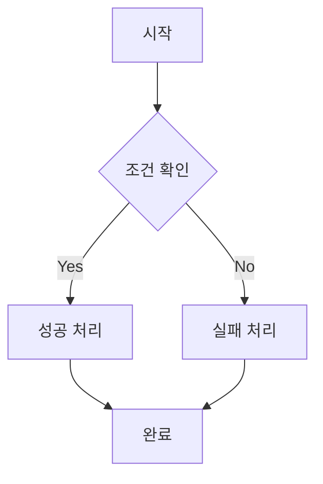
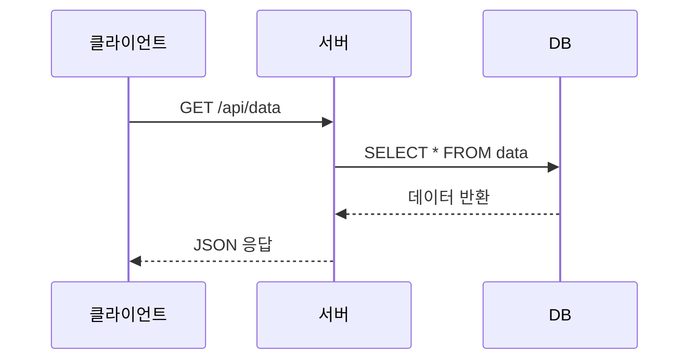

# Mermaid 다이어그램 테스트

## Flowchart

```mermaid
flowchart TD
    A[시작] --> B{조건 확인}
    B -->|Yes| C[성공 처리]
    B -->|No| D[실패 처리]
    C --> E[완료]
    D --> E
```

## Sequence Diagram

```mermaid
sequenceDiagram
    participant 클라이언트
    participant 서버
    participant DB

    클라이언트->>서버: GET /api/data
    서버->>DB: SELECT * FROM data
    DB-->>서버: 데이터 반환
    서버-->>클라이언트: JSON 응답
```

## 일반 텍스트

이 페이지에는 Mermaid 다이어그램이 포함되어 있습니다. 다이어그램이 SVG로 렌더링되어야 합니다.
