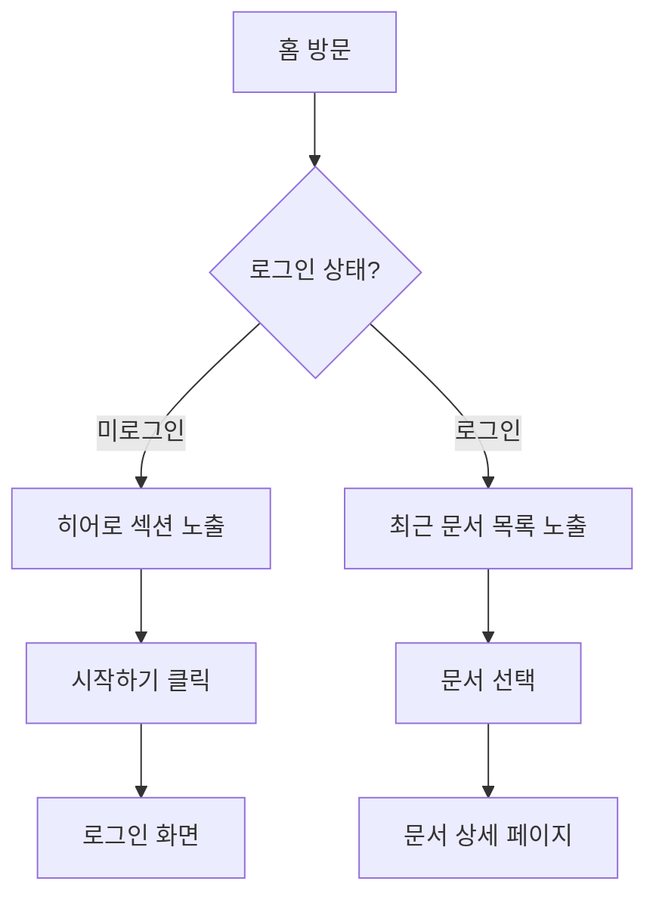

# 홈 화면 기획서

> **오른쪽 사이드바의 "화면 미리보기" 버튼**을 클릭하면 HTML 목업을 확인할 수 있습니다.

## 1. 개요

| 항목 | 내용 |
|------|------|
| 화면명 | 홈 (메인 랜딩) |
| 담당 기획자 | 기획팀 |
| 최초 작성일 | 2025-01-10 |
| 최종 수정일 | 2025-02-18 |
| 개발 예정일 | 2025-03-01 |

## 2. 화면 목적

서비스 첫 진입 시 사용자에게 핵심 가치를 전달하고, 주요 기능으로 빠르게 이동할 수 있도록 안내한다.

## 3. 구성 요소

### 3.1 헤더 (GNB)

- **로고**: 좌측 배치, 홈으로 이동
- **네비게이션**: 홈 / 기획서 / 가이드 / API (PC 전용)
- **액션 버튼**: 로그인 (아웃라인) + 시작하기 (프라이머리)

> **재고 없음 처리**: 재고 없는 상품은 CTA 버튼 비활성화 및 품절 오버레이 표시 (→ [상품 목록 기획서](./03-product-list) 참고)

### 3.2 히어로 섹션

- **타이틀**: 최대 2줄, 굵은 서체
- **서브텍스트**: 40자 이내 요약 문구
- **CTA 버튼**: "문서 작성 시작" (주) + "데모 보기" (보조)
- **배경**: 브랜드 그라디언트 (#1e3a5f → #3b82f6)

### 3.3 주요 기능 카드

4개의 기능 카드 그리드:
1. 화면 미리보기 연동
2. Mermaid 다이어그램
3. 프레젠테이션 모드
4. 접근 권한 관리

### 3.4 최근 기획 문서 목록

- 최근 수정된 문서 최대 4건 표시
- 각 항목: 아이콘 / 제목 / 수정일 / 상태 배지

## 4. 유저 플로우

## 5. 반응형 처리

| 브레이크포인트 | 레이아웃 |
|---------------|----------|
| ~ 768px (모바일) | GNB 햄버거 메뉴, 카드 1열 |
| 769px ~ 1024px (태블릿) | 카드 2열 |
| 1025px~ (PC) | 카드 4열, 풀 GNB |

## 6. 변경 이력

| 버전 | 날짜 | 변경 내용 |
|------|------|----------|
| 1.2.0 | 2025-02-18 | 최근 문서 목록 섹션 추가 |
| 1.1.0 | 2025-01-25 | 히어로 CTA 버튼 문구 변경 |
| 1.0.0 | 2025-01-10 | 최초 작성 |
