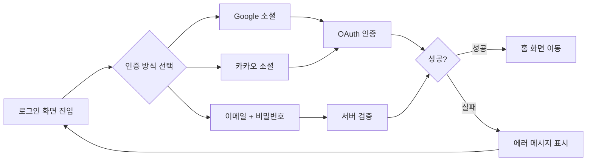

# 로그인 화면 기획서

> **오른쪽 사이드바의 "화면 미리보기" 버튼**을 클릭하면 HTML 목업을 확인할 수 있습니다.

## 1. 개요

| 항목 | 내용 |
|------|------|
| 화면명 | 로그인 |
| 담당 기획자 | 기획팀 |
| 최초 작성일 | 2025-01-05 |
| 최종 수정일 | 2025-02-10 |
| 개발 예정일 | 2025-02-28 |

## 2. 화면 목적

사용자 인증을 통해 서비스 진입을 제어하고, 소셜 로그인을 우선 제공하여 가입 장벽을 낮춘다.

## 3. 인증 방식 우선순위

소셜 로그인을 상단에 배치하는 이유:
- 비밀번호 없이 빠른 로그인 가능
- 비밀번호 분실 CS 감소
- 신규 사용자 전환율 향상 (A/B 테스트 결과 기준 +23%)

## 4. 구성 요소

### 4.1 로고 영역

- 서비스 로고 아이콘 (52×52px, 브랜드 그라디언트)
- 서비스명 텍스트
- 로그인 안내 문구

### 4.2 소셜 로그인 버튼

| 버튼 | 아이콘 색상 | 배경 | 우선순위 |
|------|------------|------|--------|
| Google | 공식 컬러 | 흰색 | 1순위 |
| 카카오 | #3C1E1E | #fee500 | 2순위 |

### 4.3 이메일 폼

- 이메일 input (type="email")
- 비밀번호 input (type="password")
- 비밀번호 찾기 링크 (우측 정렬)
- 로그인 버튼 (full-width, 프라이머리)

### 4.4 회원가입 유도

- 하단 텍스트 링크: "아직 계정이 없으신가요? 회원가입"

## 5. 유효성 검사

| 필드 | 조건 | 에러 메시지 |
|------|------|------------|
| 이메일 | 형식 검증 (RFC 5322) | "올바른 이메일 형식을 입력해 주세요" |
| 이메일 | 필수 입력 | "이메일을 입력해 주세요" |
| 비밀번호 | 필수 입력 | "비밀번호를 입력해 주세요" |
| 비밀번호 | 서버 불일치 | "이메일 또는 비밀번호가 올바르지 않습니다" |

> 보안상 이유로 이메일 존재 여부는 노출하지 않음 (이메일/비밀번호 불일치를 하나의 메시지로 처리)

## 6. 반응형 처리

- 모바일: 카드 레이아웃 동일, 상하 여백 축소
- 태블릿/PC: 중앙 정렬 카드 (max-width: 400px)

## 7. 접근성

- 모든 input에 명시적 `<label>` 연결
- 에러 메시지에 `role="alert"` 적용
- 키보드 Tab 순서: 이메일 → 비밀번호 → 로그인 버튼

## 8. 변경 이력

| 버전 | 날짜 | 변경 내용 |
|------|------|----------|
| 2.1.0 | 2025-02-10 | 카카오 로그인 버튼 추가 |
| 2.0.0 | 2025-01-20 | 소셜 로그인 우선 배치로 개편 |
| 1.0.0 | 2025-01-05 | 최초 작성 |
