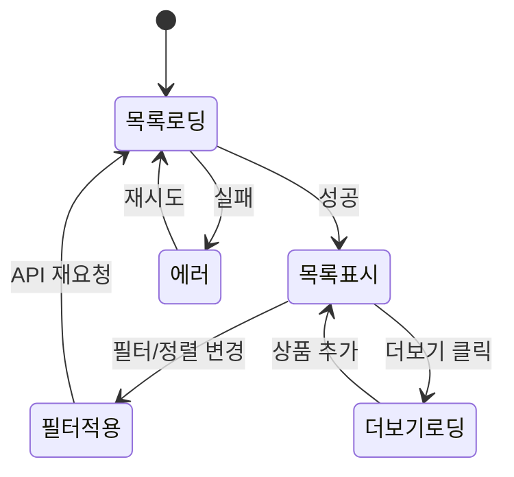

# 상품 목록 기획서

> **오른쪽 사이드바의 "화면 미리보기" 버튼**을 클릭하면 연결된 2개 화면을 탭으로 전환하며 확인할 수 있습니다.

## 1. 개요

| 항목 | 내용 |
|------|------|
| 화면명 | 상품 목록 |
| 담당 기획자 | 기획팀 |
| 최초 작성일 | 2025-02-01 |
| 최종 수정일 | 2025-02-18 |
| 검토 요청일 | 2025-02-20 |

## 2. 화면 목적

카테고리별 상품 탐색 및 필터/정렬 기능을 제공하여 사용자가 원하는 상품을 빠르게 찾을 수 있도록 한다.

## 3. 구성 요소

### 3.1 헤더

- 로고, 검색창, 찜 목록, 장바구니 (뱃지), 마이페이지

### 3.2 카테고리 탭

가로 스크롤 가능한 탭:
`전체 / 의류 / 신발 / 가방 / 액세서리 / 스포츠 / 홈·리빙 / 뷰티`

### 3.3 필터 바

```
[상의] [하의] [아우터]  |  [세일] [신상] [FREE배송]  ▾ 인기순
```

- 좌측: 서브카테고리 칩 (토글)
- 구분선 이후: 속성 필터 칩 (토글)
- 우측: 정렬 셀렉트박스

### 3.4 상품 그리드

| 요소 | 설명 |
|------|------|
| 레이아웃 | 2열 (모바일) / 3열 (태블릿) / 4열 (PC) |
| 상품 카드 | 이미지 + 브랜드 + 상품명 + 가격 + 평점 |
| 뱃지 | BEST / NEW / 할인율 (동시 표시 불가, 우선순위: 할인율 > BEST > NEW) |
| 찜 버튼 | 이미지 우상단 오버레이 |
| 품절 처리 | 이미지 위에 반투명 오버레이 + "품절" 텍스트 |

### 3.5 더보기 버튼

- 페이지네이션 대신 더보기 방식 (20개씩 추가 로드)
- 남은 수량 표시: "더보기 (1,242개)"

## 4. 상태 플로우



## 5. 상품 카드 스펙

### 가격 표시 규칙

| 상황 | 표시 방법 |
|------|----------|
| 정가 | 가격만 표시 |
| 할인 | 할인율(빨강) + 할인가 + 원가(취소선) |
| 품절 | 이미지 위 품절 오버레이, 가격 유지 |

### 뱃지 우선순위

1. 할인율 뱃지 (빨강)
2. BEST 뱃지 (노랑/주황)
3. NEW 뱃지 (초록)

> 하나의 상품에 뱃지는 최대 1개만 표시

## 6. API 연동

```
GET /api/v1/products
  ?category=clothing
  &sub_category=top
  &filters=sale,free_shipping
  &sort=popular
  &page=1
  &limit=20
```

**응답 예시:**
```json
{
  "total": 1248,
  "page": 1,
  "items": [
    {
      "id": "prod_001",
      "brand": "ZARA",
      "name": "오버핏 린넨 블렌드 셔츠",
      "price": 49900,
      "original_price": null,
      "discount_rate": null,
      "badge": "best",
      "rating": 4.8,
      "review_count": 312,
      "in_stock": true,
      "image_url": "/images/products/prod_001.jpg"
    }
  ]
}
```

## 7. 반응형 처리

| 구간 | 그리드 | 카드 이미지 비율 |
|------|--------|----------------|
| ~ 599px | 2열 | 1:1 |
| 600px ~ 899px | 3열 | 1:1 |
| 900px ~ | 4열 | 1:1 |

## 8. 검토 요청 사항

- [ ] 뱃지 우선순위 로직 개발팀 확인
- [ ] 더보기 vs 무한스크롤 최종 결정 필요
- [ ] 품절 상품 목록 노출 여부 (숨김 처리 vs 하단 배치)

## 9. 변경 이력

| 버전 | 날짜 | 변경 내용 |
|------|------|----------|
| 1.0.0 | 2025-02-01 | 최초 작성 |
