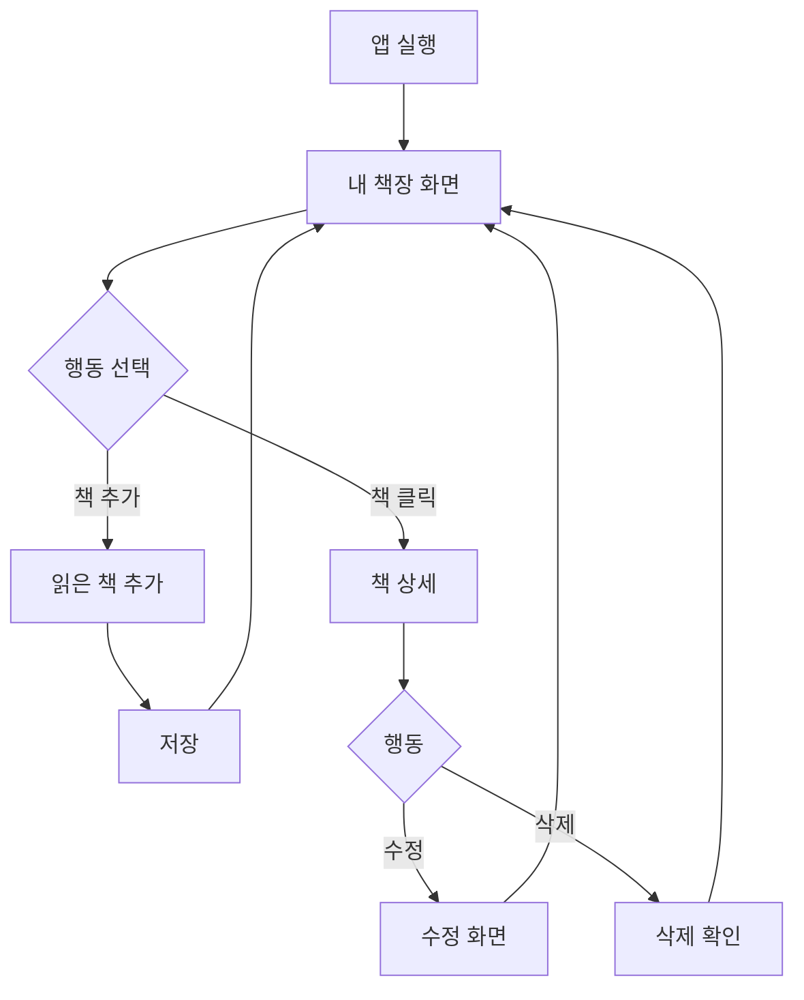

# 독서 기록 앱 기획서

> **오른쪽 사이드바의 "화면 미리보기" 버튼**을 클릭하면 연결된 3개 화면을 탭으로 전환하며 확인할 수 있습니다.

## 1. 개요

| 항목 | 내용 |
|------|------|
| 프로젝트명 | 내 책장 (Reading Tracker) |
| 담당 기획자 | 기획팀 |
| 최초 작성일 | 2026-02-19 |
| 최종 수정일 | 2026-02-19 |
| 목적 | 읽은 책을 기록하고 관리하는 간단한 앱 |

## 2. 프로젝트 목적

**"읽은 책을 한곳에 모아두고, 언제 읽었는지 기억하고 싶다"**

많은 사람들이 책을 읽지만 기억하지 못합니다. 이 앱은:
- 읽은 책을 **쉽게 기록**할 수 있고
- **언제, 어떤 책**을 읽었는지 한눈에 볼 수 있으며
- **나만의 독서 기록**을 쌓아갈 수 있게 합니다.

## 3. 핵심 기능 (쉽게 이해하기)

### 3.1 내 책장 (메인 화면)
- 내가 읽은 책 목록을 카드 형태로 표시
- 읽은 날짜, 별점, 한줄 평 표시
- 통계: 올해 읽은 책 N권

### 3.2 책 상세
- 책 정보 (제목, 저자, 표지, 읽은 날짜)
- 내가 남긴 한줄 평
- 수정/삭제 버튼

### 3.3 읽은 책 추가
- 책 검색 또는 직접 입력
- 읽은 날짜 선택
- 별점(1~5) 선택
- 한줄 평 작성 (선택)

## 4. 사용자 플로우

## 5. 화면 구성

### 5.1 내 책장 (메인)
- 상단: 제목 "내 책장", 올해 읽은 책 수
- 추가 버튼: 우측 상단 + 버튼
- 책 카드 그리드: 2열 (모바일) / 3열 (태블릿) / 4열 (PC)
- 각 카드: 표지, 제목, 저자, 읽은 날짜, 별점

### 5.2 책 상세
- 책 표지 (큰 사이즈)
- 제목, 저자
- 읽은 날짜, 별점
- 한줄 평
- 수정 / 삭제 버튼

### 5.3 읽은 책 추가
- 책 검색 입력창 (선택)
- 또는 직접 입력: 제목, 저자
- 읽은 날짜: 날짜 선택기
- 별점: 1~5 별 선택
- 한줄 평: 텍스트 입력 (선택)
- 저장 버튼

## 6. 반응형 처리

| 브레이크포인트 | 레이아웃 |
|---------------|----------|
| ~ 599px (모바일) | 카드 2열 |
| 600px ~ 899px (태블릿) | 카드 3열 |
| 900px ~ (PC) | 카드 4열 |

## 7. 변경 이력

| 버전 | 날짜 | 변경 내용 |
|------|------|----------|
| 1.0.0 | 2026-02-19 | 최초 작성 |
