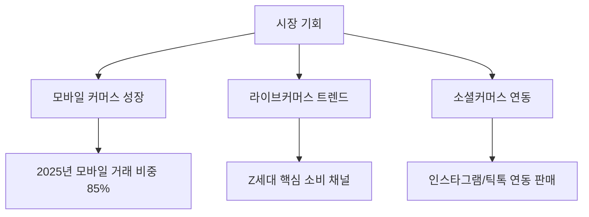
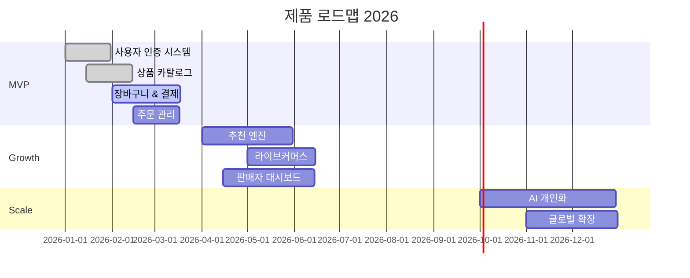

# Product Vision & Strategy

## 제품 비전

**"모든 사람이 쉽게 온라인 쇼핑을 즐길 수 있는 플랫폼"**

### 목표
- 2026년까지 MAU 100만 달성
- 평균 전환율 3.5% 이상
- 고객 만족도(NPS) 50 이상

## 시장 분석

### 타겟 시장
- **Primary**: 20-40대 온라인 쇼핑 활성 사용자
- **Secondary**: 50대 이상 디지털 전환 사용자
- **시장 규모**: 국내 이커머스 시장 200조원 (2025년 기준)

### 경쟁사 분석

| 경쟁사 | 강점 | 약점 | 우리의 차별점 |
|--------|------|------|---------------|
| 쿠팡 | 빠른 배송, 넓은 상품군 | 높은 수수료 | 판매자 친화적 수수료 구조 |
| 네이버 쇼핑 | 높은 트래픽 | 복잡한 UX | 심플한 구매 경험 |
| 11번가 | 오픈마켓 선두 | 낮은 브랜드 신뢰도 | 프리미엄 큐레이션 |

### 시장 기회

## 제품 전략

### Phase 1: MVP (Q1 2026)
- 기본 상품 검색 & 구매
- 결제 시스템 (PG 연동)
- 주문/배송 관리
- 기본 회원 관리

### Phase 2: Growth (Q2-Q3 2026)
- 추천 알고리즘 적용
- 라이브커머스 기능
- 소셜 로그인 확대
- 판매자 대시보드 고도화

### Phase 3: Scale (Q4 2026)
- AI 기반 개인화
- 글로벌 확장 (베트남, 태국)
- B2B 도매 플랫폼
- 구독형 멤버십

## 핵심 가치 제안

### 구매자
1. **빠른 탐색**: AI 추천으로 원하는 상품을 3초 내 발견
2. **안전한 거래**: 에스크로 결제와 구매 보호 정책
3. **편리한 반품**: 30일 무료 반품 정책

### 판매자
1. **낮은 진입 장벽**: 무료 입점, 판매 발생 시에만 수수료
2. **강력한 도구**: 재고 관리, 매출 분석, 마케팅 자동화
3. **빠른 정산**: 주 1회 자동 정산 (업계 최단)

## 성공 지표 (KPI)

### 비즈니스 지표
- **GMV (Gross Merchandise Value)**: 월 100억원 (6개월 내)
- **Active Buyers**: 50만명
- **Repeat Purchase Rate**: 40%

### 제품 지표
- **Conversion Rate**: 3.5%
- **Average Order Value**: 50,000원
- **Cart Abandonment Rate**: < 60%

### 사용자 경험 지표
- **Page Load Time**: < 2초
- **Search Success Rate**: > 85%
- **Customer Support Response**: < 2시간

## 로드맵

## 리스크 & 대응 전략

| 리스크 | 영향도 | 확률 | 대응 전략 |
|--------|--------|------|-----------|
| 경쟁사 공격적 마케팅 | High | Medium | 틈새 시장 집중, 브랜드 차별화 |
| PG 장애 | High | Low | 멀티 PG 연동, 자동 Failover |
| 물류 파트너 문제 | Medium | Medium | 복수 물류사 계약 |
| 규제 변경 | Medium | Low | 법률 자문 정기 검토 |

## 예산 계획

### 2026년 예산 (단위: 억원)
- **개발**: 15억 (인력 10명, 인프라)
- **마케팅**: 30억 (퍼포먼스 마케팅 중심)
- **운영**: 10억 (CS, 물류 등)
- **총계**: 55억원

### ROI 목표
- **1년차**: Break-even
- **2년차**: EBITDA 흑자 전환
- **3년차**: 매출 500억, 영업이익 10%

---

**최종 검토**: 2026-02-19
**작성자**: Product Team
**승인자**: CEO, CTO
