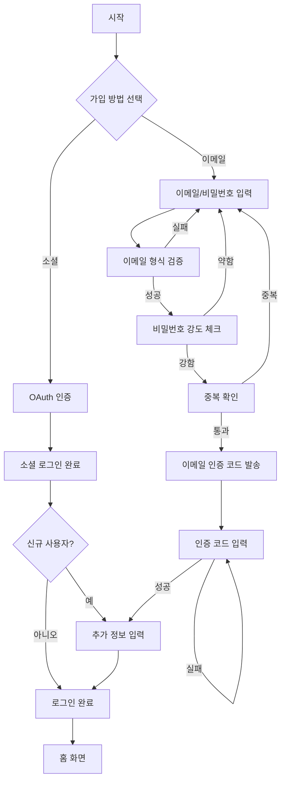
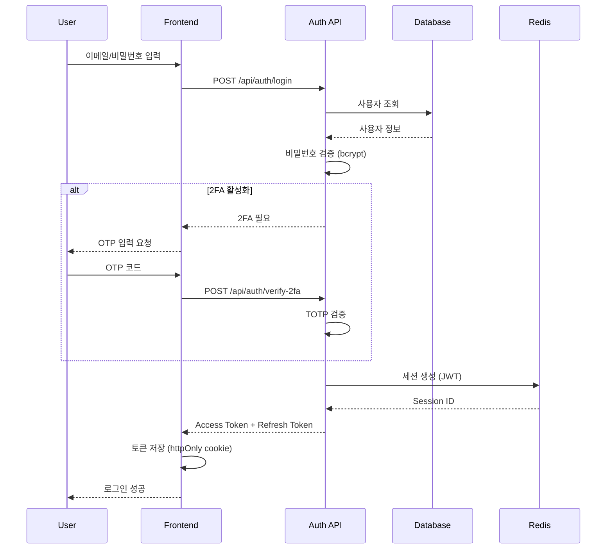

# PRD: 사용자 인증 시스템

## 개요

### 목적
안전하고 편리한 사용자 인증 시스템을 구축하여 회원 가입과 로그인 과정을 최적화

### 범위
- 이메일/비밀번호 기반 인증
- 소셜 로그인 (카카오, 네이버, 구글, 애플)
- 다중 인증(2FA)
- 비밀번호 재설정
- 세션 관리

### 타겟 사용자
- 신규 가입 사용자
- 기존 회원
- 보안을 중요시하는 사용자

## 사용자 스토리

### Epic 1: 회원가입
```
AS A 신규 사용자
I WANT TO 이메일로 간편하게 가입하고
SO THAT 구매 활동을 시작할 수 있다
```

**Acceptance Criteria**
- [ ] 이메일 형식 검증 (RFC 5322)
- [ ] 비밀번호 강도 체크 (8자 이상, 영문+숫자+특수문자)
- [ ] 이메일 인증 (6자리 코드, 5분 유효)
- [ ] 중복 가입 방지
- [ ] 개인정보 수집 동의

### Epic 2: 소셜 로그인
```
AS A 모바일 사용자
I WANT TO 카카오톡으로 1초만에 로그인하고
SO THAT 복잡한 가입 절차를 건너뛸 수 있다
```

**Acceptance Criteria**
- [ ] OAuth 2.0 표준 준수
- [ ] 카카오/네이버/구글/애플 연동
- [ ] 프로필 정보 자동 입력
- [ ] 계정 연결/해제 기능

### Epic 3: 2단계 인증 (2FA)
```
AS A 보안 의식이 높은 사용자
I WANT TO 2FA를 활성화하고
SO THAT 내 계정을 더 안전하게 보호할 수 있다
```

**Acceptance Criteria**
- [ ] TOTP 기반 (Google Authenticator 호환)
- [ ] SMS 인증 옵션
- [ ] 백업 코드 10개 생성
- [ ] 신뢰 기기 등록 (30일)

## 사용자 플로우

### 회원가입 플로우



### 로그인 플로우



## 기능 명세

### 1. 회원가입 API

**Endpoint**: `POST /api/auth/register`

**Request**
```json
{
  "email": "user@example.com",
  "password": "SecurePass123!",
  "name": "홍길동",
  "phone": "010-1234-5678",
  "agreements": {
    "terms": true,
    "privacy": true,
    "marketing": false
  }
}
```

**Response**
```json
{
  "success": true,
  "data": {
    "userId": "usr_1a2b3c4d",
    "email": "user@example.com",
    "verificationRequired": true
  }
}
```

**에러 코드**
- `EMAIL_ALREADY_EXISTS`: 이미 가입된 이메일
- `WEAK_PASSWORD`: 비밀번호 강도 부족
- `INVALID_EMAIL`: 잘못된 이메일 형식

### 2. 소셜 로그인 API

**Endpoint**: `GET /api/auth/oauth/{provider}`

**Providers**: kakao, naver, google, apple

**Flow**
1. Frontend → Backend: OAuth URL 요청
2. Backend → Frontend: Authorization URL 반환
3. Frontend → Provider: 사용자 인증
4. Provider → Backend: Authorization Code
5. Backend → Provider: Access Token 요청
6. Backend → Frontend: JWT 토큰 발급

### 3. 2FA 설정 API

**Setup Endpoint**: `POST /api/auth/2fa/setup`

**Response**
```json
{
  "success": true,
  "data": {
    "secret": "JBSWY3DPEHPK3PXP",
    "qrCode": "data:image/png;base64,iVBORw0KG...",
    "backupCodes": [
      "1234-5678-90AB",
      "CDEF-1234-5678",
      ...
    ]
  }
}
```

**Verify Endpoint**: `POST /api/auth/2fa/verify`

**Request**
```json
{
  "code": "123456"
}
```

## 보안 요구사항

### 비밀번호 정책
- **최소 길이**: 8자
- **복잡도**: 영문 대소문자 + 숫자 + 특수문자 중 3가지 이상
- **히스토리**: 최근 5개 비밀번호 재사용 금지
- **만료**: 90일 (선택적)

### 세션 관리
- **Access Token**: 15분 유효, JWT
- **Refresh Token**: 30일 유효, DB 저장
- **Rotation**: Refresh 시 기존 토큰 무효화
- **Concurrent Sessions**: 최대 5개 기기

### 보안 헤더
```
Strict-Transport-Security: max-age=31536000; includeSubDomains
X-Content-Type-Options: nosniff
X-Frame-Options: DENY
Content-Security-Policy: default-src 'self'
```

### Rate Limiting
- **로그인 시도**: 5회/5분 (IP 기준)
- **비밀번호 재설정**: 3회/1시간
- **이메일 인증 재발송**: 3회/10분

## 데이터 모델

### User Table
```sql
CREATE TABLE users (
    id VARCHAR(36) PRIMARY KEY,
    email VARCHAR(255) UNIQUE NOT NULL,
    password_hash VARCHAR(255),
    name VARCHAR(100) NOT NULL,
    phone VARCHAR(20),
    email_verified BOOLEAN DEFAULT FALSE,
    two_factor_enabled BOOLEAN DEFAULT FALSE,
    two_factor_secret VARCHAR(255),
    created_at TIMESTAMP DEFAULT CURRENT_TIMESTAMP,
    updated_at TIMESTAMP DEFAULT CURRENT_TIMESTAMP ON UPDATE CURRENT_TIMESTAMP,
    last_login_at TIMESTAMP,
    INDEX idx_email (email)
);
```

### OAuth Provider Table
```sql
CREATE TABLE oauth_providers (
    id VARCHAR(36) PRIMARY KEY,
    user_id VARCHAR(36) NOT NULL,
    provider ENUM('kakao', 'naver', 'google', 'apple'),
    provider_user_id VARCHAR(255) NOT NULL,
    access_token TEXT,
    refresh_token TEXT,
    expires_at TIMESTAMP,
    created_at TIMESTAMP DEFAULT CURRENT_TIMESTAMP,
    FOREIGN KEY (user_id) REFERENCES users(id) ON DELETE CASCADE,
    UNIQUE KEY unique_provider (provider, provider_user_id)
);
```

## UI/UX 디자인

### 로그인 화면
```
┌─────────────────────────────────┐
│         [로고]                   │
│                                 │
│  이메일                          │
│  [____________________]         │
│                                 │
│  비밀번호                        │
│  [____________________] [👁]     │
│                                 │
│  [로그인]                        │
│                                 │
│  ───────── 또는 ────────         │
│                                 │
│  [🟡 카카오 로그인]              │
│  [🟢 네이버 로그인]              │
│  [🔴 구글 로그인]                │
│  [⚫ Apple 로그인]               │
│                                 │
│  비밀번호 찾기 | 회원가입         │
└─────────────────────────────────┘
```

### 반응형 디자인
- **Desktop**: 400px 고정폭 중앙 정렬
- **Mobile**: 전체 너비, 패딩 20px
- **Touch Target**: 최소 44x44px

## 성능 요구사항

### 응답 시간
- **로그인**: < 200ms (P95)
- **회원가입**: < 500ms (P95)
- **OAuth**: < 1s (외부 API 의존)

### 가용성
- **SLA**: 99.9% (월 43분 다운타임 허용)
- **Failover**: 자동 전환 < 30초

## 테스트 시나리오

### Unit Tests
- [ ] 비밀번호 해싱/검증
- [ ] JWT 토큰 생성/검증
- [ ] TOTP 코드 생성/검증
- [ ] 이메일 형식 검증

### Integration Tests
- [ ] 회원가입 전체 플로우
- [ ] 로그인 → 세션 생성
- [ ] 소셜 로그인 각 Provider별
- [ ] 2FA 활성화/비활성화
- [ ] 비밀번호 재설정

### E2E Tests
```gherkin
Feature: 사용자 로그인

  Scenario: 정상적인 로그인
    Given 가입된 사용자 "test@example.com"
    When 올바른 비밀번호로 로그인 시도
    Then 홈 화면으로 이동
    And 사용자 이름이 헤더에 표시됨

  Scenario: 잘못된 비밀번호
    Given 가입된 사용자 "test@example.com"
    When 잘못된 비밀번호로 로그인 시도
    Then 에러 메시지 "이메일 또는 비밀번호가 일치하지 않습니다"
    And 로그인 화면에 머무름
```

## 릴리스 계획

### Phase 1 (Week 1-2)
- 이메일/비밀번호 인증
- 기본 세션 관리

### Phase 2 (Week 3-4)
- 소셜 로그인 (카카오, 네이버)
- 비밀번호 재설정

### Phase 3 (Week 5-6)
- 2FA 지원
- 구글, 애플 로그인 추가

## 운영 계획

### 모니터링
- **로그인 성공률**: > 95%
- **평균 로그인 시간**: < 200ms
- **2FA 활성화율**: 추적

### 알림
- 5분간 로그인 실패 > 100건
- DB 응답 시간 > 100ms
- OAuth Provider 장애

---

**버전**: 1.0
**최종 수정**: 2026-02-19
**담당자**: Auth Team
