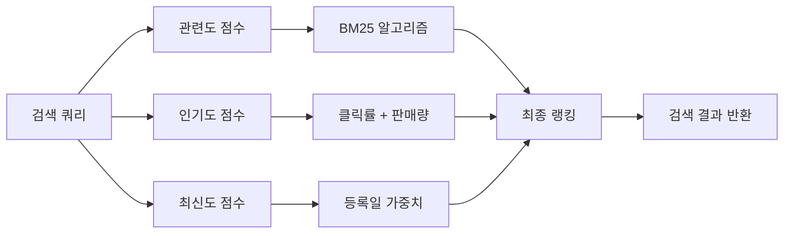
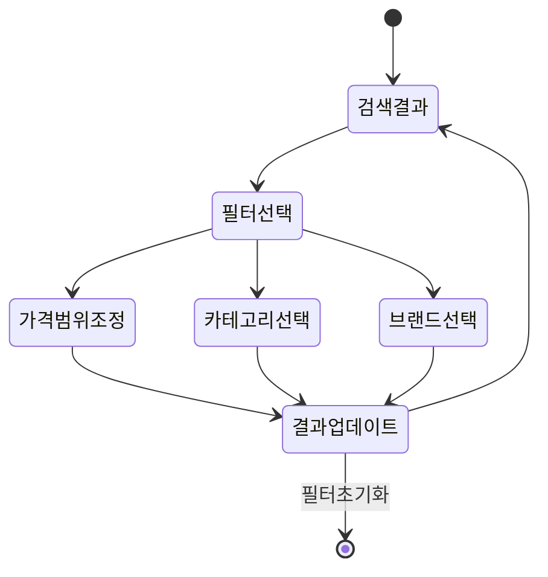
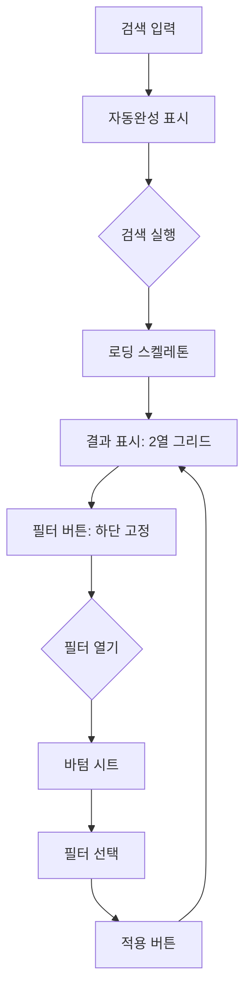
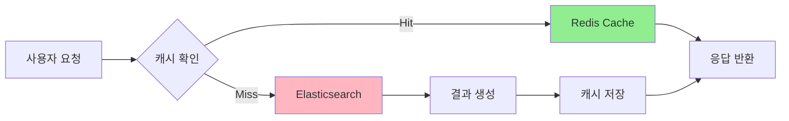
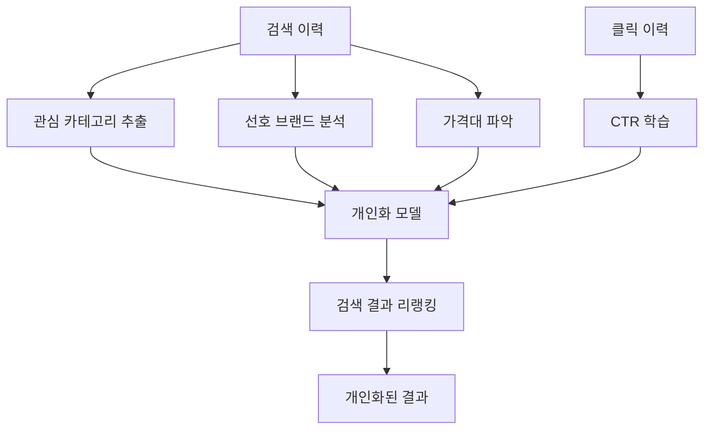

# PRD: 상품 검색 및 필터링

## 개요

### 목적
사용자가 원하는 상품을 빠르고 정확하게 찾을 수 있도록 강력한 검색 및 필터링 시스템 구축

### 비즈니스 목표
- 검색 성공률 85% 이상
- 검색 → 구매 전환율 5% 이상
- 평균 검색 시간 3초 이내

### 범위
- 키워드 검색
- 자동완성
- 필터링 (가격, 카테고리, 브랜드 등)
- 정렬 (인기순, 가격순, 최신순)
- 검색 기록 및 추천

## 사용자 페르소나

### Persona 1: "빠른 쇼퍼" 민지 (28세, 직장인)
- **목표**: 퇴근 후 빠르게 필요한 물건 찾기
- **Pain Points**: 너무 많은 검색 결과, 관련 없는 상품들
- **Needs**: 정확한 검색, 필터로 빠른 좁히기

### Persona 2: "비교 쇼퍼" 준호 (35세, 가정주부)
- **목표**: 여러 상품 꼼꼼히 비교하고 최저가 찾기
- **Pain Points**: 가격 비교가 어려움, 리뷰 찾기 번거로움
- **Needs**: 상세 필터, 정렬 옵션, 가격 히스토리

## 기능 요구사항

### 1. 키워드 검색

#### 검색 기능
- **전체 텍스트 검색**: 상품명, 설명, 태그, 브랜드
- **동의어 처리**: "노트북" = "랩탑" = "laptop"
- **오타 교정**: "아이폰" → "아이폰" (자음/모음 분리)
- **형태소 분석**: "무선 이어폰" → ["무선", "이어폰", "무선이어폰"]

#### 검색 결과 랭킹



**점수 계산식**
```
final_score = (relevance * 0.5) + (popularity * 0.3) + (recency * 0.2)

relevance = BM25(query, document)
popularity = log(clicks + sales * 2)
recency = 1 / (days_old + 1)
```

### 2. 자동완성

#### 실시간 제안
- **입력 3자 이상**: 자동완성 트리거
- **응답 시간**: < 100ms
- **제안 개수**: 최대 10개
- **정렬**: 인기도 + 개인화

#### 데이터 소스
1. **인기 검색어**: 최근 7일 검색 빈도
2. **개인 히스토리**: 사용자 최근 검색어
3. **트렌딩 키워드**: 급상승 검색어

**예시**
```
사용자 입력: "아이"
제안:
  🔥 아이폰 15 프로         (트렌딩)
  ⏱️ 아이패드 에어          (최근 검색)
  🔍 아이팟 터치            (인기 검색)
  🔍 아이맥                (인기 검색)
```

### 3. 필터링

#### 필터 카테고리

| 필터 | 타입 | 예시 |
|------|------|------|
| 가격 | Range | 0원 ~ 1,000,000원 |
| 카테고리 | Multi-select | 전자기기, 의류, 식품 |
| 브랜드 | Multi-select | Apple, Samsung, LG |
| 평점 | Single-select | 4.5점 이상 |
| 배송 | Multi-select | 무료배송, 오늘도착 |
| 할인 | Boolean | 할인 상품만 |
| 재고 | Boolean | 재고 있음 |

#### 필터 UI 플로우



#### 동적 필터 카운트
```json
{
  "filters": {
    "price": {
      "0-50000": 152,
      "50000-100000": 89,
      "100000-200000": 34
    },
    "brand": {
      "Apple": 45,
      "Samsung": 67,
      "LG": 23
    }
  }
}
```

### 4. 정렬

#### 정렬 옵션
- **관련도순** (기본): 검색 점수 기준
- **인기순**: 클릭 + 구매 + 리뷰 종합
- **낮은 가격순**: 최저가 우선
- **높은 가격순**: 최고가 우선
- **최신순**: 등록일 최신
- **평점순**: 평균 평점 높은순
- **리뷰 많은순**: 리뷰 개수 기준

#### 정렬 알고리즘 (인기순)

```python
def calculate_popularity_score(product):
    views = product.views_last_7days
    clicks = product.clicks_last_7days
    purchases = product.purchases_last_7days
    reviews = product.total_reviews
    rating = product.average_rating

    # Weighted score
    score = (
        views * 0.1 +
        clicks * 0.2 +
        purchases * 0.4 +
        reviews * 0.15 +
        rating * 20 * 0.15
    )

    # Recency boost
    days_old = (today - product.created_at).days
    recency_boost = 1.0 if days_old < 7 else (1.0 / (1 + days_old / 30))

    return score * recency_boost
```

## 기술 스펙

### 검색 엔진: Elasticsearch

#### 인덱스 매핑
```json
{
  "mappings": {
    "properties": {
      "id": { "type": "keyword" },
      "name": {
        "type": "text",
        "analyzer": "korean",
        "fields": {
          "keyword": { "type": "keyword" },
          "ngram": {
            "type": "text",
            "analyzer": "ngram_analyzer"
          }
        }
      },
      "description": {
        "type": "text",
        "analyzer": "korean"
      },
      "category": { "type": "keyword" },
      "brand": { "type": "keyword" },
      "price": { "type": "integer" },
      "rating": { "type": "float" },
      "tags": { "type": "keyword" },
      "popularity_score": { "type": "float" },
      "created_at": { "type": "date" }
    }
  }
}
```

#### 검색 쿼리 예시
```json
{
  "query": {
    "function_score": {
      "query": {
        "bool": {
          "must": [
            {
              "multi_match": {
                "query": "무선 이어폰",
                "fields": ["name^3", "description", "tags^2"],
                "type": "best_fields",
                "fuzziness": "AUTO"
              }
            }
          ],
          "filter": [
            { "range": { "price": { "gte": 10000, "lte": 100000 } } },
            { "terms": { "brand": ["Apple", "Samsung"] } }
          ]
        }
      },
      "functions": [
        {
          "field_value_factor": {
            "field": "popularity_score",
            "modifier": "log1p",
            "factor": 0.5
          }
        },
        {
          "gauss": {
            "created_at": {
              "scale": "30d",
              "offset": "7d",
              "decay": 0.5
            }
          }
        }
      ],
      "score_mode": "sum",
      "boost_mode": "multiply"
    }
  },
  "sort": [
    { "_score": { "order": "desc" } },
    { "popularity_score": { "order": "desc" } }
  ],
  "from": 0,
  "size": 20
}
```

### API 엔드포인트

#### 1. 검색 API
**Endpoint**: `GET /api/search`

**Parameters**
```
q: 검색 키워드 (required)
category: 카테고리 필터 (optional)
brand: 브랜드 필터 (optional, comma-separated)
price_min: 최소 가격 (optional)
price_max: 최대 가격 (optional)
rating_min: 최소 평점 (optional)
sort: 정렬 기준 (optional, default: relevance)
page: 페이지 번호 (optional, default: 1)
size: 페이지 크기 (optional, default: 20, max: 100)
```

**Response**
```json
{
  "success": true,
  "data": {
    "total": 1523,
    "page": 1,
    "size": 20,
    "query": "무선 이어폰",
    "took": 45,
    "products": [
      {
        "id": "prod_12345",
        "name": "Apple AirPods Pro 2세대",
        "price": 359000,
        "originalPrice": 389000,
        "discount": 8,
        "rating": 4.8,
        "reviewCount": 2341,
        "image": "https://cdn.example.com/airpods.jpg",
        "badge": "베스트",
        "shipping": {
          "free": true,
          "todayDelivery": true
        }
      }
    ],
    "filters": {
      "categories": [...],
      "brands": [...],
      "priceRanges": [...]
    },
    "suggestions": [
      "무선 이어폰 추천",
      "무선 이어폰 가성비"
    ]
  }
}
```

#### 2. 자동완성 API
**Endpoint**: `GET /api/search/autocomplete`

**Parameters**
```
q: 입력 텍스트 (required, min 2 chars)
limit: 결과 개수 (optional, default: 10)
```

**Response**
```json
{
  "success": true,
  "data": {
    "suggestions": [
      {
        "text": "아이폰 15 프로",
        "type": "trending",
        "count": 15234
      },
      {
        "text": "아이패드 에어",
        "type": "history",
        "timestamp": "2026-02-18T10:30:00Z"
      }
    ]
  }
}
```

## 사용자 경험

### 검색 결과 레이아웃

```
┌─────────────────────────────────────────────┐
│  🔍 [무선 이어폰_______________] [검색]       │
├─────────────────────────────────────────────┤
│  홈 > 검색 결과 "무선 이어폰"                 │
│                                             │
│  전체 1,523개 | ⚙️ 필터                      │
│  정렬: [관련도순 ▼]                          │
├───────┬─────────────────────────────────────┤
│ 필터  │  ┌─────┐  ┌─────┐  ┌─────┐         │
│       │  │     │  │     │  │     │         │
│ 가격  │  │ 상품 │  │ 상품 │  │ 상품 │         │
│ ☐ 0~5 │  │ 1   │  │ 2   │  │ 3   │         │
│ ☐ 5~10│  └─────┘  └─────┘  └─────┘         │
│       │  ₩359,000 ₩289,000 ₩129,000        │
│ 카테고│  ⭐4.8    ⭐4.6    ⭐4.3             │
│ ☑ 이어│  리뷰2341  리뷰892   리뷰445         │
│ ☐ 헤드│                                     │
│       │  ┌─────┐  ┌─────┐  ┌─────┐         │
│ 브랜드│  │ 상품 │  │ 상품 │  │ 상품 │         │
│ ☑ Appl│  │ 4   │  │ 5   │  │ 6   │         │
│ ☑ Sam │  └─────┘  └─────┘  └─────┘         │
│       │                                     │
└───────┴─────────────────────────────────────┘
```

### 모바일 UX



## 성능 최적화

### 캐싱 전략



#### 캐시 키 전략
```
search:{query}:{filters_hash}:{sort}:{page}
TTL: 5분
```

#### 캐시 Warming
- 인기 검색어 Top 100: 매 1분 갱신
- 카테고리별 베스트: 매 5분 갱신

### 검색 성능 목표

| 지표 | 목표 | 현재 |
|------|------|------|
| 검색 응답 시간 (P95) | < 200ms | 150ms |
| 자동완성 응답 (P95) | < 100ms | 75ms |
| 검색 QPS | 1000 | 650 |
| 인덱스 크기 | < 100GB | 45GB |

## 개인화 및 추천

### 검색 기반 추천



### A/B 테스트

**실험 1: 검색 알고리즘**
- **Variant A**: BM25 기본
- **Variant B**: BM25 + 인기도 부스팅
- **Metric**: 검색 성공률, CTR, 전환율

**실험 2: 필터 UI**
- **Variant A**: 사이드바 필터
- **Variant B**: 상단 펼침 필터
- **Metric**: 필터 사용률, 이탈률

## 분석 및 모니터링

### 핵심 지표

```sql
-- 검색 성공률
SELECT
  DATE(created_at) as date,
  COUNT(*) as total_searches,
  SUM(CASE WHEN results_count > 0 THEN 1 ELSE 0 END) as successful_searches,
  SUM(CASE WHEN results_count > 0 THEN 1 ELSE 0 END) * 100.0 / COUNT(*) as success_rate
FROM search_logs
WHERE created_at >= NOW() - INTERVAL 7 DAY
GROUP BY DATE(created_at);
```

### 대시보드

**실시간 모니터링**
- 초당 검색 수 (QPS)
- 평균 응답 시간
- 에러율
- 캐시 히트율

**비즈니스 지표**
- Top 10 검색어
- 검색 → 구매 전환율
- 필터 사용률
- Zero-result 검색어

## 향후 로드맵

### Q2 2026
- [ ] 이미지 검색 (Visual Search)
- [ ] 음성 검색
- [ ] 검색 결과 개인화 고도화

### Q3 2026
- [ ] 자연어 검색 ("50만원 이하 노트북")
- [ ] 유사 상품 추천
- [ ] 검색 히스토리 기반 재추천

### Q4 2026
- [ ] AI 챗봇 검색 도우미
- [ ] AR 기반 상품 미리보기

---

**작성일**: 2026-02-19
**담당팀**: Search & Discovery Team
**리뷰어**: Product Manager, Engineering Lead
