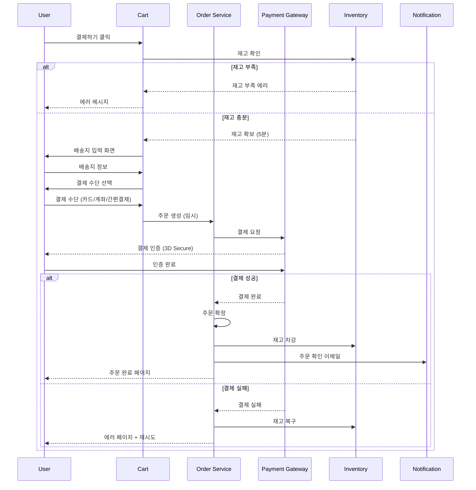
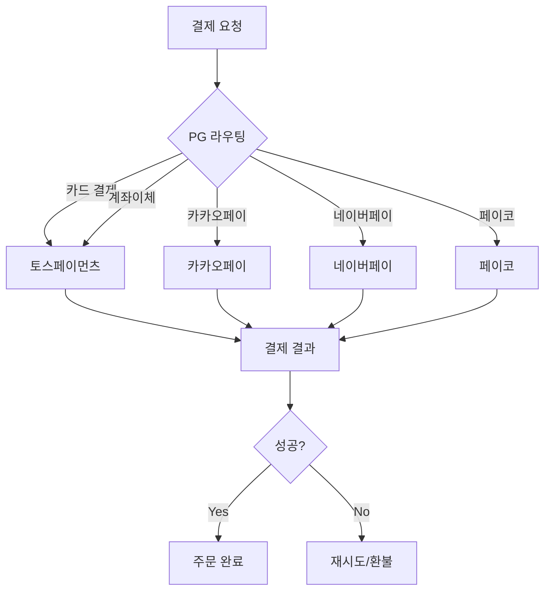
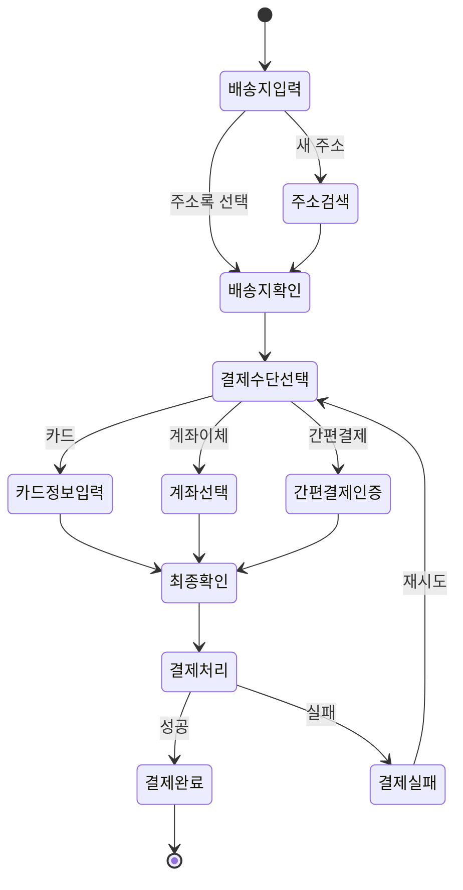

# PRD: 장바구니 및 결제 시스템

## Executive Summary

### 목표
원활한 구매 경험을 제공하는 장바구니와 결제 시스템을 통해 전환율 3.5% 달성

### 핵심 지표
- **Cart Abandonment Rate**: < 60% (업계 평균 69.8%)
- **Checkout Completion Rate**: > 70%
- **Average Checkout Time**: < 2분

## 비즈니스 컨텍스트

### 현재 문제점
1. **높은 이탈률**: 현재 결제 단계 이탈률 75%
2. **복잡한 프로세스**: 결제까지 평균 7단계 필요
3. **모바일 경험 부족**: 모바일 전환율 데스크톱의 40% 수준

### 경쟁사 벤치마크

| 플랫폼 | 결제 단계 | 게스트 결제 | 저장된 카드 | 평균 완료 시간 |
|--------|-----------|-------------|-------------|----------------|
| 쿠팡 | 3단계 | ✅ | ✅ | 45초 |
| 네이버페이 | 1단계 | ✅ | ✅ | 30초 |
| 우리 (목표) | 2단계 | ✅ | ✅ | 60초 |

## 사용자 스토리

### Epic 1: 장바구니 관리

#### User Story 1.1: 상품 추가
```
AS A 쇼핑 중인 사용자
I WANT TO 상품 상세 페이지에서 장바구니에 바로 추가하고
SO THAT 나중에 함께 구매할 수 있다

Acceptance Criteria:
✅ "장바구니 담기" 버튼 클릭 시 즉시 추가
✅ 토스트 메시지로 추가 확인 (2초)
✅ 장바구니 아이콘에 개수 배지 업데이트
✅ 로그인하지 않아도 로컬에 저장 (30일)
✅ 재고 부족 시 에러 메시지
```

#### User Story 1.2: 수량 조절
```
AS A 장바구니를 확인하는 사용자
I WANT TO 각 상품의 수량을 쉽게 변경하고
SO THAT 원하는 만큼 구매할 수 있다

Acceptance Criteria:
✅ +/- 버튼으로 수량 조절
✅ 수량 변경 시 실시간 가격 업데이트
✅ 재고 한도 초과 시 경고
✅ 최소 수량 1개 제한
✅ 변경사항 자동 저장 (Debounce 500ms)
```

### Epic 2: 결제 프로세스

#### 결제 플로우



## 기능 명세

### 1. 장바구니 API

#### 1.1 장바구니 조회
**Endpoint**: `GET /api/cart`

**Response**
```json
{
  "success": true,
  "data": {
    "id": "cart_abc123",
    "userId": "usr_xyz789",
    "items": [
      {
        "id": "item_1",
        "productId": "prod_12345",
        "name": "Apple AirPods Pro",
        "price": 359000,
        "quantity": 1,
        "image": "https://cdn.example.com/airpods.jpg",
        "options": {
          "color": "화이트"
        },
        "stock": 15,
        "shipping": {
          "free": true,
          "estimatedDays": 1
        }
      }
    ],
    "summary": {
      "itemCount": 3,
      "subtotal": 789000,
      "shippingFee": 0,
      "discount": 50000,
      "total": 739000
    },
    "availableCoupons": [
      {
        "id": "coupon_1",
        "name": "첫 구매 10% 할인",
        "discount": 73900
      }
    ]
  }
}
```

#### 1.2 상품 추가
**Endpoint**: `POST /api/cart/items`

**Request**
```json
{
  "productId": "prod_12345",
  "quantity": 1,
  "options": {
    "color": "화이트"
  }
}
```

**Response**
```json
{
  "success": true,
  "data": {
    "itemId": "item_1",
    "cartItemCount": 4
  },
  "message": "장바구니에 추가되었습니다"
}
```

#### 1.3 수량 변경
**Endpoint**: `PATCH /api/cart/items/:itemId`

**Request**
```json
{
  "quantity": 2
}
```

### 2. 결제 API

#### 2.1 결제 준비
**Endpoint**: `POST /api/checkout/prepare`

**Request**
```json
{
  "cartId": "cart_abc123",
  "shippingAddress": {
    "name": "홍길동",
    "phone": "010-1234-5678",
    "zipCode": "06234",
    "address": "서울시 강남구 테헤란로 123",
    "addressDetail": "4층"
  },
  "deliveryRequest": "문 앞에 놓아주세요",
  "couponId": "coupon_1"
}
```

**Response**
```json
{
  "success": true,
  "data": {
    "orderId": "ord_temp_xyz",
    "amount": 739000,
    "reservedUntil": "2026-02-19T15:35:00Z",
    "paymentMethods": [
      {
        "type": "card",
        "name": "신용/체크카드",
        "fee": 0
      },
      {
        "type": "transfer",
        "name": "계좌이체",
        "fee": 0
      },
      {
        "type": "kakaopay",
        "name": "카카오페이",
        "fee": 0
      }
    ]
  }
}
```

#### 2.2 결제 실행
**Endpoint**: `POST /api/checkout/pay`

**Request**
```json
{
  "orderId": "ord_temp_xyz",
  "paymentMethod": "card",
  "paymentData": {
    "cardNumber": "1234-5678-9012-3456",
    "expiryMonth": "12",
    "expiryYear": "26",
    "cvc": "123",
    "installment": 0,
    "saveCard": true
  }
}
```

**Response**
```json
{
  "success": true,
  "data": {
    "orderId": "ord_123456",
    "status": "paid",
    "paidAt": "2026-02-19T15:30:25Z",
    "receipt": {
      "url": "https://example.com/receipt/123456",
      "number": "2026021912345"
    }
  }
}
```

## 결제 수단 통합

### 지원 PG사



### PG별 특징

| PG사 | 수수료 | 정산 주기 | 특징 |
|------|--------|-----------|------|
| 토스페이먼츠 | 2.9% | D+1 | API 간편, 개발자 친화적 |
| 카카오페이 | 3.0% | D+2 | 높은 사용률, 간편결제 |
| 네이버페이 | 3.3% | D+3 | 포인트 연동 |

## 데이터 모델

### Cart Table
```sql
CREATE TABLE carts (
    id VARCHAR(36) PRIMARY KEY,
    user_id VARCHAR(36),
    session_id VARCHAR(36),
    created_at TIMESTAMP DEFAULT CURRENT_TIMESTAMP,
    updated_at TIMESTAMP DEFAULT CURRENT_TIMESTAMP ON UPDATE CURRENT_TIMESTAMP,
    expires_at TIMESTAMP,
    INDEX idx_user_id (user_id),
    INDEX idx_session_id (session_id)
);
```

### Cart Items Table
```sql
CREATE TABLE cart_items (
    id VARCHAR(36) PRIMARY KEY,
    cart_id VARCHAR(36) NOT NULL,
    product_id VARCHAR(36) NOT NULL,
    quantity INT NOT NULL DEFAULT 1,
    options JSON,
    price INT NOT NULL,
    added_at TIMESTAMP DEFAULT CURRENT_TIMESTAMP,
    FOREIGN KEY (cart_id) REFERENCES carts(id) ON DELETE CASCADE,
    FOREIGN KEY (product_id) REFERENCES products(id),
    INDEX idx_cart_id (cart_id)
);
```

### Orders Table
```sql
CREATE TABLE orders (
    id VARCHAR(36) PRIMARY KEY,
    user_id VARCHAR(36) NOT NULL,
    order_number VARCHAR(20) UNIQUE NOT NULL,
    status ENUM('pending', 'paid', 'preparing', 'shipped', 'delivered', 'cancelled', 'refunded'),

    -- 금액
    subtotal INT NOT NULL,
    shipping_fee INT NOT NULL,
    discount INT DEFAULT 0,
    total INT NOT NULL,

    -- 배송
    shipping_address JSON NOT NULL,
    delivery_request TEXT,

    -- 결제
    payment_method VARCHAR(50),
    payment_data JSON,
    paid_at TIMESTAMP,

    -- 타임스탬프
    created_at TIMESTAMP DEFAULT CURRENT_TIMESTAMP,
    updated_at TIMESTAMP DEFAULT CURRENT_TIMESTAMP ON UPDATE CURRENT_TIMESTAMP,

    FOREIGN KEY (user_id) REFERENCES users(id),
    INDEX idx_user_id (user_id),
    INDEX idx_order_number (order_number),
    INDEX idx_status (status),
    INDEX idx_created_at (created_at)
);
```

### Payments Table
```sql
CREATE TABLE payments (
    id VARCHAR(36) PRIMARY KEY,
    order_id VARCHAR(36) NOT NULL,
    pg_provider VARCHAR(50) NOT NULL,
    pg_transaction_id VARCHAR(100),
    amount INT NOT NULL,
    status ENUM('pending', 'authorized', 'captured', 'failed', 'cancelled', 'refunded'),
    method VARCHAR(50),
    card_info JSON,
    error_code VARCHAR(50),
    error_message TEXT,
    created_at TIMESTAMP DEFAULT CURRENT_TIMESTAMP,
    updated_at TIMESTAMP DEFAULT CURRENT_TIMESTAMP ON UPDATE CURRENT_TIMESTAMP,
    FOREIGN KEY (order_id) REFERENCES orders(id),
    INDEX idx_order_id (order_id),
    INDEX idx_pg_transaction_id (pg_transaction_id)
);
```

## UI/UX 디자인

### 장바구니 페이지 (Desktop)

```
┌─────────────────────────────────────────────────────────────┐
│  장바구니 (3)                                                │
├─────────────────────────────────────────────────────────────┤
│  ☑ 전체선택 (3/3)          선택삭제                          │
├─────────────────────────────────────────────────────────────┤
│  ☑ [이미지] Apple AirPods Pro              [-] 1 [+]  ✕      │
│           화이트                                              │
│           359,000원                        359,000원         │
├─────────────────────────────────────────────────────────────┤
│  ☑ [이미지] 무선 키보드 K380               [-] 2 [+]  ✕      │
│           블랙                                                │
│           49,000원                          98,000원         │
├─────────────────────────────────────────────────────────────┤
│  ☑ [이미지] 마우스 패드                    [-] 1 [+]  ✕      │
│           무료배송                                            │
│           12,000원                          12,000원         │
├─────────────────────────────────────────────────────────────┤
│                                                               │
│  ┌─────────────────────┐                                     │
│  │ 주문 금액 요약       │                                     │
│  │                     │                                     │
│  │ 상품금액   469,000원 │                                     │
│  │ 배송비          0원 │                                     │
│  │ 할인      -50,000원 │                                     │
│  │ ─────────────────── │                                     │
│  │ 결제금액   419,000원 │                                     │
│  │                     │                                     │
│  │  [전체 상품 주문]    │                                     │
│  └─────────────────────┘                                     │
└─────────────────────────────────────────────────────────────┘
```

### 결제 페이지 플로우



## 최적화 전략

### 장바구니 이탈 방어

#### 1. 이탈 의도 감지
```javascript
// 마우스가 화면 상단으로 이동 시 (탭 닫기 시도)
document.addEventListener('mouseout', (e) => {
  if (e.clientY < 10) {
    showExitIntentModal({
      title: "잠깐! 할인 쿠폰을 받아가세요",
      coupon: "10% 할인",
      cta: "쿠폰 받고 계속 쇼핑하기"
    });
  }
});
```

#### 2. 장바구니 리마인더
```
[타임라인]
T+0:   장바구니 추가
T+1h:  푸시 알림 "장바구니에 상품이 있어요"
T+24h: 이메일 "잊지 않으셨나요?"
T+48h: 할인 쿠폰 제공
```

### 성능 최적화

#### 캐싱 전략
```redis
# 장바구니 캐시
SET cart:{userId} {cartData} EX 3600

# 재고 캐시
SET product:{productId}:stock {quantity} EX 60
```

#### 낙관적 UI 업데이트
```javascript
// 수량 변경 시 즉시 UI 업데이트
function updateQuantity(itemId, newQuantity) {
  // 1. UI 즉시 업데이트
  updateCartItemUI(itemId, newQuantity);

  // 2. 백엔드 요청 (비동기)
  api.updateCartItem(itemId, newQuantity)
    .catch(error => {
      // 실패 시 롤백
      revertCartItemUI(itemId);
      showError("수량 변경에 실패했습니다");
    });
}
```

## 보안 고려사항

### PCI-DSS 준수
- 카드 정보 직접 저장 금지
- PG사를 통한 토큰화된 결제만 지원
- SSL/TLS 암호화 필수

### 주문 위변조 방지
```javascript
// 주문 금액 검증
function validateOrder(order) {
  const calculatedTotal =
    order.items.reduce((sum, item) => sum + item.price * item.quantity, 0) +
    order.shippingFee -
    order.discount;

  if (calculatedTotal !== order.total) {
    throw new Error("주문 금액 불일치");
  }
}
```

### Rate Limiting
```
장바구니 추가: 100회/분
결제 요청: 5회/분
```

## 테스트 시나리오

### Happy Path
1. ✅ 상품 페이지에서 장바구니 추가
2. ✅ 장바구니에서 수량 조절
3. ✅ 결제하기 클릭
4. ✅ 배송지 입력
5. ✅ 카드 정보 입력
6. ✅ 결제 완료

### Edge Cases
- ❌ 재고 부족 상품 주문 시도
- ❌ 결제 중 재고 소진
- ❌ PG 타임아웃
- ❌ 중복 결제 요청
- ❌ 할인 쿠폰 만료

### 로드 테스트
- 동시 주문 처리: 1000 TPS
- 장바구니 조회: 10000 RPS
- 결제 성공률: > 99.5%

## 분석 지표

### 주요 퍼널
```sql
SELECT
  COUNT(DISTINCT cart_views) as cart_views,
  COUNT(DISTINCT checkout_started) as checkout_started,
  COUNT(DISTINCT payment_entered) as payment_entered,
  COUNT(DISTINCT orders_completed) as orders_completed,

  COUNT(DISTINCT checkout_started) * 100.0 / COUNT(DISTINCT cart_views) as cart_to_checkout_rate,
  COUNT(DISTINCT payment_entered) * 100.0 / COUNT(DISTINCT checkout_started) as checkout_to_payment_rate,
  COUNT(DISTINCT orders_completed) * 100.0 / COUNT(DISTINCT payment_entered) as payment_to_order_rate
FROM funnel_events
WHERE date = CURRENT_DATE;
```

### 대시보드 메트릭
- 평균 장바구니 금액 (Average Cart Value)
- 장바구니 이탈률 (Cart Abandonment Rate)
- 결제 완료율 (Checkout Completion Rate)
- PG별 성공률
- 평균 결제 시간

---

**문서 버전**: 2.0
**최종 업데이트**: 2026-02-19
**작성자**: Product & Engineering Team
**승인**: CPO, CTO
