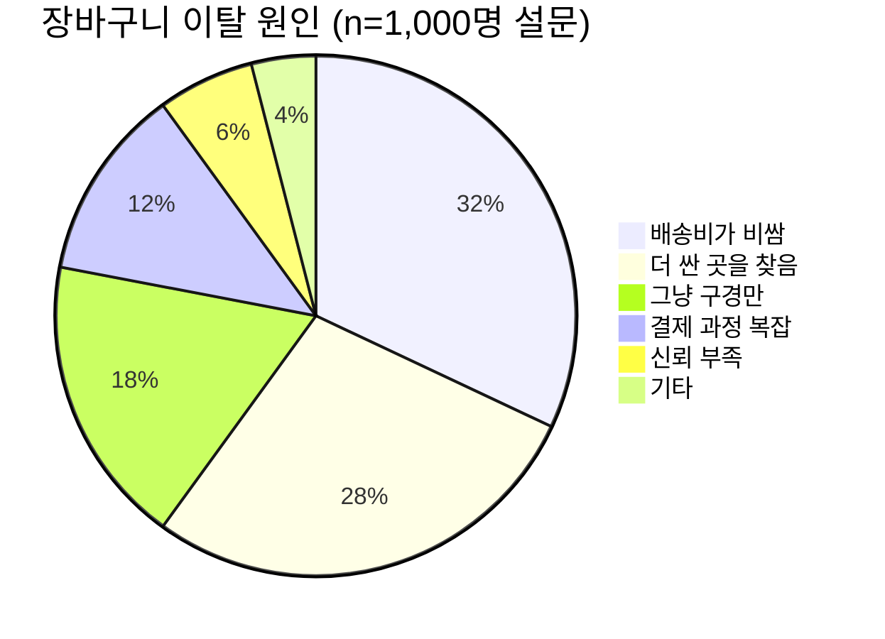

# Feature Spec: 장바구니 최적화

## 개요

### 문제 정의
현재 장바구니 이탈률이 72%로 업계 평균(69.8%)보다 높음. 사용자가 장바구니에 상품을 담고도 구매하지 않는 주요 원인을 분석하고 해결.

### 데이터 분석
```sql
-- 지난 30일 장바구니 이탈 데이터
SELECT
  COUNT(DISTINCT cart_id) as total_carts,
  COUNT(DISTINCT CASE WHEN orders.id IS NOT NULL THEN cart_id END) as converted_carts,
  COUNT(DISTINCT CASE WHEN orders.id IS NOT NULL THEN cart_id END) * 100.0 /
    COUNT(DISTINCT cart_id) as conversion_rate
FROM carts
LEFT JOIN orders ON carts.id = orders.cart_id
WHERE carts.created_at >= DATE_SUB(NOW(), INTERVAL 30 DAY);

-- 결과:
-- total_carts: 125,430
-- converted_carts: 35,120
-- conversion_rate: 28.0% (이탈률 72%)
```

### 이탈 원인 분석



## 목표

### 비즈니스 목표
- 장바구니 이탈률 72% → 65% 감소 (10% 개선)
- 장바구니 → 구매 전환율 28% → 35% 증가
- 예상 매출 증대: 월 +2억원

### 사용자 목표
- 결제 과정 단순화 (7단계 → 3단계)
- 배송비 정보 투명화
- 가격 비교 편의성 증대

## 솔루션

### Solution 1: 배송비 조기 노출

#### 현재 문제
```
[현재 플로우]
1. 상품 추가 → 장바구니 (배송비 표시 X)
2. 결제 시작 → 배송지 입력
3. 배송비 계산 → "어? 배송비 3,000원?"
4. 이탈 💔
```

#### 개선안
```
[개선 플로우]
1. 상품 추가 → 장바구니 (배송비 실시간 표시)
2. "50,000원 이상 구매 시 무료배송" 진행바
3. 추가 구매 유도 → 배송비 절감
4. 구매 완료 ✅
```

#### 구현

**UI 디자인**
```
┌─────────────────────────────────────┐
│ 장바구니 (3)                         │
├─────────────────────────────────────┤
│ 상품 합계          47,000원          │
│ 배송비              3,000원 ⓘ        │
│ ─────────────────────────────        │
│ 결제 예상 금액      50,000원          │
│                                     │
│ 🚚 3,000원 더 담으면 무료배송!       │
│ [████████████░░░] 94%               │
│                                     │
│ 이 상품은 어때요? 👇                  │
│ [관련 상품 추천 3개]                 │
└─────────────────────────────────────┘
```

**API 응답 예시**
```json
{
  "cart": {
    "items": [...],
    "subtotal": 47000,
    "shippingFee": 3000,
    "total": 50000,
    "freeShippingThreshold": 50000,
    "amountUntilFreeShipping": 3000,
    "freeShippingProgress": 0.94,
    "recommendations": [
      {
        "productId": "prod_123",
        "name": "무선 마우스",
        "price": 15000,
        "reason": "자주 함께 구매됨"
      }
    ]
  }
}
```

### Solution 2: 가격 비교 위젯

#### 현재 문제
사용자가 다른 사이트로 이동해 가격 비교 → 돌아오지 않음

#### 개선안
장바구니 내에서 타 쇼핑몰 최저가 표시 (신뢰 구축)

#### 구현

**UI**
```
┌─────────────────────────────────────┐
│ Apple AirPods Pro         359,000원 │
│ ─────────────────────────            │
│ 💰 가격 비교                         │
│ 쿠팡          365,000원 (+6,000)    │
│ 11번가        362,000원 (+3,000)    │
│ 우리 가격     359,000원 ✓ 최저가!    │
└─────────────────────────────────────┘
```

**데이터 수집**
```javascript
// 크롤러 (매 1시간 실행)
const competitors = [
  { name: '쿠팡', url: 'https://coupang.com/...' },
  { name: '11번가', url: 'https://11st.co.kr/...' }
];

async function collectPrices() {
  for (const product of popularProducts) {
    for (const competitor of competitors) {
      const price = await scrapePrice(competitor.url, product.keywords);
      await db.priceComparisons.insert({
        productId: product.id,
        competitor: competitor.name,
        price: price,
        scrapedAt: new Date()
      });
    }
  }
}
```

### Solution 3: 장바구니 저장 & 리마인더

#### 타임라인
```mermaid
gantt
    title 장바구니 리마인더 타임라인
    dateFormat HH:mm
    axisFormat %H:%M

    section 사용자 액션
    장바구니 추가           :done, t1, 00:00, 1m

    section 시스템 반응
    즉시: 팝업 (쿠폰)       :done, t2, 00:00, 1m
    1시간 후: 푸시 알림     :active, t3, 01:00, 1m
    24시간 후: 이메일       :t4, 24:00, 1m
    48시간 후: 할인 쿠폰    :t5, 48:00, 1m
```

#### 푸시 알림 메시지
```javascript
const messages = [
  {
    timing: '1시간',
    title: '장바구니에 상품이 기다리고 있어요',
    body: 'Apple AirPods Pro 외 2개 상품',
    action: 'cart'
  },
  {
    timing: '24시간',
    title: '지금 구매하면 내일 도착!',
    body: '오늘 주문 시 내일 새벽 배송',
    action: 'cart'
  },
  {
    timing: '48시간',
    title: '특별한 할인을 드릴게요',
    body: '10% 할인 쿠폰이 도착했어요',
    action: 'cart',
    coupon: 'CART10'
  }
];
```

#### 이메일 템플릿
```html
<!DOCTYPE html>
<html>
<head>
  <style>
    body { font-family: Arial, sans-serif; }
    .product { border: 1px solid #ddd; padding: 16px; margin: 8px 0; }
    .cta { background: #FF6B6B; color: white; padding: 12px 24px; text-decoration: none; }
  </style>
</head>
<body>
  <h1>장바구니에 남겨둔 상품이 있어요!</h1>

  <div class="product">
    
    <h3>{{ product.name }}</h3>
    <p>{{ product.price | currency }}</p>
  </div>

  <p>지금 바로 구매하시면 <strong>내일 도착</strong>합니다!</p>

  <a href="{{ cartUrl }}" class="cta">장바구니 확인하기</a>

  <hr>
  <p style="color: #888;">
    더 이상 이메일을 받고 싶지 않으시면
    <a href="{{ unsubscribeUrl }}">여기</a>를 클릭하세요.
  </p>
</body>
</html>
```

### Solution 4: 간편 결제 확대

#### 현재 상황
- 카드 결제: 8단계 (카드번호, 유효기간, CVC, 비밀번호, SMS 인증, ...)
- 평균 소요 시간: 2분 30초
- 모바일 완료율: 62%

#### 개선안: 원클릭 결제

**저장된 카드로 결제**
```
┌─────────────────────────────────────┐
│ 결제 수단 선택                       │
├─────────────────────────────────────┤
│ ✓ 신한카드 1234-****-****-5678     │
│   [지금 결제하기] ← 클릭 1번!        │
│                                     │
│   다른 카드로 결제                   │
└─────────────────────────────────────┘
```

**간편결제 통합**
```javascript
// 토스페이먼츠 위젯
const paymentWidget = await loadPaymentWidget(clientKey);

paymentWidget.renderPaymentMethods('#payment-methods', {
  value: amount,
  methods: ['CARD', 'KAKAO_PAY', 'NAVER_PAY', 'TOSS_PAY']
});

// 결제 요청 (1클릭)
await paymentWidget.requestPayment({
  orderId: order.id,
  orderName: '장바구니 상품',
  customerName: user.name,
  successUrl: 'https://example.com/success',
  failUrl: 'https://example.com/fail'
});
```

### Solution 5: 장바구니 공유

#### Use Case
> "친구에게 장바구니를 공유해서 같이 주문하면 배송비 절약!"

#### 구현

**공유 링크 생성**
```javascript
// API: POST /api/cart/share
{
  "cartId": "cart_abc123",
  "expiresIn": 86400  // 24시간
}

// Response
{
  "shareUrl": "https://example.com/cart/shared/xyz789",
  "expiresAt": "2026-02-20T10:00:00Z"
}
```

**공유 화면**
```
┌─────────────────────────────────────┐
│ 🎉 친구가 장바구니를 공유했어요!      │
├─────────────────────────────────────┤
│ [상품 1] Apple AirPods Pro           │
│ [상품 2] 무선 키보드                 │
│ [상품 3] 마우스 패드                 │
│                                     │
│ 합계: 450,000원                     │
│ 배송비: 무료 (공동 구매)             │
│                                     │
│ [내 장바구니에 추가]                 │
│ [바로 구매]                          │
└─────────────────────────────────────┘
```

## 성공 지표

### 주요 KPI

| 지표 | 현재 | 목표 | 측정 방법 |
|------|------|------|-----------|
| 장바구니 전환율 | 28% | 35% | orders / carts |
| 장바구니 이탈률 | 72% | 65% | abandoned / total carts |
| 평균 장바구니 금액 | 47,000원 | 55,000원 | AVG(cart.total) |
| 무료배송 달성률 | 45% | 60% | carts >= 50k / total |
| 리마인더 응답률 | - | 15% | clicks / sends |

### A/B 테스트 계획

#### Test 1: 배송비 진행바
- **Control (A)**: 기존 장바구니
- **Variant (B)**: 무료배송 진행바 + 추천 상품
- **Traffic Split**: 50/50
- **Duration**: 2주
- **Primary Metric**: 전환율

#### Test 2: 리마인더 타이밍
- **Variant A**: 1시간 후 알림
- **Variant B**: 3시간 후 알림
- **Variant C**: 6시간 후 알림
- **Primary Metric**: 응답률

## 구현 계획

### Phase 1: Week 1-2 (MVP)
- [x] 배송비 조기 노출
- [x] 무료배송 진행바
- [x] 관련 상품 추천 (간단한 룰 기반)

### Phase 2: Week 3-4
- [ ] 푸시 알림 인프라
- [ ] 이메일 리마인더
- [ ] 저장된 카드 결제

### Phase 3: Week 5-6
- [ ] 가격 비교 위젯
- [ ] 장바구니 공유
- [ ] ML 기반 상품 추천

## 리스크 & 대응

### 리스크 1: 크롤링 법적 이슈
**대응**:
- 타 쇼핑몰 크롤링 전 법률 검토
- robots.txt 준수
- 공개 API 우선 활용

### 리스크 2: 과도한 알림 → 사용자 피로
**대응**:
- 알림 빈도 제한 (최대 주 2회)
- 알림 설정에서 on/off 가능
- A/B 테스트로 최적 빈도 찾기

### 리스크 3: 성능 저하 (추천 알고리즘)
**대응**:
- 캐싱 (Redis, 5분 TTL)
- 비동기 처리
- 폴백: 룰 기반 추천

## 롤백 계획

### 롤백 트리거
- 전환율 5% 이상 감소
- 서버 에러율 1% 이상 증가
- 사용자 불만 급증 (CS 문의 2배)

### 롤백 절차
1. Feature Flag OFF (1분 이내)
2. 캐시 초기화
3. 이전 버전으로 배포 (5분 이내)
4. 사후 분석 회의

---

**문서 버전**: 1.0
**작성일**: 2026-02-19
**작성자**: Product Team
**리뷰어**: Engineering, Design, Marketing
